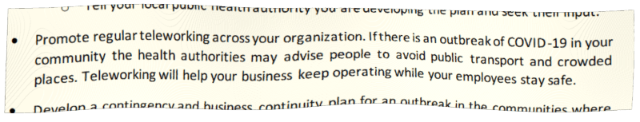
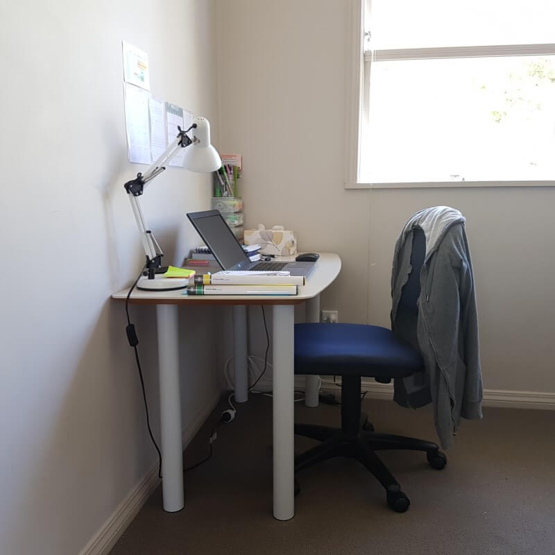
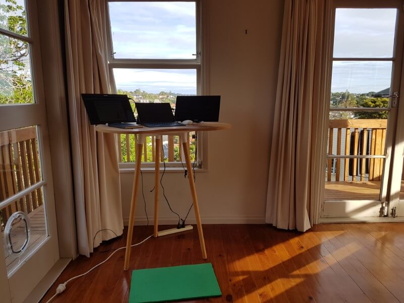
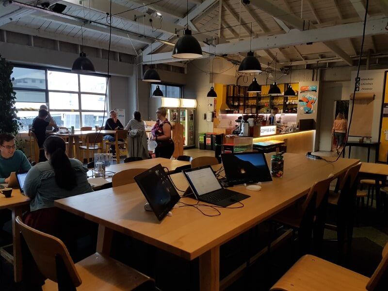
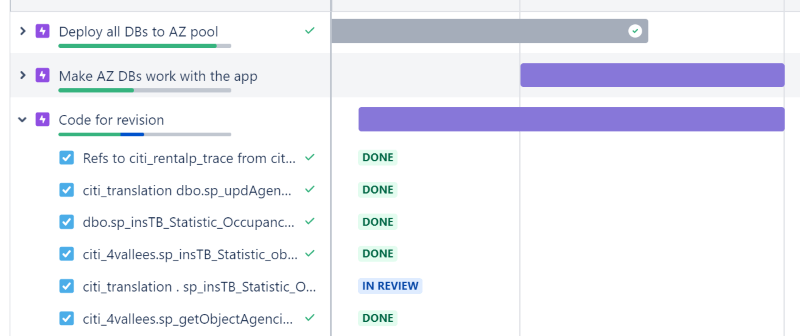
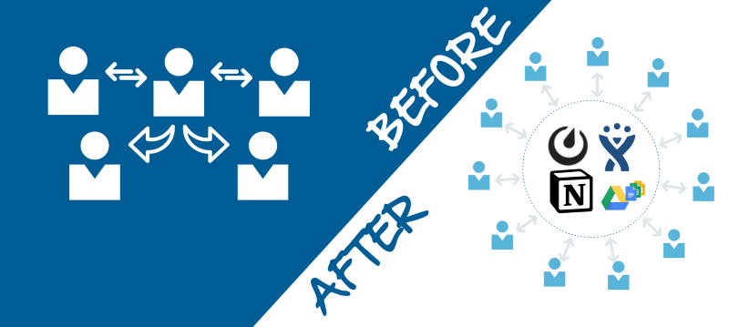
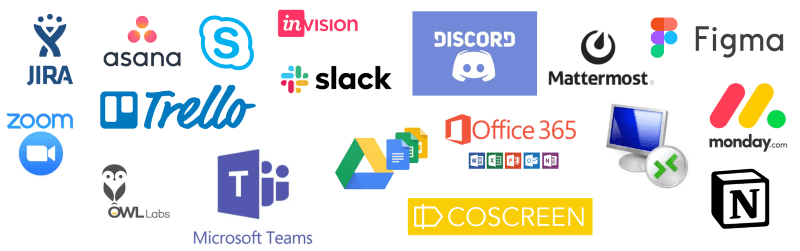

# How to switch to working remotely: COVID-19 edition
#### A practical guide for corporate managers facing the risk of business disruption due to staff absences

I wish this was my sales chart, but it's not. It is the increase of confirmed COVID-19 cases worldwide [according to World Health Organisation](https://www.who.int/emergencies/diseases/novel-coronavirus-2019/situation-reports/).

The WHO recommends protecting yourself by washing your hands and ... [staying home](https://www.who.int/docs/default-source/coronaviruse/getting-workplace-ready-for-covid-19.pdf). 

## Can your organisation function if your workers have to stay home?

*Remote work is not just about being able to video conference. There are many other aspects for workers, managers and the company culture.*

We all work from home once in a while. Usually it's for a day or two. It's an exception. Managers cut us some slack and we make up for it when we are back in the office. Working from home on a long term basis is a different story. Having multiple team members working from home is a completely different game.

This guide is split into several practical sections. It doesn't offer all the right answers, but at least it provides you some guidance on how to make remote work a success. We will look at:

* The home office set up
* Management of remote workers
* New processes
* Technology
* Examples from other companies

---

## Home-office set up

The home worker should be a *productive team player* - not just **PRODUCTIVE**, but a **PRODUCTIVE TEAM PLAYER**. If you close your office now and ask everyone to work from home your team will run into a bunch of problems pretty quickly. 

Here is an example of an improvised "home office" for an admin worker quarantined at home. It suffers from a number of issues discussed below. You, as an employer or a manager have to understand those issues and help your staff find workable solutions.

#### Lack of space
Not everyone has a big house with a spare room for a quiet office. City dwellers live in tiny apartments. Young folks share houses with other flatmates. 
  > Ask if they have space they can convert into an "office area".

#### Distractions
Kids, flatmates, live-in parents, people coming and going. All these things can be incredibly distracting, especially if other people demand your attention.
> Help your staff set boundaries or look for creative ways to solve the problem.
>
> Consider working around the times when they cannot do meetings.

#### Working hours
* **Option 1**: enforce strict working hours, make it hell for everyone.
* **Option 2**: relax the hours, focus on [*outcome* and *output*](https://hbr.org/2012/11/its-not-just-semantics-managing-outcomes).
  
*I may drop off kids to school between 8am-9am, work until 2pm, do chores for an hour(my afternoon slump anyway), work some more until 5pm, then catch up with the backlog between 8pm - 11pm. I may take a break for a few minutes now and then to do some chores.*
  > Set clear expectations of what is expected and some non-negotiable hours. It can be a bit chaotic at the beginning, but if you keep focusing on the outcomes people will put whatever hours they need to achieve them. 

#### Costs & savings

* Commute cost: $5 x 2 x 22 = $220
* Commute time (door to door): 1.5 hrs x 22 = 33hrs
* Dry cleaning: $50
* Business attire: $50
* Extra sleep: [priceless](https://freakonomics.com/podcast/the-economics-of-sleep-part-1/)

**Total monthly savings**: $320

The biggest saving is probably the commute time. Reclaiming 33hrs is the equivalent of having **4 days off every month**!

* Extra power use: $20
* Extra heating in winter: $100
* Faster internet: $50

**Total monthly costs**: $170

> Ask everyone to do their own cost/savings estimates, but make it clear there will be no penalties if they save.

#### Connectivity

The speed and quality of the Internet connection is a key factor to being a productive remote worker:

* slow connectivity is frustrating and even infuriating at times
* it slows down the pace and flow of everything
* audio and video calls become difficult

Let's assume that a faster internet connection adds up to 10% extra productivity: 
* $100 per hour output * 0.1 * 8 * 22 = $1,760 increase in output per month 

> Make a spreadsheet with everyone's [speed test results](https://www.speedtest.net/) and decide if they need an upgrade.

#### Hardware

* laptop
* mouse
* headset
* 2 or more additional screens
* external data storage device
* sitting or standing desk

**Additional screens** give a huge boost to productivity. There are many types of [portable screens](https://www.amazon.com/s?k=portable%20monitor) that don't make your house look like NASA mission control and are easy to put away.

*My laptop screen is the primary working window for typing this post. The monitor on the right has the browser for research. The monitor on the left has slack, zoom, skype, gmail and other distractions. I plan to add one more screen for note-taking.*

Some people like working with paper. Paying 50% for a **laser printer and consumables** will discourage any non-essential printing.

Many **home routers** are very old and very vulnerable. You may need to get your IT people to check it's up to scratch.

> Make a spreadsheet with hardware a inventory and individual requirements for every team member.

#### Cabin fever

Even the most introverted of us need to get amongst their peers or colleagues. Some people cannot work in isolation at all. There is no hard and fast rule about how to deal with that situation and people won't know how they feel about it all until they actually try. 
  > Consider getting a desk in the nearest shared office for those not under quarantine.

  

*This is my mobile 3-screen workstation in [Wellington BizDojo](https://www.bizdojo.com/coworking-space/bizdojo-tory-street). I also work from [GridAKL](https://gridakl.com/) and other shared offices one day a week.*

#### Family tension

Other household members are probably used to you being away from home all day for work. They have their way of using the space and their own routines. Your constant presence may impinge on that and lead to irritation that spills into other parts of family life. Demands to be quiet or not to distract only make it worse.
> Ask everyone to consider who may be affected to help them be better prepared.

---

## Management

The main problem for a traditional office manager running a remote team is the *perception of loss of control*. This is especially true for *micro-managing types*.

We are used to *"bums on seats"* mentality, but all you can see with a remote team is a stream of output. Now pause and think about it for a moment - **"a stream of output"**. Isn't it what we are after anyway? Ideally, we should focus on *outcomes*, but *output* a good transitional metric too.

> Do you have experience managing a remote team?
> 
> Do you have experience working remotely?

You really need to experience both sides of this equation to be an effective and empathetic manager. 

#### Who's doing what

The role of the manager becomes that of a facilitator and enforcer of the new workflow. The visibility of who's doing what and where they are at comes from everyone updating their status regularly. No more sticky notes or crossing out items on the whiteboard. It all moves online.

Modern [project and issue tracking systems](https://www.capterra.com/issue-tracking-software/) become the *"source of truth"*. Code repositories and shared online storage are collectors of *"output"* as well as *"work in progress"*. For example, you could see me editing this document live in Google Docs or committing code into GitHub.

The biggest hurdle for managers is letting go of their [old ways](https://www.forbes.com/sites/markmurphy/2020/02/21/barclays-forced-to-stop-big-brother-employee-tracking-system-after-backlash/).

> How do you currently track projects? 
> 
> How big of a change will it be to start using an online project tracking tool?

#### Meetings

You simply don't need as many meetings if project tracking is done properly and discussions are visible to all involved. You do need to catch up now and then, but it's not as critical any more. 

Audio and [video conferencing](https://www.producthunt.com/search?q=video%20conferencing) are ubiquitous now. Skype, Slack, Google, Atlasian all have video conferencing built in. Whichever tool you use, a good meeting should be [well organised and efficient](https://medium.com/@gentry/navigator-the-teamwork-assistant-f5c19bdb1abf).

> Do you know how much time you and your staff spend in meetings?

#### Inputs vs. outputs

In an ideal world we should all be focused on *outcomes*. In reality, many office workers just put in "hours" because this is how the corporate machine has been designed. Enabling remote work is a unique opportunity to refocus on outcomes, or at least on outputs to begin with. It is a big [culture and mindset change](https://www.perdoo.com/the-ultimate-okr-guide).

> What are your top 3 metrics used to calculate someone's pay?

Usually you get what you reward. Don't expect a change just because someone works remotely.

#### Innovation culture

Retreating to your own tasks and checking things off your list does not foster new ideas. It is up to managers to [create a culture of collaboration](https://about.gitlab.com/blog/2019/02/27/remote-enables-innovation/) where ideas can be freely exchanged and fostered.

---

## New processes

Office workflow does not apply well to remote teams. People start communicating asynchronously. The visibility of tasks and progress becomes a priority. The whole team dynamic changes. It's as if someone emptied all the cogs from a machine onto the floor and you have to reassemble everything.

#### Remote first

It is hard to get a smooth process with some people being remote while others continue to work from the office. Those in the office use face-to-face communication, white boards and post-it notes - leaving the remotes in the dark.

The solution to this is to be *"remote first"* - even those in the office have to communicate as if they were remote. If something was decided in a face to face meeting it has to be logged online for the rest of the team to see. Issue tracking, progress updates, and document sharing within the office should be done the same way as if you were remote.

#### Shared hours

There have to be some hours of the day when all team members are guaranteed to be available for communication and working together. E.g. 9am-10:30am, 1pm-3:30pm. The rest of the time can be more or less flexible.

#### Status updates

Status update intervals must be discussed and agreed upon by all team members. It is a bit tedious and hard to remember to change the status on every task you are working on, particularly if you have a few on the go. Having to log updates at regular intervals helps to keep everyone engaged and informed. The end of the day update is a must.

#### "Open plan" remote office

Any work in progress, be it written, edited, drawn or calculated should be saved to shared storage for others to see. There should be no need to ask "Where are you at with ... ?". It should be a case of checking the task status or the file contents on the shared drive.

Another option is to use screen broadcasting, but that can be quite intrusive.

---

## Technology

There are hundreds of online collaboration and productivity tools for remote teams. Their applicability depends on the nature of work your company does, team size and personal preferences. Beware of making disconnected silos.

#### Collaboration tools

There is plenty of good advice about collaboration tools for remote teams on the Internet. Read [here](https://www.collaborationsuperpowers.com/tools/), [here](https://www.producthunt.com/newsletter/4285) and [here](https://www.zdnet.com/article/remote-working-101-professionals-guide-to-the-tools-of-the-trade/). [ProductHunt](https://www.producthunt.com) and [Capterra](https://www.capterra.com/web-conferencing-software/) are good starting points in search for new tools.

> It does take time to find a set of tools that works for you.

#### Accessing corporate network

There will be software, shared drives and servers accessible only from within your corporate network.

* Configure a VPN to access your corporate network from authorised devices
* Allow Remote Desktop Access to office workstations
* Migrate some of your resources to a cloud provider

> Ask everyone to test access to at least their office workstation over Remote Desktop from home.

#### Connectivity

It doesn't matter how fast the fibre connection is - what really matters for productivity is the [the UI's response time](https://www.nngroup.com/articles/response-times-3-important-limits/).

You'll need to choose whether to allow access to the software directly or via a Remote Desktop Connection to the office workstation. For example, accessing CAD or design software via Remote Desktop can be very irritating because of the lag in redrawing the screen. On the other hand, the laptop may not have enough grunt to run the CAD software at all.

> Ask users or get someone technical to do a few quick tests to see what works best.

#### Security

It's best if you get professional security advice before enabling more outside access to your network. Some of concerns to keep in mind are:

* [BYOD policy](https://blog.rsisecurity.com/bring-your-own-device-security-issues-and-challenges/)
* Use of PKI infrastructure
* 2-factor authentication
* User privileges on the device (e.g. admin vs restricted user)
* User activity audit if the office workstation is bypassed
  
There are also non-technical security issues like unauthorised access to the device by family members or taking photos of sensitive information from the screen.

## Successful examples

Remote work used to be the exclusive domain of software companies. Now [more and more businesses](https://www.flexjobs.com/blog/post/100-top-companies-with-remote-jobs-2020/) offer flexible working arrangements that include remote work. 

Most "remote-first" companies started as small software projects maintaining their original "remote-first" structure as they grew.

* [GitLab](https://about.gitlab.com/) ($2.75B valuation, [plans 2020 IPO](https://www.forbes.com/sites/alexkonrad/2019/09/17/gitlab-doubles-valuation-to-nearly-3-billion/)) has published their [company playbook](https://about.gitlab.com/company/culture/all-remote/guide/).

* [PagerDuty](https://www.pagerduty.com/) (NYSE:PD, $1.4B) has offices worldwide with a sizable remote-only workforce.

* [ElasticSearch](https://www.elastic.co/about/careers/), [Hashicorp](https://www.hashicorp.com/jobs), [Mozilla](https://blog.mozilla.org/careers/working-on-distributed-teams/) and [hundreds of other well known names](https://github.com/yanirs/established-remote/) are also "remote-first". 

 Their evolutionary approach doesn't really apply to established businesses with "office-only" culture who are forced to go "remote" almost on the spot. One of the biggest differences between "remote-first" and "office-only" companies going remote is their people - "remote-first" companies only hire people who can and want to work remotely.

**We should learn from them now to minimise the risk of disruption and make our companies a better place to work at the same time.**

---

*This post is based on my own experience building multiple remote teams and working remotely as a freelance consultant. Feel free to reach out to me directly if you want to go into more detail on this subject.*
