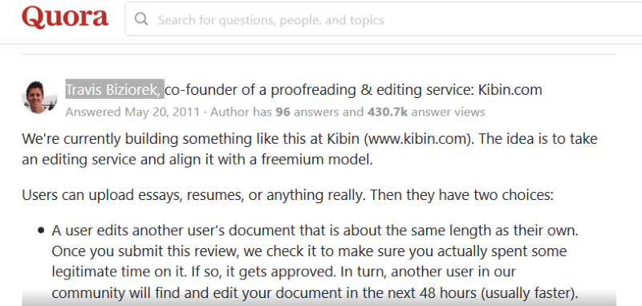
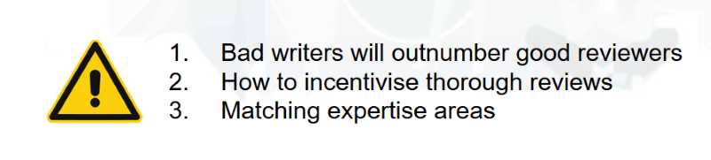
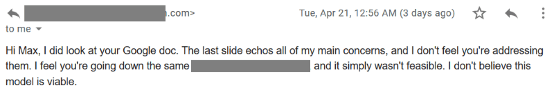
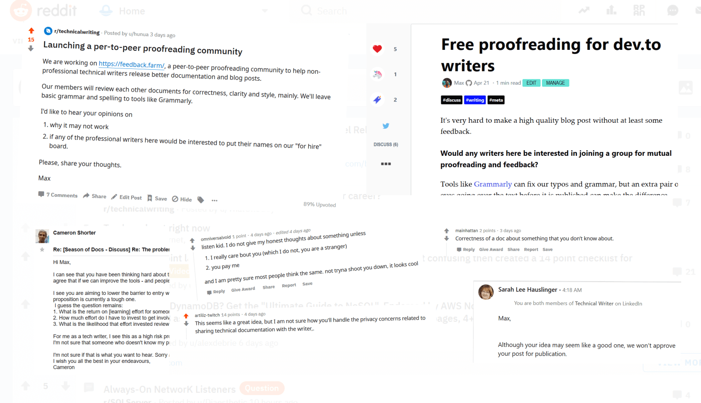

# How I validated a business idea with Lean Canvas
#### A practical guide based on a real-life project

*There is plenty of good advice in books and on the Internet about how to validate an idea. The authors may convincingly tell you what to do, but skip the execution part as if it's not important. This post is a step-by-step walk through an idea validation process I did recently.*

I got this idea about a proofreading community to help technical writers release better posts by giving each other feedback after I started posting on [Dev.To](https://dev.to/rimutaka). Better posts, more reactions, more readers, everyone wins, right?

Maybe not so!

Most ideas sound good on the face of it. You need to look much deeper to know if they are worth pursuing. 

My idea validation tool of choice is [Lean Canvas](https://leanstack.com). Ash Maurya, the Godfather of Idea Validation came up with that simple, but very powerful framework to make us think about ideas as businesses before we invest any time or money into building a product.

This is what my idea looked like in Lean Canvas format:

It's quite light on detail, isn't it? 

> A "lean canvas" isn't supposed to have the depth of a business plan. It is just a starting point to get something on paper, like a bird's eye view.

There are other ways to validate an idea. The most expensive one is to go and build the product. Jeff Bezos requires a [6-page memo and a press release](https://www.inc.com/carmine-gallo/jeff-bezos-requires-amazons-leaders-to-perform-this-powerful-ritual-before-launching-anything.html) before even discussing a new idea. Or, you can make big bets Elon Musk's style by [boiling it down to first principles](https://www.rollingstone.com/culture/culture-features/elon-musk-the-architect-of-tomorrow-120850/). I am nowhere near their level of greatness, so I just dig deeper with the Lean Canvas framework.

## Why doesn't it exist?

> If there is StackOverflow and Quora where we help each other solve problems, why isn't there a community where we help each other release better posts and documentation?

If there is an unmet need there must be a reason why it is unmet.

* Is it technically feasible?
* Is it financially viable?
* Has anyone else tried and failed?

Building a community somewhat similar to Stack Overflow is not technically challenging and assuming the need is there, it must be down to business viability or some other hidden issue. This Quora reply from 2011 held the answer:

The description of the service in that post sounds exactly like my idea. Surprisingly, [kibin.com](http://kibin.com) is a very different type of proofreading service with no community aspect. Travis Biziorek, the founder of kibin.com kindly replied to my cold email with a detailed explanation about why that model didn't work out. In short, they could not monetize it.
> If kibin.com couldn't monetize it, why would I succeed?

10 years is a long time in the life of the Internet. If it didn't work for Travis and his team back in 2011 it *may* work just fine in 2020.

## Investor pitch deck

I practiced my "elevator pitch" on anyone who'd listen until it started making sense. It went from blabbering something about proofreading my blog posts to a very concise statement.

> Peer-to-Peer Proofreading Community
> 
> Get feedback on your blog posts and technical documentation from other writers, users and engineers for free.

A proper "investor pitch deck" took me a day to make and ran into 11 slides. The amount of thinking I had to put into that document was an order of magnitude more than for the canvas. It had to be detailed enough to start a meaningful conversation with others about the project.

You can download the entire document from Google Docs: https://docs.google.com/presentation/d/1wxuYD6lA3G4bK1N03kCIUi4mQJrtBZHvXOoshhsONzM/.

## Red flags and self-deception

Validation is not about proving that something will work. You can only prove that by "doing it". It is easier to [invert our model](https://fs.blog/2013/10/inversion/) to try to falsify the assumptions it is based on. The inversion won't guarantee project success, but it will save us from a predictable failure.

Some red flags popped up as soon as I started writing the pitch deck. We tend to dismiss those warning signs that something's off as minor issues. After all, we want the idea to succeed, so we kind of ignore them, until the reality comes back to bite us. Let's not make that mistake ever again.

> Catalogue all issues, risks, and uncertainties

You'll find a few boxes like this one in my deck. I expanded and summarized them in a separate slide at the end of the presentation.

## The power of nay-sayers

Most of your friends want you to succeed, so they will just say, yeah, it's a great idea and change the subject. Deep down, they neither understand nor care about your new idea. Those are not the responses I take seriously.

It takes a lifetime to build a network of trusted advisors or even people capable of giving advice. In situations like this, they can be worth their weight in gold by pointing out the blind spots.

> Is it safe to share my idea in such details with my wider network? What if someone steals it?

Ideas are dime a dozen. If someone steals my idea, then [it wasn't a good idea for me to work on](https://www.jimcollins.com/concepts/the-hedgehog-concept.html) (someone else would beat me to it anyway). Primed with that thinking I sent 21 cold emails with the pitch deck to people outside of my immediate network. 3 replied. 1 gave me a very detailed analysis of some of the flaws in my plan.

> Listen to all feedback carefully, but draw your own conclusions.

## Let the mob tear it apart

Talking to potential partners and customers can't be done over a pitch deck. I had to come up with a name for the project, register the domain name, and set up a landing page. I called it [**Feedback Farm**](https://feedback.farm). It may be not the best of names, but is better than no name.

Reddit, ProductHunt, LinkedIn and Slack groups are the quickest way to gage the response from your target audience. The feedback there can be brutal, but some of it is very good. Ignore the brutes and listen to those who put some thought into it.

Expect your posts to be removed, your account blocked and IP blacklisted if you don't have a good standing in that community. Check out this [excellent Product Hunt interview](https://open.spotify.com/episode/7lnR9bNr0WZYRH3pPQqabS) with Josh Howarth from [Exploding Topics](https://explodingtopics.com/) on how makers can use online communities to validate and launch their new products.

## Silence is worse than a No

You will get a lot of non-replies. That's worse than a No because it doesn't resolve the uncertainty one way or the other. Did they ignore you because your idea is not worth replying or was there some other reason? Here is my "guess-list".

* Confusing message
* Didn't ask the right questions
* Spam filters
* Too busy
* Too many emails
* No interest in the subject
* Not a decision-maker of any kind
* Bad idea
* Conflict of interest
* Does not understand the problem
* Understands the problem, but cannot relate to it

Add any number of other reasons to it, but you are still none the wiser.

> Non-replies is a predictor of failure - whatever the reason is, you failed to generate interest.

## The weakest link

Putting the feedback aside, what is the weakest list in my chain of assumptions? Pick one.

> Let's assume the problem is real, there is some demand and it is technically feasible. How am I going to reach and acquire users?

My weakest link was in "*Channels*". I would not be able to reach such a diverse and dispersed audience like bloggers and technical writers without relying on channel partners.

I set myself a deadline of 1 week to acquire at least one channel partner to help me reach my target audience. 10 days later I only had 2 "maybe". 

## To build or not to build

> Unless the validation comes back overwhelmingly positive and you see strong upside in investing your time and effort into the product, step back for a moment. Let the emotions cool down. Think of the [opportunity cost](https://seths.blog/2019/01/opportunity-costs-just-went-up/) and [ignore the effort you put into your idea](https://freakonomics.com/2014/01/21/meditating-on-those-sunk-costs/).

My validation didn't return a clear winner. It could be because the idea is bad or because I didn't execute it well, or both.
I may still go ahead with [Feedback Farm](https://feedback.farm) as a side project and make a browser plugin for easy proofreading of blog posts, but that would be just to "*scratch my own itch*". 

