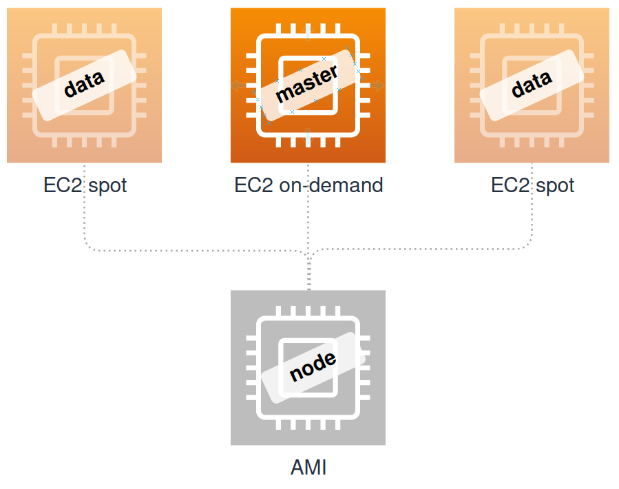

# Goodbye OpenSearch, hello self-hosted ElasticSearch on EC2

#### An AWS OpenSearch to EC2-hosted ElasticSearch migration guide

AWS ElasticSearch Service used to be a quick and easy option to add ElasticSearch to a project already hosted on AWS. It was forked into [AWS OpenSearch](https://aws.amazon.com/opensearch-service/) and is now only [nominally related to ElasticSearch](https://aws.amazon.com/blogs/opensource/introducing-opensearch/). That change created a dilemma to stay with this new AWS service or make a move elsewhere to stay with ElasticSearch.

The future of OpenSearch doesn't look bright. [AWS OpenSearch project on github](https://github.com/opensearch-project/OpenSearch) has tanked since AWS took over while [ElasticSearch project](https://github.com/elastic/elasticsearch) is keeping up a steady pace.


The other consideration against AWS OpenSearch is its high cost compared to other options.

For example, using a mix of _on-demand_ and _spot_ EC2 instances running ElasticSearch can cost just 1/3 of the comparable OpenSearch configuration.


## Target EC2 configuration

Mixing EC2 on-demand and spot instances is very cost-effective for non-mission-critical projects. If the ES cluster is configured correctly, the worst case scenario of all spot instances going down is degraded performance with no data loss. It is possible only if the shards are allocated so that there is at least one copy in the on-demand part of the cluster. This setting is addressed later in this guide.



The number of nodes can be easily scaled with addition of more *master* and *data* nodes from the same AMI. Both types can be run as either *spot* or *on-demand* as long as there are enough on-demand instances to hold at least one copy of every shard.


## ElasticSearch fear factor

ElasticSearch installation and configuration may look daunting at first. I was definitely intimidate by the JVM and all the "cluster-node-master-whatnot" terminology. It turned out to be easy to install and not too hard to configure. I did have to read a lot of their docs to fill in the blanks in their [official installation guide](https://www.elastic.co/guide/en/elasticsearch/reference/current/install-elasticsearch.html). The rest of this post contains the exact steps I had to go through to create my ElasticSearch cluster and migrate all the data from AWS OpenSearch to it.

#### I am not scared of you, ElasticSearch, any more!

----

## ES Node AMI

The first task is to build an ElasticSearch Node AMI (ES Node AMI) to serve as a blueprint for any node type. The size of the instance is not important at this stage. It will be easy to resize after creation of the AMI.

* **ElasticSearch version**: 7.16
* **AWS AMI**: Ubuntu 20.04LTS
* **Storage**: 50GB root + 60GB data GP3 SSD ([storage sizing guide](https://docs.aws.amazon.com/opensearch-service/latest/developerguide/sizing-domains.html#bp-storage))
* **Static IP**: required
* **Misc**: 
  * **Hostname type**: Resource name
  * **Enhanced monitoring**: Yes

We only need to set up a single machine to create a reusable ES Node AMI. Any differences between ES nodes will be in the configuration applied after the AMI is launched.

Start by launching a brand new Ubuntu 20.04 instance on EC2 with the above config.

## ES installation

This guide is based on the [official ES install guide for Debian Package](https://www.elastic.co/guide/en/elasticsearch/reference/current/deb.html). It was used to build a 3-node production cluster with a single *master* on-demand and 2 *data* spot instances.


> #### Important note about Shell Scripts
> 
> Most scripts in this guide are formatted as blocks and can be copy-pasted as such into the CLI. It is better to **copy-paste them line by line** because there is no error handling and some steps require manual input.

```shell
# update the OS
sudo apt-get update && sudo apt-get upgrade

# ES pre-requisites
sudo apt-get install unzip
wget -qO - https://artifacts.elastic.co/GPG-KEY-elasticsearch | sudo apt-key add -
sudo apt-get install apt-transport-https
echo "deb https://artifacts.elastic.co/packages/7.x/apt stable main" | sudo tee /etc/apt/sources.list.d/elastic-7.x.list

# install ES
sudo apt-get update
sudo apt-get install elasticsearch
```

ES is now installed, but not enabled.


## Storage configuration

Attach the 2nd disk to the ES data directory to make it portable. If the instance dies or has to be replaced the index data can be salvaged by re-attaching the volume to another ES EC2 instance.

Mount the 2nd EBS drive to `/var/lib/elasticsearch` folder. Make sure the permissions of the mount are set exactly as in the target folder (`drwxr-s---  2 elasticsearch elasticsearch`).

```shell
sudo mkfs -t xfs /dev/nvme1n1
sudo mount /dev/nvme1n1 /var/lib/elasticsearch
sudo chown elasticsearch:elasticsearch /var/lib/elasticsearch
sudo chmod 2750 /var/lib/elasticsearch
```

Mount the drive on boot by adding it to *fstab*. 

Update *fstab*:
```shell
echo "UUID=$(sudo blkid | grep -oP '(?<=/dev/nvme1n1: UUID=")[a-z0-9\-]+') /var/lib/elasticsearch xfs defaults 0 2" | sudo tee -a /etc/fstab
```

Verify it is still a valid *fstab* file. The instance may fail to boot if its corrupt: 
```shell
sudo blkid
cat /etc/fstab
```

*fstab* should look similar to this example:
```shell
ubuntu@i-0c4ba3e0d781e7f34:~$ sudo blkid
/dev/nvme0n1p1: LABEL="cloudimg-rootfs" UUID="436cf32d-5e3d-46ca-b557-f870c8a25794" TYPE="ext4" PARTUUID="24ca9e81-01"
/dev/loop0: TYPE="squashfs"
/dev/loop1: TYPE="squashfs"
/dev/loop2: TYPE="squashfs"
/dev/loop3: TYPE="squashfs"
/dev/loop4: TYPE="squashfs"
/dev/nvme1n1: UUID="b90fdf46-25a9-48a2-a7e6-82986da39306" TYPE="xfs"
ubuntu@i-0c4ba3e0d781e7f34:~$ cat /etc/fstab
LABEL=cloudimg-rootfs	/	 ext4	defaults,discard	0 1
UUID=b90fdf46-25a9-48a2-a7e6-82986da39306 /var/lib/elasticsearch xfs defaults 0 2
```

Reboot to make sure the VM comes back to life and there are no old file handles pointing at the mounting folder.
```shell
sudo shutdown -r 0
```

## Install Kibana and plugins

Install ES S3 plugin to backup and restore using AWS S3 for snapshot storage. It is needed to restore a backup from AWS OpenSearch. Do not try to restart ES as instructed by the plugin. We'll do that later.
```shell
sudo /usr/share/elasticsearch/bin/elasticsearch-plugin install repository-s3
```

#### Install Kibana:
```shell
sudo apt-get install kibana
```

### Useful shortcuts and troubleshooting

A [detailed overview of the distro layout](https://www.elastic.co/guide/en/elasticsearch/reference/current/deb.html#deb-layout) can be summarized with a few frequently used commands:

#### Config files
* ES config: `sudo nano /etc/elasticsearch/elasticsearch.yml`
* Kibana config: `sudo nano /etc/kibana/kibana.yml`

#### Log files
* ES log: `sudo tail -n 100 /var/log/elasticsearch/stm-prod.log`
* Kibana log: `sudo tail -n 100 /var/log/kibana/kibana.log`
* systemctl log: `tail -n 100  /var/log/syslog`

#### Folders
* ES tools: */usr/share/elasticsearch/bin*
* ES path.data: */var/lib/elasticsearch*
* ES path.logs: */var/log/elasticsearch*

#### CLI `curl` calls
* Check ES is running: `curl -X GET "localhost:9200/?pretty"`
* Over HTTPS locally: `curl --insecure -X GET "https://localhost:9200/?pretty"`
* Over HTTPS anywhere: `curl -X GET "https://master.es.stackmuncher.com:9200/?pretty"`
* Check Kibana is running: `curl --insecure --verbose -L http://localhost:5601/`
* Delete all Kibana indexes: `curl --user $STM_ES_BASIC_AUTH -XDELETE https://master.es.stackmuncher.com:9200/.kibana`
* View all ES indexes: `curl --user $STM_ES_BASIC_AUTH https://master.es.stackmuncher.com:9200/_cat/indices`

**ES log** is placed in the file named after the cluster. Initially it is called *elasticsearch.log*. As soon as the cluster is renamed into *stm-prod*, the log name changes to *stm-prod.log*.

**systemctl log** is useful for troubleshooting failed `start` commands. ES start-up errors are likely to be found there. **Kibana always starts OK** and then places any errors in its own */var/log/kibana/kibana.log*

**$STM_ES_BASIC_AUTH** env variable should be set to `elastic:your_elastic_autogenerated_pwd`. The password will be generated at a later step.


## Networking

ES instances need to be accessible by clients from within the VPC and from outside the VPC. Create a single public access point at *master.es.stackmuncher.com* with 600 TTL in Route53 for both access modes.

* public hosted zone:  e.g. `master.es.stackmuncher.com A 34.232.124.28`
* private hosted zone: e.g. `master.es.stackmuncher.com CNAME i-0c4ba3e0d781e7f34.ec2.internal` (replace *i-0c4ba3e0d781e7f34.ec2.internal* with the instance ID)

Test it within and outside of the VPC with  `nslookup master.es.stackmuncher.com`. It should resolve to a private and static IPs respectively.

AWS Lambda Functions need to have [access to the VPC of the ES instance](https://docs.aws.amazon.com/lambda/latest/dg/configuration-vpc.html).


## Initial config

ES configuration is dependant on the use case. I suggest to get something going using this example and then tailor it to your needs.

#### Reference:
* Recommended 1-2-3 node cluster configurations: https://www.elastic.co/guide/en/elasticsearch/reference/current/high-availability-cluster-small-clusters.html
* Discovery settings: https://www.elastic.co/guide/en/elasticsearch/reference/current/modules-discovery-settings.html
* Node settings: https://www.elastic.co/guide/en/elasticsearch/reference/current/modules-node.html

ES configuration is done in `.yml` config files and via `PUT _cluster/settings` commands once the cluster is up and running. 


## Basic security config

There are 3 levels of security config in ES. A production set up for migration requires the full monty with *basic*, *transport* and *HTTPs* for ES and Kibana.

Also, it's a good idea to [password-protect the keystore](https://www.elastic.co/guide/en/elasticsearch/reference/current/elasticsearch-keystore.html). This can be done after the cluster is fully operational.

#### Reference:
* https://www.elastic.co/guide/en/elasticsearch/reference/7.16/security-minimal-setup.html
* https://www.elastic.co/guide/en/elasticsearch/reference/7.16/security-basic-setup.html
* https://www.elastic.co/guide/en/elasticsearch/reference/7.16/security-basic-setup-https.html

We'll need 2 sets of certificates: 
* self-issued for transport level to enable ES nodes securely talk to each other
* a trusted cert for external requests to ES API and Kibana front-end

#### Enable and launch ES:
```shell
sudo systemctl enable elasticsearch.service
sudo systemctl start elasticsearch.service
```

### Bootstrap ES security

This step will generate random passwords for ES built-in accounts and **can only be run once**. Save the login/passwords it outputs into a file.
```shell
echo "xpack.security.enabled: true" | sudo tee -a /etc/elasticsearch/elasticsearch.yml
echo "discovery.type: single-node" | sudo tee -a /etc/elasticsearch/elasticsearch.yml
echo "network.host: 0.0.0.0" | sudo tee -a /etc/elasticsearch/elasticsearch.yml
sudo systemctl restart elasticsearch.service
sudo /usr/share/elasticsearch/bin/elasticsearch-setup-passwords auto
```

*discovery.type: single-node* setting is needed to stop ES accepting other nodes. *network.host: 0.0.0.0* will make it listen on all IPs, internal and external.

Kibana security config reference: https://www.elastic.co/guide/en/elasticsearch/reference/7.16/security-minimal-setup.html#add-built-in-users

#### Add the password for *kibana_system* account when requested:
```shell
echo 'elasticsearch.username: "kibana_system"' | sudo tee -a /etc/kibana/kibana.yml
echo "server.host: 0.0.0.0" | sudo tee -a /etc/kibana/kibana.yml
sudo /usr/share/kibana/bin/kibana-keystore add elasticsearch.password
```

#### Enable and start Kibana:
```shell
sudo systemctl enable kibana.service
sudo systemctl start kibana.service
```

Wait for a minute or so and check the logs to make sure Kibana started OK.
1. Check the logs: `sudo tail -n 100 /var/log/kibana/kibana.log`
2. This request should return some HTML: `curl --insecure --verbose -L http://localhost:5601/`

### Generate transport-level certificates

Transport-level certificates are self-issued certificates that are trusted by all nodes. They can be used for external communications if all your clients can be forced to trust them. It may be easier to get a LetsEncrypt cert and be trusted everywhere. 

**Reference**: https://www.elastic.co/guide/en/elasticsearch/reference/7.16/security-basic-setup.html#generate-certificates

1. Generate the certificate authority file: `sudo /usr/share/elasticsearch/bin/elasticsearch-certutil ca`
  * it is saved as */usr/share/elasticsearch/elastic-stack-ca.p12*

2. Generate the certificate: `sudo /usr/share/elasticsearch/bin/elasticsearch-certutil cert --ca elastic-stack-ca.p12`
   * it is saved as */usr/share/elasticsearch/elastic-certificates.p12*

3. Copy the cert to its default location:
```shell
sudo cp /usr/share/elasticsearch/elastic-certificates.p12 /etc/elasticsearch/elastic-certificates.p12
sudo chmod 440 /etc/elasticsearch/elastic-certificates.p12
```


### Enable transport-level certificates

Certificates are generated and enabled once only because all nodes are built from the same AMI and share the certs.

```shell
echo "xpack.security.transport.ssl.enabled: true
xpack.security.transport.ssl.verification_mode: certificate 
xpack.security.transport.ssl.client_authentication: required
xpack.security.transport.ssl.keystore.path: elastic-certificates.p12
xpack.security.transport.ssl.truststore.path: elastic-certificates.p12"  | sudo tee -a /etc/elasticsearch/elasticsearch.yml

sudo /usr/share/elasticsearch/bin/elasticsearch-keystore add xpack.security.transport.ssl.keystore.secure_password

sudo /usr/share/elasticsearch/bin/elasticsearch-keystore add xpack.security.transport.ssl.truststore.secure_password

sudo systemctl restart elasticsearch.service
```

### HTTPs with LetsEncrypt

Communications between ES and external clients should be secured with a publicly trusted CA. [LetsEncrypt](https://letsencrypt.org/) is free, but comes with 2 problems: must be renewed every 3 months and the web server must provide the full chain version of the certificate because some intermediaries there are not commonly trusted.

Generate a LetsEncrypt wildcard certificate on a local machine:

* Issue the cert: `sudo certbot certonly --manual` for `*.es.stackmuncher.com`
* Local location: */etc/letsencrypt/live/es.stackmuncher.com* with shortcuts pointing at */etc/letsencrypt/archive/es.stackmuncher.com/*

#### Copy the certificate files to the ES instance:

```shell
sudo scp -i ~/.ssh/dev-ld-useast1.pem  /etc/letsencrypt/live/es.stackmuncher.com/fullchain.pem ubuntu@master.es.stackmuncher.com:/home/ubuntu/fullchain.pem

sudo scp -i ~/.ssh/dev-ld-useast1.pem  /etc/letsencrypt/live/es.stackmuncher.com/privkey.pem ubuntu@master.es.stackmuncher.com:/home/ubuntu/privkey.pem

sudo scp -i ~/.ssh/dev-ld-useast1.pem  /etc/letsencrypt/live/es.stackmuncher.com/chain.pem ubuntu@master.es.stackmuncher.com:/home/ubuntu/chain.pem
```

*scp* can't get to the ultimate destination of the certificates on the ES instance, so they are copied into the home directory on the instance first and then moved locally within the instance:
```shell
sudo mv ~/fullchain.pem /etc/elasticsearch/fullchain.pem
sudo chown root:elasticsearch /etc/elasticsearch/fullchain.pem
sudo chmod 440 /etc/elasticsearch/fullchain.pem
sudo mv ~/privkey.pem /etc/elasticsearch/privkey.pem
sudo chown root:elasticsearch /etc/elasticsearch/privkey.pem
sudo chmod 440 /etc/elasticsearch/privkey.pem
sudo mv ~/chain.pem /etc/elasticsearch/chain.pem
sudo chown root:elasticsearch /etc/elasticsearch/chain.pem
sudo chmod 440 /etc/elasticsearch/chain.pem
```

Add the certificates to ES config:
```shell
echo "xpack.security.http.ssl.enabled: true" | sudo tee -a /etc/elasticsearch/elasticsearch.yml
echo "xpack.security.http.ssl.key: /etc/elasticsearch/privkey.pem" | sudo tee -a /etc/elasticsearch/elasticsearch.yml
echo "xpack.security.http.ssl.certificate: /etc/elasticsearch/fullchain.pem" | sudo tee -a /etc/elasticsearch/elasticsearch.yml
echo "xpack.security.http.ssl.certificate_authorities: /etc/elasticsearch/chain.pem" | sudo tee -a /etc/elasticsearch/elasticsearch.yml
sudo systemctl restart elasticsearch.service
```

Test ES access via HTTPs internally and externally by running `curl -X GET "https://master.es.stackmuncher.com:9200/?pretty"`. In both cases it should return an error similar to this example, which means ES is working and HTTP SSL is configured correctly: 
```json
{
  "error" : {
    "root_cause" : [
      {
        "type" : "security_exception",
        "reason" : "missing authentication credentials for REST request [/?pretty]",
        "header" : {
          "WWW-Authenticate" : [
            "Basic realm=\"security\" charset=\"UTF-8\"",
            "Bearer realm=\"security\"",
            "ApiKey"
          ]
        }
      }
    ],
    "type" : "security_exception",
    "reason" : "missing authentication credentials for REST request [/?pretty]",
    "header" : {
      "WWW-Authenticate" : [
        "Basic realm=\"security\" charset=\"UTF-8\"",
        "Bearer realm=\"security\"",
        "ApiKey"
      ]
    }
  },
  "status" : 401
}
```

## Configure kibana

Detailed Kibana configuration: https://www.elastic.co/guide/en/kibana/current/settings.html 

Copy LetsEncrypt certificates from the ES location to Kibana:
```shell
sudo cp /etc/elasticsearch/fullchain.pem /etc/kibana/fullchain.crt
sudo chown root:kibana /etc/kibana/fullchain.crt
sudo chmod 440 /etc/kibana/fullchain.crt
sudo cp /etc/elasticsearch/privkey.pem /etc/kibana/privkey.key
sudo chown root:kibana /etc/kibana/privkey.key
sudo chmod 440 /etc/kibana/privkey.key
```

Add the certificates to Kibana config:
```shell
echo "elasticsearch.hosts: https://master.es.stackmuncher.com:9200" | sudo tee -a /etc/kibana/kibana.yml
echo "server.publicBaseUrl: https://master.es.stackmuncher.com:5601" | sudo tee -a /etc/kibana/kibana.yml
echo "server.ssl.certificate: /etc/kibana/fullchain.crt" | sudo tee -a /etc/kibana/kibana.yml
echo "server.ssl.key: /etc/kibana/privkey.key" | sudo tee -a /etc/kibana/kibana.yml
echo "server.ssl.enabled: true" | sudo tee -a /etc/kibana/kibana.yml
sudo systemctl restart kibana.service
```

Kibana should now be available at https://master.es.stackmuncher.com:5601/. Login as *elastic* user with its auto-generated password.

If Kibana is not working, troubleshoot with `tail -n 100  /var/log/syslog` and `sudo tail -n 100 /var/log/kibana/kibana.log`.


## Misc settings

Add any tweaks specific to the set up. E.g. StackMuncher doesn't use GeoIP and ML:
```shell
echo "ingest.geoip.downloader.enabled: false
xpack.ml.enabled: false" | sudo tee -a /etc/elasticsearch/elasticsearch.yml
sudo systemctl restart elasticsearch.service
```


## Anonymous access to ES

AWS OpenSearch access control is different from how it is commonly done in ES. The easiest migration approach is to retain the anonymous access for now, but restrict the anonymous user privileges.

Reference: https://www.elastic.co/guide/en/elasticsearch/reference/current/anonymous-access.html

Create a role describing anonymous user rights in Kibana:
```
POST /_security/role/stm_apps
{
  "run_as": [ "_es_anonymous_user" ],
  "indices": [
    {
      "names": [ "stm*","dev*","stats*" ],
      "privileges": [ "read","write","create" ]
    }
  ]
}

GET /_security/role/stm_apps
```

Map built in *_es_anonymous_user* to *stm_apps* role:
```shell
echo "xpack.security.authc:
  anonymous:
    roles: stm_apps" | sudo tee -a /etc/elasticsearch/elasticsearch.yml

sudo systemctl restart elasticsearch.service
```

### Anonymous access tests

This call from any machine with sufficient network access to the VM **should fail** because *_es_anonymous_user* is not allowed to create new indexes:
```shell 
curl -X POST "https://master.es.stackmuncher.com:9200/dev/_doc" -H 'Content-Type: application/json' -d'{ "foo": "bar" }'
```
Expected error: *...action [indices:admin/auto_create] is unauthorized for user [_anonymous] with roles [stm_apps]...*

Create *dev* index in Kibana by running `PUT /dev` and repeat the *curl* request - it **should succeed** with *dev* index in place.
Clean up with `DELETE /dev`.

This call should always fail for *_es_anonymous_user*: `curl https://master.es.stackmuncher.com:9200/_cat/indices`

## Create ES Node AMI

The ES instance is now in a state ready to be reused for creating multiple *master* and *data* nodes by spinning more instances within the same VPC.

Optionally, remove comment lines starting with `#` from ES config to make it more readable:
```shell
sudo sed -i '/^#/d' /etc/elasticsearch/elasticsearch.yml
```

Kibana config can also be cleaned up with `sudo sed -i '/^#/d' /etc/kibana/kibana.yml`.

Save `/etc/elasticsearch/elasticsearch.yml` and `/etc/kibana/kibana.yml` for reference.

Create an AMI


# Launching ES nodes

An instance launched from ES Node AMI starts as a single node due to `discovery.type: single-node` setting and lack of cluster-level config. It needs to be re-configured to join a cluster as a *master* or a *data* node.

## Master node config 

This script will turn a standalone ES node into a master:

```shell
sudo systemctl stop elasticsearch.service
sudo sed -i '/discovery.type: single-node/d' /etc/elasticsearch/elasticsearch.yml
echo 'cluster.name: stm-prod
node.name: es-master
discovery.seed_hosts: ["master.es.stackmuncher.com"]

# comment out one of the two reservation options
# this setting affects shard allocation
node.attr.reservation: persistent
# node.attr.reservation: spot

cluster.initial_master_nodes: ["es-master"]
cluster.routing.allocation.awareness.attributes: reservation' | sudo tee -a /etc/elasticsearch/elasticsearch.yml
sudo systemctl start elasticsearch.service
sudo systemctl restart kibana.service
```

Open Kibana at https://master.es.stackmuncher.com:5601/ and check the cluster state with `GET /_cluster/state`. It should be named appropriately and have only one node:
```json
{
  "cluster_name" : "stm-prod",
  "cluster_uuid" : "voHWCBEdRO-shwxv0ngiaw",
  "version" : 207,
  "state_uuid" : "x7vj0CmvSlmmHY4ASeCTcA",
  "master_node" : "V4EZprKlTleq9DzgIfIm1A",
  "blocks" : { },
  "nodes" : {
    "V4EZprKlTleq9DzgIfIm1A" : {
      "name" : "es-master",
      "ephemeral_id" : "OWTuL7nIRGedVd19oTM0Hw",
      "transport_address" : "172.31.7.40:9300",
      "attributes" : {
        "xpack.installed" : "true",
        "transform.node" : "true",
        "reservation" : "persistent"
      },
      "roles" : [
        "data",
        "data_cold",
        "data_content",
        "data_frozen",
        "data_hot",
        "data_warm",
        "ingest",
        "master",
        "remote_cluster_client",
        "transform"
      ]
    }
  }
  ...
```

Use `node.attr.reservation: persistent` for instances that are unlikely to go offline unexpectedly (reserved or on-demand instances) and `node.attr.reservation: spot` for any kind of spot instances. ES will be configured to allocate shards so that even if all spot instances drop off there will still be enough replicas to recover and re-balance.

If you are trying to recover an instance and Kibana won't start due to its shard loss:
* kill Kibana indexes with `curl --user $STM_ES_BASIC_AUTH -XDELETE https://master.es.stackmuncher.com:9200/.kibana*`
* restart Kibana with `sudo systemctl restart kibana.service`

The *master* node is now ready for the production snapshot restore from AWS OpenSearch.


## Data node config

A [data node](https://www.elastic.co/guide/en/elasticsearch/reference/current/modules-node.html) performs fewer functions than a *master* and has to be configured differently.

Remove Kibana as it's not needed on data nodes. Also, any prior node info should be deleted for a new node to establish itself:
```shell
sudo systemctl stop elasticsearch.service
sudo systemctl disable kibana.service
sudo systemctl stop kibana.service
sudo rm /etc/kibana/kibana.yml
sudo rm -rf /var/lib/elasticsearch/nodes
sudo ls -al /var/lib/elasticsearch
```
Expected output:
```
drwxr-s---  2 elasticsearch elasticsearch    6 Jan 27 08:52 .
drwxr-xr-x 42 root          root          4096 Jan 26 22:05 ..
```
**WARNING**

**WARNING**: modify the node name in this script below.

**WARNING**
```shell
sudo sed -i '/discovery.type: single-node/d' /etc/elasticsearch/elasticsearch.yml
echo 'cluster.name: stm-prod
node.name: es-data-1
node.roles: [ data ]
discovery.seed_hosts: ["master.es.stackmuncher.com"]

# comment out one of the two reservation options
# this setting affects shard allocation
# node.attr.reservation: persistent
node.attr.reservation: spot' | sudo tee -a /etc/elasticsearch/elasticsearch.yml
sudo systemctl start elasticsearch.service
```

Open Kibana at https://master.es.stackmuncher.com:5601/ and check cluster state with `GET _cat/nodes`. It should have the newly added node:
```
172.31.9.51 9 65 16 0.28 0.32 0.23 d          - es-data-1
172.31.7.40 8 75  4 0.05 0.07 0.10 cdfhimrstw * es-master
```

# Migrate production data from AWS OpenSearch to EC2 ES

Backup and restore to S3 requires [S3 Repo Plugin](https://www.elastic.co/guide/en/elasticsearch/plugins/7.16/repository-s3-repository.html). It is installed on AWS OpenSearch and is part of our ES Node AMI.

Backup / restore is done via [snapshot repositories](https://www.elastic.co/guide/en/elasticsearch/reference/current/snapshots-register-repository.html).

Use these snapshot commands to list and recreate a repository (replace IDs as needed):
```
GET /_snapshot
DELETE _snapshot/snap-syd
PUT _snapshot/snap-syd
{"type":"s3","settings":{"bucket":"stm-prod-sdvevr3i65bzgp4zuh6b","endpoint":"s3.amazonaws.com"}}
```

A repository must be registered at both ends (AWS OpenSearch and EC2 ES) for the transfer to work.

Stop all ES clients to prevent any updates until the new ES cluster is operational.

Start a backup on AWS OpenSearch:
```
PUT /_snapshot/snap-syd/es_20220125_1044?wait_for_completion=false
```

Check the backup progress:
```
GET /_snapshot/snap-syd/es_20220125_1044
```

Start a restore on EC2 ES:
```
POST /_snapshot/snap-syd/es_20220125_1044/_restore?wait_for_completion=false
{"indices": "dev_*,search_log,stats,stm_*"}
```

Check the restore progress and shard allocation:
```
GET _cat/recovery
GET _cat/shards
```
All shards should be distributed such that there is at least one copy on `persistent` nodes and one copy on `spot` nodes with no `UNASSIGNED` shards.

Modify replication settings by adjusting the number of replicas if the number of nodes in the new cluster is different from what it was on AWS OpenSearch:
```
PUT _all/_settings
{
  "index.number_of_replicas": 2,
  "unassigned.node_left.delayed_timeout": "5m"
}
```

Wait for all shards to be allocated and `GET _cluster/health` to return *green* cluster status.

Change the config in all ES clients to point them at https://master.es.stackmuncher.com:9200 .

Congratulations - you are now running your own ElasticSearch cluster.