# Estimating Azure SQL Server Size for on-prem migration
#### A reducted copy of a report produced for migrating a real estate management system from on-prem to Azure

*The system we had to migrate had 1 DB per customer, a few system DBs and multiple web front-ends. Our task was to estimate ongoing cost of running the database part on Azure SQL.*

## Cost estimation methodology

Microsoft provides a very useful [SQL server sizing calculator](https://dtucalculator.azurewebsites.net) for estimating [DTUs (Data Transaction Units)](https://docs.microsoft.com/en-us/azure/sql-database/sql-database-service-tiers-dtu#single-database-dtu-and-storage-limits) needed to guarantee a certain performance level. DTUs can be mapped to different [service tiers](https://docs.microsoft.com/en-us/azure/sql-database/sql-database-service-tiers-dtu#compare-the-dtu-based-service-tiers) and [pricing](https://azure.microsoft.com/en-us/pricing/details/sql-database/elastic/).

1. Collect some representative on-prem performance data (`Processor Total / %`,`LogicalDisk Read/Write per sec`, `SQLServer Total\Log Bytes Flushed per sec`) using a PowerShell script. See [detailed instructions](https://dtucalculator.azurewebsites.net).
2. Upload the log files from Step 1 to [Azure DTU calculator](https://dtucalculator.azurewebsites.net)
3. Choose the best sizing option given the performance estimates.

## Estimating SQL Server I: Customer DBs

The SQL databases were spread across two servers. *Server I* contained mostly customer DBs, one per customer. 

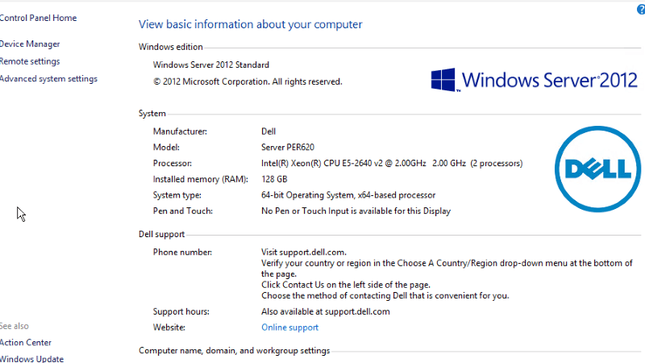 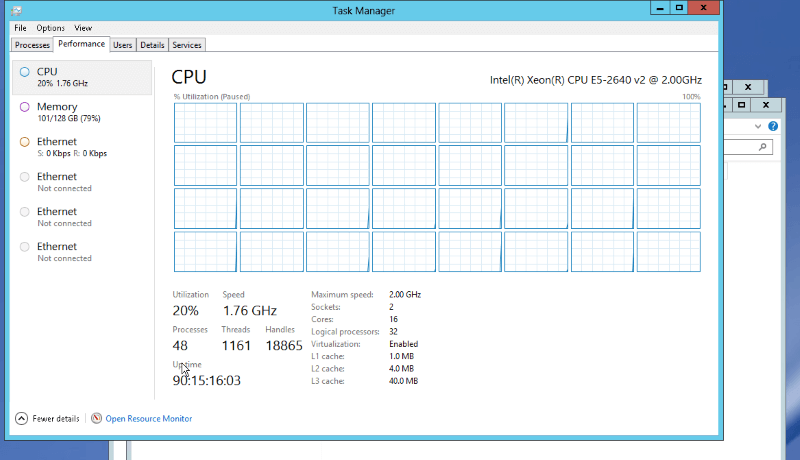

* 2 x 16 cores @ 2.00 GHz = 32 logical processors
* 128 GB RAM / 369 GB storage used for 141 DBs
* Microsoft SQL Server 2012 (SP4) Standard Edition (64-bit)

#### Server size recommended by Azure calculator
*Based on a representative sample of Server I performance log*
* S4 / 200 DTU
* 91.75% of the sample
* 9.25% throttling
* $1.18/hr
* $857 per month
* $10,284 per year

#### Server size based on our own assessment

* S6 / 400 DTU
* 99.89% of the sample
* 0.11% throttling
* $2.35/hr
* $1,715 per month
* $20,580 per year

**Single DB estimate**

This option is not directly applicable as we have multiple databases, but it is still an indication of expected performance.

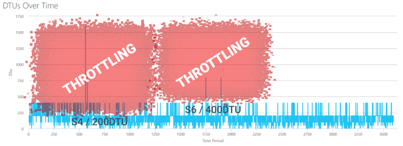

**Elastic Pool estimate**

*Elastic Pool* estimates are more complicated because there are [utilisation limitations](https://docs.microsoft.com/en-us/azure/sql-database/sql-database-elastic-pool#when-should-you-consider-a-sql-database-elastic-pool) per pool as well as per single database. An *Elastic Pool* works best when DBs have low average utilisation with high peaks. A constant high load requires a higher service tier than it may appear.

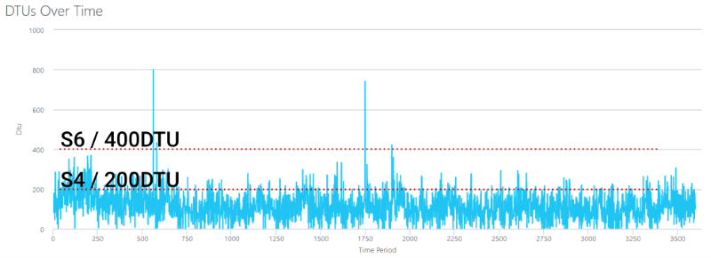

The following graph is a good example of the 80/20 rule with 20% of DBs (32 out of 146) creating 80% of the load. Although, it is obvious from the graph that *tempdb* is [overused](https://dba.stackexchange.com/questions/19870/how-to-identify-which-query-is-filling-up-the-tempdb-transaction-log).

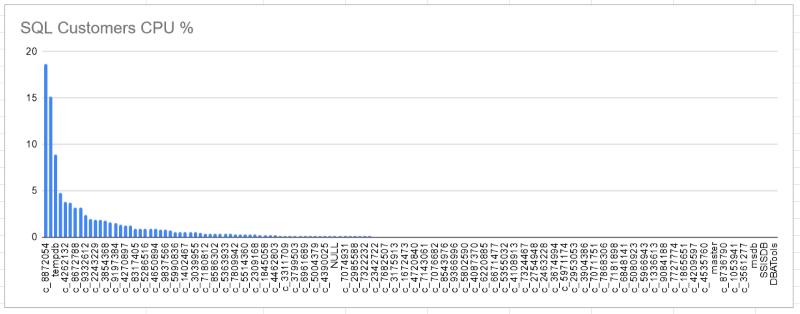

#### Utilisation breakdown

The optimal tier choice should be the one above 100% utilisation to maintain a comparable level of user experience. 

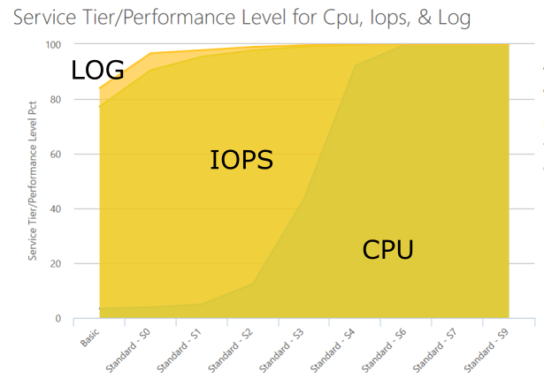

|        | *S4*   | *S6*   | *S7*   | *S9* |
|--------|--------|--------|--------|------|
| **CPU**  | 92.8%  | 100%   | 100%   | 100% |
| **IOPS** | 99.75% | 99.94% | 100%   | 100% |
| **LOG**  | 99.89% | 99.94% | 99.97% | 100% |
|       |*CPU throttling, will be noticeable*|*Minimal throttling, hardly noticeable*|*Full coverage*|*Full coverage with some to spare*|

### Performance improvements

It should be possible to optimise the current DB queries to fit all current customer DBs into a smaller server size without sacrificing the user experience.

* **Target size after improvements**: S4
* **Development cost**: ~ $3,000
* **Annual savings**: $10,000 (*$20k for S6 - $10k for S4*)

Only a small number of frequently called and poorly performing queries would need to be redesigned to get noticeable performance gains.

---

## Estimating SQL Server II: Shared DBs

This server contains databases used by front and back end apps, but they do not contain any customer data. Several databases contain replicas of some of customer data for a public facing website.

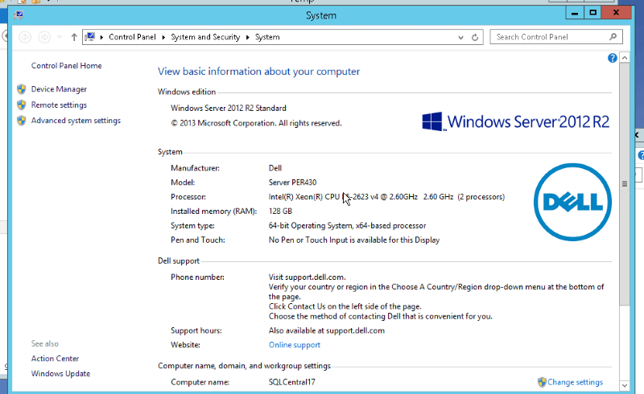 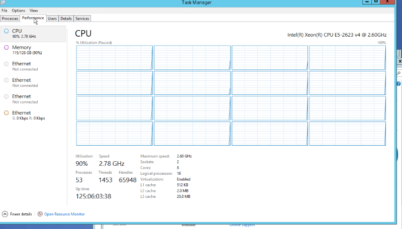

* 2 x 8 cores = 16 logical processors
* 128 GB RAM / 100 GB storage used for 43 DBs
* Microsoft SQL Server 2014 (SP2) Standard Edition (64-bit)

#### Server size recommended by Azure calculator
* S6 / 400 DTU
* 99.89% of the sample
* 0.11% throttling
* $2.35/hr
* $1,715 per month
* $20,580 per year

#### Server size based on a pessimistic assessment
* S7 / 800 DTU
* 99.89% of the sample
* 0.11% throttling
* $4.70/hr
* $3,431 per month
* $41,172 per year

S6 is ½ price of S7 and there is no in-between size. It may be possible to split these databases into 2 smaller pools for more optimal utilisation.

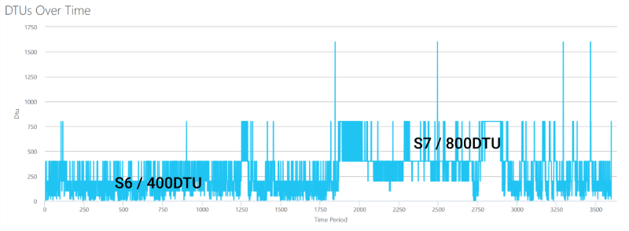

**Pool**

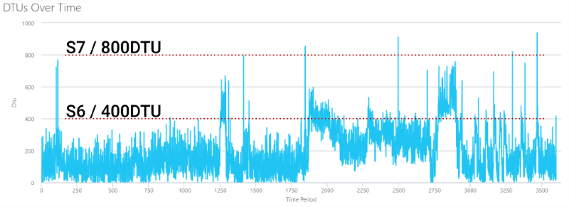

### Utilisation breakdown

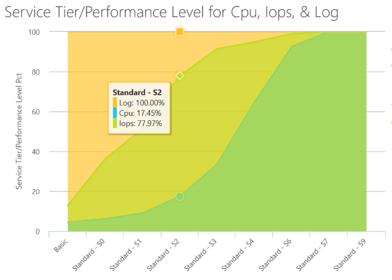 

| |S2 |S4 |S6 |S7 |
|---  |---  |---  |---  |---  |
|CPU|17.45%|64.63%|92.58%|100%|
|IOPS|77.97%|94.83%|98.89%|99.89%|
|LOG|100%|100%|100%|100%|
|Annual cost|$2,568|$10,284|$20,580|$41,172|
|Migrate as-is|Non-functional|Unusable|Some throttling, quite noticeable, errors|Minimal throttling, will be smoothed out|

### Performance improvements

* Target size if radical improvements are made: S2
* Target size if quick improvements are made: S4

Most of the queries on this server are *SELECT*. A single database *PBLLOCATION* dominates with 67.44% of workload for the public-facing website.

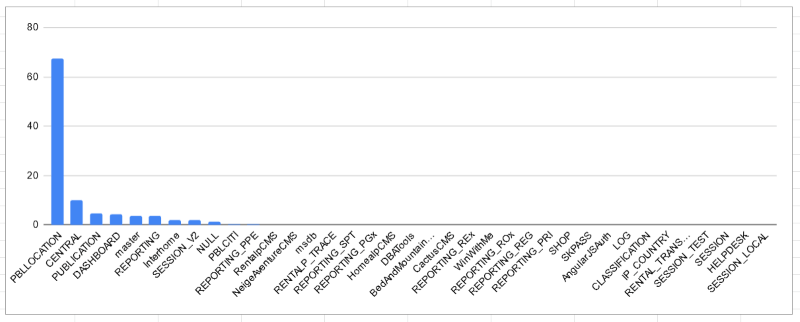

There are a few relatively simple changes that can be enacted on top of the current architecture to greatly reduce the load on the databases:

* Reduce the number of cross-DB queries ([Elastic Queries](https://docs.microsoft.com/en-us/azure/sql-database/sql-database-elastic-query-overview#preview-limitations))
* De-normalise the data model to reduce joins (more storage, but fewer and simpler queries)
* Re-arrange how the web pages are assembled
* Use caching, e.g. Azure Redis with 13GB costs only $150 a month

**Target size after improvements**: S4 ($857/m).

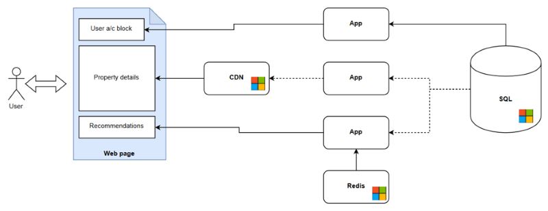

A more radical approach would be to replace the SQL databases with cheaper and more suitable technologies:

* Put all static objects behind a [CDN](https://azure.microsoft.com/en-us/services/cdn/)
* Use a [Redis](https://azure.microsoft.com/en-us/services/cache/) (or similar) cache for frequently queried data
* Use [ElasticSearch](https://azuremarketplace.microsoft.com/en-us/marketplace/apps/elastic.elasticsearch) in place of SQL DB for non-transactional data
* Limit SQL DB to being *the source of truth* and critical transactions

**Target pool size with newer architecture**: S2 ($214/m)

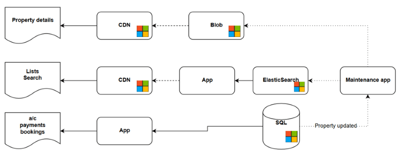
