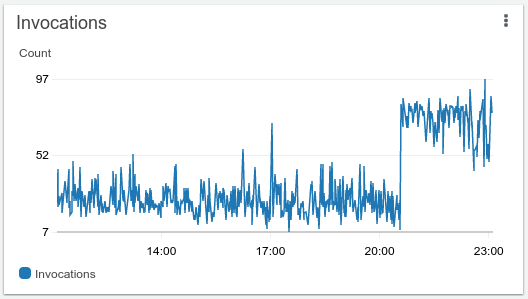
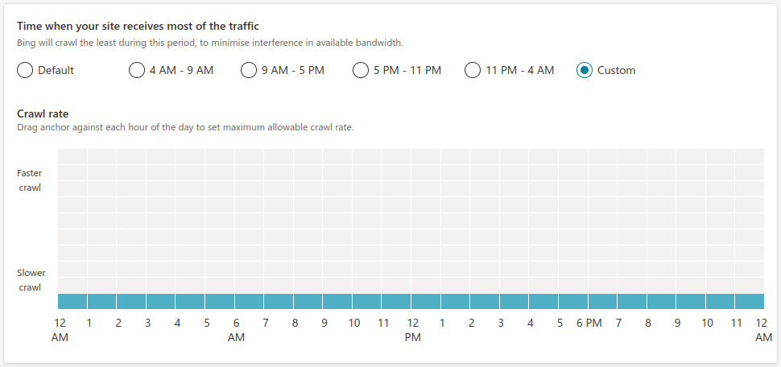
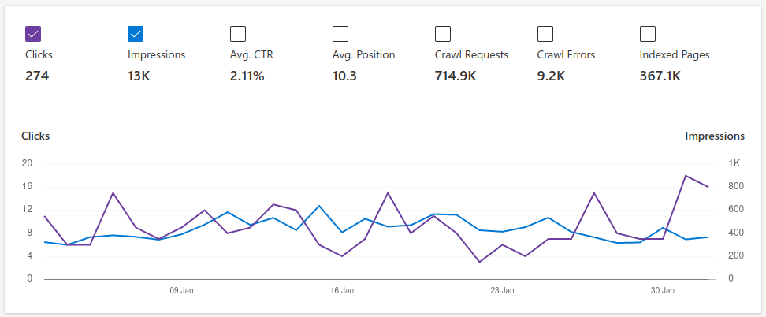
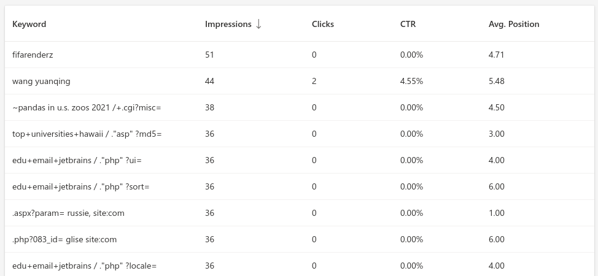
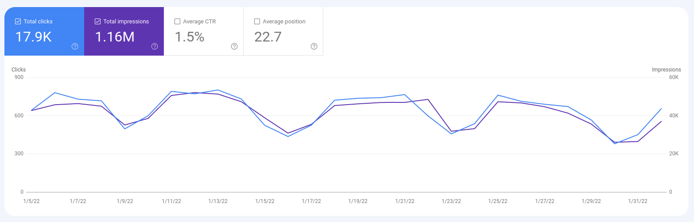
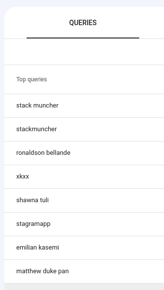
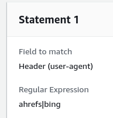

# I blocked Bing Web Crawler and you probably should too

#### Why letting bing.com to crawl your site is a waste of your resources

It all started after I updated `noindex` policy for my [Software Developer Directory project](https://stackmuncher.com). It increased the number of indexable pages by approximately 2,000,000. Incidentally, my AWS Lambda invocations that handle new queries before they are cached by the CDN doubled within minutes.



A quick look through the logs revealed the culprit: `Mozilla/5.0%20(compatible;%20bingbot/2.0;%20+http://www.bing.com/bingbot.htm)`.

It's the Bing Crawler!!!

## How to control BingCrawler

The official way to control Bing's crawling is via its [Webmaster Tools page](https://www.bing.com/webmasters/crawlcontrol). StackMuncher was already set to the minimal crawl level possible using their slider.

**There is actually no way to set the desired interval or any kind of absolute value**. Bing decides the crawling rate for itself depending on how big your site is and how often its content changes. In my case it turned out to be a 3s interval.


Some of the links Bing crawled generated quite a bit of overhead.

One may say that it is my fault that I publish links to expensive queries. In my defense, I still want them to be indexed, just over a longer period of time.

## The high cost and low value of Bing

I calculated that Bing cost me about $100 - $150 a month in AWS fees. What value did I get for that?



In the last 30 days I had 274 clicks from them. It came to 54c per click. That's 54c more than I would pay for the keywords they list StackMuncher under.



Anyone willing to pay 54c per click for `~pandas in u.s. zoos 2021 /+.cgi?misc=` keyword? No, me neither.

## Bing and Google compared

The number of StackMuncher pages in Google index is about the same as in Bing, yet, Google sends 45 times more traffic for much more relevant keywords.





OK, maybe StackMuncher isn't dominating some lucrative search category, but at least its own name is at the top of the keywords list. The rest of the keywords are GitHub profile names, which is what the site is about at the moment.


## How to block Bing

With no way of telling Bing Crawler to slow down my only other choice was to block it completely.

1. I updated my https://stackmuncher.com/robots.txt with this snippet and parsed it via [Bing's _robots.txt_ tester](https://www.bing.com/webmasters/robotstxttester):

```
User-agent: bingbot
Disallow: /

User-agent: msnbot
Disallow: /
```

4 hours after the change Bing continued hammering the site. If anything, it increased the crawling rate to 2 requests per second.

2. I had to do **the unpleasant task of completely blocking Bing** at the [firewall level](https://console.aws.amazon.com/wafv2/homev2/start?region=global).

It was not ideal because they would not be able to fetch _robots.txt_ ever, but what else can a webmaster do with a crawler that doesn't play by the rules?

I'd like to call out [AhrefsBot](https://ahrefs.com/robot) on this one as well. It keeps coming back for the URLs it indexed prior to me blocking it via _robots.txt_.

And there they are, *Ahrefs* and *Bing* sitting side by side in the "naughty crawlers corner" of my firewall blocking rules page.




## Collateral damage

DuckDuckGo uses Bing web index as [their main data source](https://help.duckduckgo.com/duckduckgo-help-pages/results/sources/). I guess the privacy-conscious web user will not find [StackMuncher](https://stackmuncher.com) there. Sorry.

