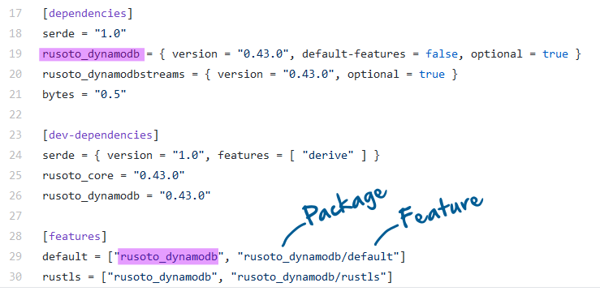

# Cargo [features] explained with examples
#### If you feel confused about all the intricacies of Cargo.toml *[features]* section you are not alone ([1](https://github.com/Geal/nom/issues/544),[2](https://github.com/chyh1990/yaml-rust/issues/44),[3](https://github.com/rust-lang/cargo/issues/4328)).

*First of all, I assume that you have already read the docs at https://doc.rust-lang.org/cargo/reference/features.html to get some foundation of what features are before going through these examples. I did read the docs first too, but they left me confused until days later when I had to go much deeper into the topic to make some crates work together. What I think was missing from the docs for me was more examples with explanations how they work. This post was written to fill that gap.*

#### What you will learn from this post


* What those cryptic feature definitions in Cargo.toml actually mean.
* How to find the full list of features for a dependency even if they are not listed in the docs.
* How `default_features` and `optional` attributes work.
* How features work across multiple levels of dependencies.


## How to find all features of a package

Crate docs can be very incomplete. Even if features are mentioned it's not always clear what they are for and how to use them. There is an easy way of finding out what features available and what may be behind them - check the *Cargo.toml* file of that package.

Consider this description of *features* in [serde_dynamodb](https://docs.rs/serde_dynamodb/0.5.0/serde_dynamodb/) crate:


If you check [the source](https://github.com/mockersf/serde_dynamodb/blob/0.5.0/serde_dynamodb/Cargo.toml) you'll notice that it fails to mention `rustls` feature altogether.

```
[dependencies]
rusoto_dynamodb = { version = "0.43.0", default-features = false, optional = true }

[features]
default = ["rusoto_dynamodb", "rusoto_dynamodb/default"]
rustls = ["rusoto_dynamodb", "rusoto_dynamodb/rustls"]
```
Checking the source Cargo.toml file revealed that there are actually 2 features: 
* `default`, which is a special Cargo keyword for when you do not specify any features as in `serde_dynamodb = "0.5"`
* `rustls`, which is only activated if specified as in `serde_dynamodb = { version="0.5", features=["rustls"]}`

So if we specify nothing (as in `serde_dynamodb = "0.5"`), the compiler will transform
```
rusoto_dynamodb = { version = "0.43.0", default-features = false, optional = true }
into
rusoto_dynamodb = { version = "0.43.0", default-features = true }
```

If we specify `serde_dynamodb = { version="0.5", features=["rustls"]}` the compiler will transform 
```
rusoto_dynamodb = { version = "0.43.0", default-features = false, optional = true }
into
rusoto_dynamodb = { version = "0.43.0", default-features = false, features=["rustls"] }
```
A feature definition can include a special notation to set features in a dependency:

* `"rusoto_dynamodb/default"` means set `default-features = true` for dependency `rusoto_dynamodb`
* `"rusoto_dynamodb/rustls"` means apply feature `rustls` to dependency `rusoto_dynamodb`



## default_features = false

`default_features` attribute enables or disables any defaults provided by the dependency.

For example, `some_core` package uses *OpenSSL* by default with *RustLS* implementation as an optional feature. *OpenSSL* and *RustLS* are mutually exclusive, so to enable *RustLS* we have to disable the defaults. Your Cargo.toml would have a line like this:
```
some_core = { version = "0.44", default_features = false, features=["rustls"] }
```
If we don't use `default_features = false` then the behavior of `some_core` is undetermined and will most likely fail at compile time. This will be discussed in more detail later.


The authors of *some_core* package could use [conditional compilation](https://doc.rust-lang.org/reference/conditional-compilation.html) to save us from having to remember to use `default_features = false`:
```
#[cfg(feature="rustls")]
fn use_rustls_here {
  ...
}

#[cfg(not(feature="rustls"))]
fn use_openssl_here {
  ...
}
```

## optional = true

`optional = true` attribute tells the compiler to include the dependency only if it is explicitly mentioned in one of the activated features. In the following example, *log* is always included, while *dynomite-derive* will only be included if your Cargo.toml requests *derive* feature as in `dynomite = {version = "*", features = ["derive"]}`.
```
[dependencies]
log = "0.4"
dynomite-derive = { version = "*", path = "../dynomite-derive", optional = true }

[features]
derive = ["dynomite-derive"]
```

## More example of Cargo [features]

Initially, features have to be declared in Cargo.toml of the package they are used in, that is, in your dependency. Then they are "referenced" in your Cargo.toml file to tell the dependency what you want from it.

Here is an abridged example of feature declarations from [Dynomite, a DynamoDB library](https://github.com/softprops/dynomite/blob/master/dynomite/Cargo.toml).

```
[dependencies]
log = "0.4"
dynomite-derive = { version = "0.8.2", path = "../dynomite-derive", optional = true }
rusoto_core_default = { package = "rusoto_core", version = "0.44", optional = true }
rusoto_core_rustls = { package = "rusoto_core", version = "0.44", default_features = false, features=["rustls"], optional = true }
rusoto_dynamodb_default = { package = "rusoto_dynamodb", version = "0.44", optional = true }
rusoto_dynamodb_rustls = { package = "rusoto_dynamodb", version = "0.44", default_features = false, features=["rustls"], optional = true }
uuid = { version = "0.8", features = ["v4"], optional = true }
chrono = { version = "0.4", optional = true }

[features]
default = ["uuid", "chrono", "rusoto_core_default", "rusoto_dynamodb_default"]
rustls = ["uuid", "chrono", "derive", "rusoto_core_rustls", "rusoto_dynamodb_rustls"]
derive = ["dynomite-derive"]
magic = []
```

That gives us a default and 3 optional features, `rustls`, `derive` and `magic`. You can use these features to tell Dynomite what you need from it in your project.

- *default* - activates if no feature is specified or even if another feature is specified without `default_features = false`. In the example above it lists the name of dependencies that should be included if this feature is activated.
- *rustls* - activates if your Cargo.toml has something like `dynomite = {version = "0.8.2", default-features = false, features = ["rustls"]}`. Its declaration includes a list of dependencies and another feature - `derive`. So if you specify  `features = ["rustls"]` it is the same as `features = ["rustls", "derive"]`
- *derive* - this feature references a single dependency `dynomite-derive`. No other conditional dependencies would be included if only *derive* was requested in your Cargo.toml.
- *magic* - this feature does not reference anything. It can only be used for conditional compilation with `#[cfg(feature="magic")]`


**If your Cargo.toml** had `dynomite = {version = "0.8.2"}` it would tell the compiler to use all unconditional dependencies (*log*) and those listed in *default* feature declaration:
```
log = "0.4"
rusoto_core_default = { package = "rusoto_core", version = "0.44", optional = true }
rusoto_dynamodb_default = { package = "rusoto_dynamodb", version = "0.44", optional = true }
uuid = { version = "0.8", features = ["v4"], optional = true }
chrono = { version = "0.4", optional = true }
```

**If your Cargo.toml** had `dynomite = {version = "0.8.2", default-features = false, features = ["derive"]}` it would tell the compiler you only want *derive* and none of the defaults:
```
log = "0.4"
dynomite-derive = { version = "0.8.2", path = "../dynomite-derive", optional = true }
```
If you didn't specify `default-features = false` all the default features would still be included. 

**If your Cargo.toml** had: `dynomite = {version = "0.8.2", default-features = false, features = ["rustls"]}` it would tell the compiler you want everything from *rustls* feature, which also includes *derive* feature:
```
log = "0.4"
dynomite-derive = { version = "0.8.2", path = "../dynomite-derive", optional = true }
rusoto_core_rustls = { package = "rusoto_core", version = "0.44", default_features = false, features=["rustls"], optional = true }
rusoto_dynamodb_rustls = { package = "rusoto_dynamodb", version = "0.44", default_features = false, features=["rustls"], optional = true }
uuid = { version = "0.8", features = ["v4"], optional = true }
chrono = { version = "0.4", optional = true }
```

## Dependency of a dependency: beware that features are "additive"

Cargo takes the union of all features enabled for a crate throughout the dependency graph. If multiple crates enable *mutually exclusive* features of another crate, then all those features will be enabled at build time. The result of that would depend on the implementation of the crate and may result in a compiler error if mutually exclusive crates or features are enabled.

An example of this type of dependency would be *Crate X* that depends on *Crates A* and *Crate B*, while both *A* and *B* depend on *Crate awesome*.
```
       Crate X
      /        \
Crate A        Crate B
      \        /
    Crate awesome
```

In the following example both `go-faster` and `go-slower` features will be enabled in crate `awesome`. It will be up to that crate to decide which of the two features prevails.

- Crate `awesome`:
```
[features]
"go-faster" = []
"go-slower" = []
```
- Crate A: `awesome = { version = "1.0", features = ["go-faster"] }`
- Crate B: `awesome = { version = "1.0", features = ["go-slower"] }`

Consider a more complicated example with three possible configurations for `some_core` dependency.

- Crate `awesome `:
```
[dependencies]
some_core_default = { package = "some_core", version = "0.1" }
some_core_openssl = { package = "some_core", version = "0.1", default_features = false, features=["openssl"], optional = true }
some_core_rustls = { package = "some_core", version = "0.1", default_features = false, features=["rustls"], optional = true }

[features]
default = ["some_core_default"]
openssl = ["some_core_openssl"]
rustls = ["some_core_rustls"]
```

The following combination will make crate `awesome ` depend on `some_core_rustls` because the resulting tree includes `default-features = false,  features = ["rustls"]` which overrides the default:
- Crate A:  `awesome = { version = "1.0" }`
- Crate B: `awesome = { version = "1.0", default-features = false,  features = ["rustls"]` }`

Removing `default-features = false` results in a compilation error because the same `some_core` dependency is included twice. Once via `default` and once via `rustls`:
- Crate A:  `awesome = { version = "1.0" }`
- Crate B: `awesome = { version = "1.0", features = ["rustls"] }`

The following combination will also result in the same compilation error because package `some_core` is included twice via `some_core_openssl` and `some_core_rustls`:
- Crate A:  `awesome = { version = "1.0", default-features = false, features = ["openssl"] }`
- Crate B: `awesome = { version = "1.0", default-features = false, features = ["rustls"] }`

## Useful links

* https://www.reddit.com/r/rust/comments/7o7ov7/can_someone_explain_how_features_work_in_cargo/
* https://doc.rust-lang.org/cargo/reference/specifying-dependencies.html
* https://doc.rust-lang.org/cargo/reference/features.html
* https://github.com/rust-lang/cargo/issues/4328
* https://stackoverflow.com/questions/59761045/how-to-tell-what-features-are-available-per-crate
* https://stackoverflow.com/questions/40021555/how-do-i-pass-down-feature-flags-to-subdependencies-in-cargo
* https://doc.rust-lang.org/reference/conditional-compilation.html
* https://github.com/mockersf/serde_dynamodb/blob/0.5.0/serde_dynamodb/Cargo.toml
* https://github.com/softprops/dynomite/blob/master/dynomite/Cargo.toml