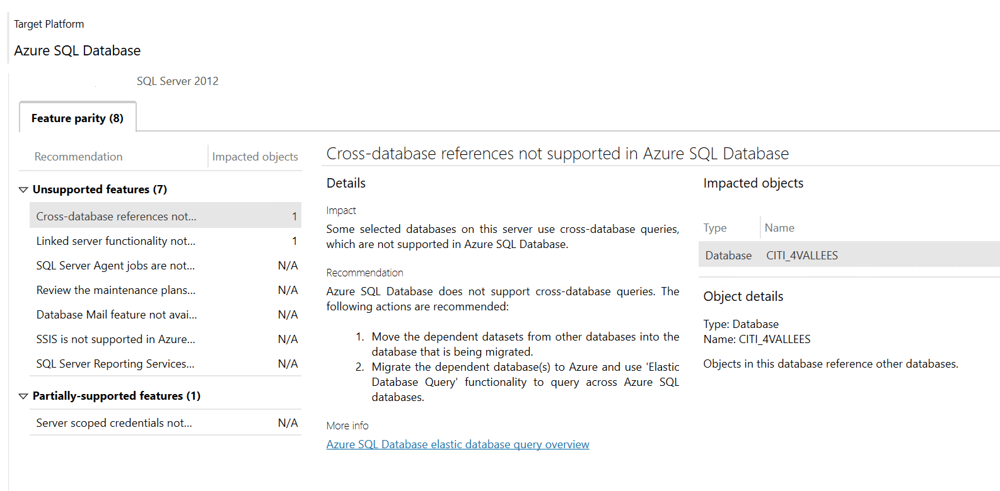
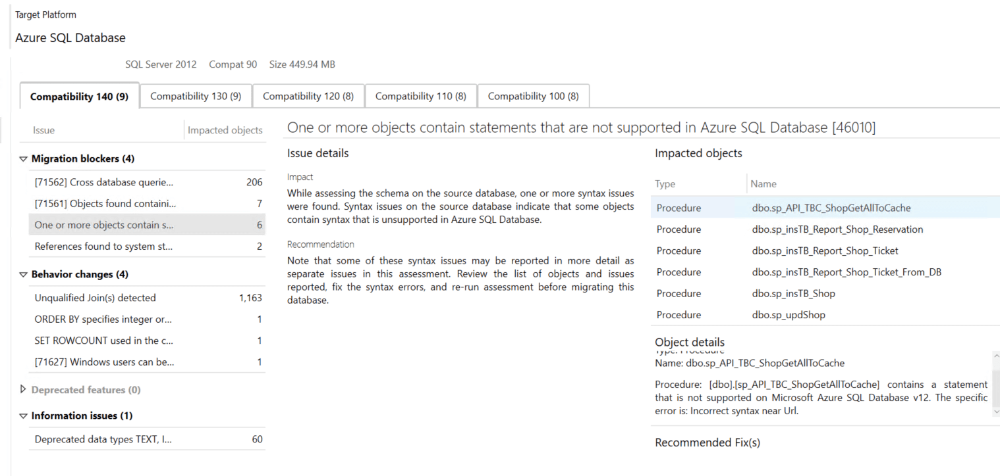
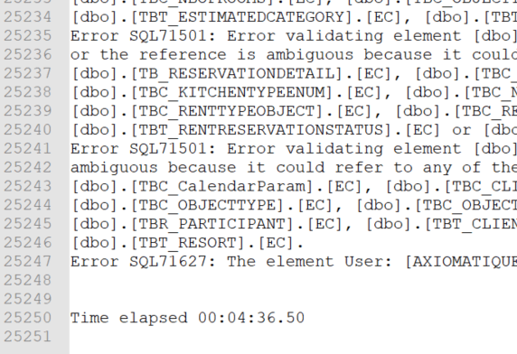
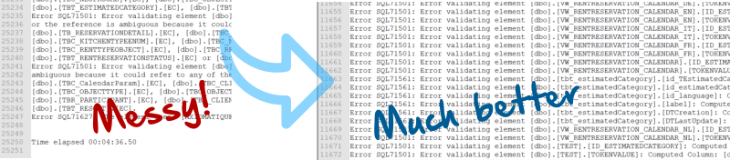

# Cloud migration assessment with Microsoft DMA and SqlPackage tools

#### A brief guide for anyone tasked with estimating migration cost from on-prem to Azure SQL


---

In theory, Azure SQL is a cloud version of MS SQL server. In practice, there are numerous limitations and incompatibilities with MS SQL we are used to running on our own servers.

The quickest and easiest way of assessing the compatibility of your MS SQL DB with Azure SQL is to use [Database Migration Assistant](https://docs.microsoft.com/en-us/sql/dma/dma-overview) (DMA) tool by Microsoft. It can connect to your database and produce a detailed report within minutes.



DMA is good at providing an overview of compatibility issues, but the UI doesn't make it easy to look deeper into the details of individual issues. The only other viewing option is a JSON report file that is not easy to parse.



## Using SqlPackage as a DMA alternative

[SqlPackage](https://docs.microsoft.com/en-us/sql/tools/sqlpackage) is a cross-platform command-line utility that can be used to get a different view of the compatibility issues. Its main purpose is to export MS SQL databases into `bacpac` format for importing into Azure SQL, but its error reporting can be used for estimating compatibility issues as well.

The utility was written in .Net and can be run on Win, Mac and Linux with just one line:

`sqlpackage.exe /Action:Export /ssn:127.0.0.1 /su:sa /sp:sapwd /sdn:test_db /tf:test_db.bacpac`

At first glance, the output of *SqlPackage* may look gibberish. There were definitely many compatibility issues in this example, but the format of the output was not any more useful than with the *DMA tool*.


Viewing the output in *Notepad++* makes it a bit clearer, but not clear enough to make sense of it. In my case, I stood little chance of getting any useful info from 25,000 lines of very dense and repetitive error messages.



### Prettifying the output

Unfortunately, *SqlPackage* tool has a problem with large error reports. They come out with broken lines and are hard to parse. There is a simple way to fix the problem in a text editor like *Notepad++*:

1. Remove the summary info at the top and bottom of the file.
2. Replace all new lines with a single space.
3. Replace `Error SQL` with `\nError SQL`.

Your document should have one error message per line after the replacement. For example, my 25,000 lines shrunk to "just" 11,673 lines of very repetitive error messages, so the next logical step would be to find some patterns.



### Resolving incompatibility issues

My key questions for estimating the extent of incompatibilities were:
1. How many tables, views, procedures and other objects are affected?
2. What are the common issues?
3. Can they be fixed by automatically refactoring the code?

#### Q1: What objects are affected?

Applying this regex `Error[^\[]*(\[[^\]]+\]\.\[[^\]]+\])` to the error report converted long verbose messages like

```
Error SQL71561: Error validating element [dbo].[tbt_estimatedCategory].[label]: Computed Column: [dbo].[tbt_estimatedCategory].[label] has an unresolved reference to object [CITI_CENTRAL].[dbo].[tbt_estimatedCategory].[label]. External references are not supported when creating a package from this platform.
```

into a relatively clean list of affected object names

```
[dbo].[VW_RENTRESERVATION_CALENDAR]
[dbo].[VW_RENTRESERVATION_CALENDAR]
[dbo].[tbt_estimatedCategory]
[dbo].[tbt_estimatedCategory]
[dbo].[tbt_estimatedCategory]
[dbo].[tbt_estimatedCategory]
[dbo].[tbt_estimatedCategory]
[dbo].[tbt_estimatedCategory]
[dbo].[VW_RENTRESERVATION_CALENDAR_NL]
```

which can be further de-duped to a unique list of object names that need attention

```
VW_RENTRESERVATION_CALENDAR
tbt_estimatedCategory
VW_RENTRESERVATION_CALENDAR_NL
```

#### Q2: What are the common issues?

I used a very unscientific method of scrolling up and down the report and running some keyword searches trying to identify common issues. A clear pattern emerged within a few minutes:

* cross-DB references
* references to non-existent table columns from view definitions
* references to other non-existent objects like functions and SPs

The references to **non-existent columns and functions** may sound strange, but there is a high chance that schema changes have accumulated over the lifetime of the system. MS SQL allows objects to be dropped without checking their dependents, unless [WITH SCHEMA BINDING](https://www.mssqltips.com/sqlservertip/4673/benefits-of-schemabinding-in-sql-server/) option was specified. 

Identifying objects with broken references is actually good news. If we know that a certain object has been broken in production for a long time and no one complained it is probably no longer used and can be marked for deletion.

#### Q3: What code can be refactored automatically?

That question is difficult to answer by looking at the list of issues alone. Some familiarity with the source code is required. 

The difficulty of estimating refactoring is that 500 identical code changes can be fixed within minutes with global search-and-replace while a small number of unique issues may take days of work. Removing the repeating errors identified in the previous step from the list will leave only less common problems for further investigation.


### Estimation multiplier

Remember to include testing, staging and DevOps changes into your estimate. A shortcut for that can be to [quadruple the initial estimate](https://en.wikipedia.org/wiki/Pareto_principle).

----

## Data Migration Assistant vs. SQL Package comparison

In short, both tools are complimentary of each other and I recommend using both.

### DMA
* more issue types covered
* recommendations
* summary per type of issue
* detailed info is hard to extract
* many of the problems are just "warnings" and do not affect the migration as such
* [doesn't work with the latest MS SQL (2019)](https://social.msdn.microsoft.com/Forums/sqlserver/en-US/6a4a6106-7335-4e39-aa56-65c20c90df53/upgrade-advisory-report-failure-on-sql-server-2019) as the source

### SqlPackage

* lists only inconsistencies in the schema and code that prevent it from exporting the DB
* the output is easier to parse than the JSON report from DMA
* no recommendations are included in the report
* not concerned with the quality of the code
* not concerned with issues that will arise after the migration

#### Watch out for deprecated data types 

DMA puts deprecated data types like `text`, `ntext` and `image` into *warnings* section. You can still migrate those to AZ as-is, but expect some of the code to fail where those types are involved. We had to completely eliminate them from all our parameters in functions and procedures. *Text* became *nvarchar(max)* and *image* became *varbinary(max)*.
