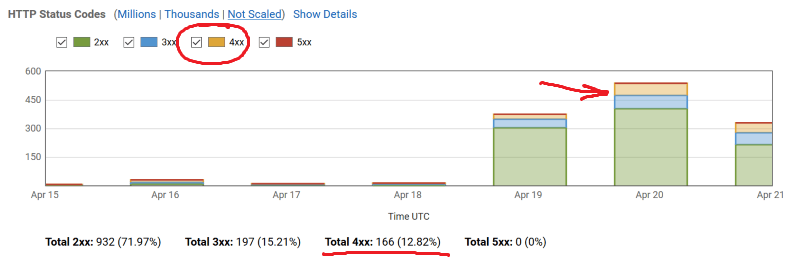
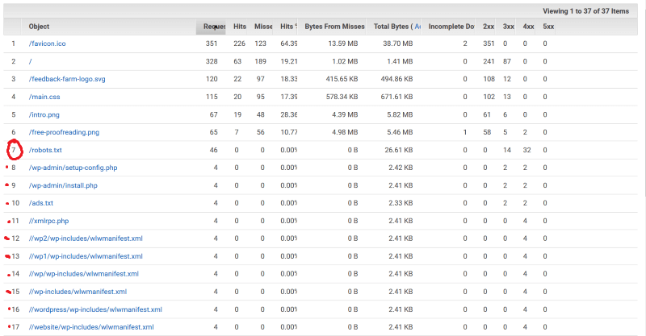

# Replacing Google Analytics with CloudFront metrics
#### A detailed look at AWS website monitoring tools built into AWS CloudFront

I had to build a landing page to validate a [free proofreading community](https://feedback.farm) idea a few days ago. It was just a single page with 2 images and an email sign up form. The easiest hosting option was [AWS S3 + CloudFront + Route53](https://dev.to/jillesvangurp/using-cloudfront-s3-and-route-53-for-hosting-395o). I decided not to add the obligatory Google Analytics JS tracker and rely on the analytics provided by CloudFront. 

Here is what I found a few days later when the data started coming in ...

## CloudFront Logging

The logs were written into a separate S3 bucket in [W3C format](https://www.w3.org/TR/WD-logfile.html). There were standard W3C fields like `date`, `time`, `sc-bytes`, `c-ip` and `cs(Referer)` as well as AWS-specific fields like `x-edge-location` or `x-edge-result-type`. For example, the 3rd column in the snippet below is an extended field with a name of the AWS edge location the content was served from. It's kind of cool to know, but it doesn't tell us much about our visitors.

```
#Version: 1.0
#Fields: date time x-edge-location sc-bytes c-ip cs-method cs(Host) cs-uri-stem sc-status cs(Referer) cs(User-Agent) cs-uri-query cs(Cookie) x-edge-result-type x-edge-request-id x-host-header cs-protocol cs-bytes time-taken x-forwarded-for ssl-protocol ssl-cipher x-edge-response-result-type cs-protocol-version fle-status fle-encrypted-fields c-port time-to-first-byte x-edge-detailed-result-type sc-content-type sc-content-len sc-range-start sc-range-end
2020-04-19	05:33:36	IAD89-C3	100094	34.227.59.34	GET	dvvs5hy178tti.cloudfront.net	/intro.png	200	https://feedback.farm/	Mozilla/5.0%20(compatible;%20redditbot/1.0;%20+http://www.reddit.com/feedback)	-	-	Miss	8ipYDNH0CvV2lqANkkL9hkCf8fqEwImPf5eXkplC92knzEvPk2OhqA==	feedback.farm	https	190	0.060	-	TLSv1.2	ECDHE-RSA-AES128-GCM-SHA256	Miss	HTTP/1.1	-	-	25329	0.057	Miss	image/png	99641	-	-
2020-04-19	05:33:43	IAD89-C3	6493	54.211.21.183	GET	dvvs5hy178tti.cloudfront.net	/	200	-	Mozilla/5.0%20(compatible;%20redditbot/1.0;%20+http://www.reddit.com/feedback)	-	-	Hit	OH_XrRls6xYVxO85em0bS5g8Q1OUjgo6OZjew0SEZnPk01oV3pa17g==	feedback.farm	https	148	0.000	-	TLSv1.2	ECDHE-RSA-AES128-GCM-SHA256	Hit	HTTP/1.1	-	-	23242	0.000	Hit	text/html	6034	-	-
2020-04-19	05:33:43	IAD89-C3	4780	54.211.21.183	GET	dvvs5hy178tti.cloudfront.net	/feedback-farm-logo.svg	200	https://feedback.farm/	Mozilla/5.0%20(compatible;%20redditbot/1.0;%20+http://www.reddit.com/feedback)	-	-	Hit	hnJ4onLxGD95WKnlattdD5dtTZvQm6jw8QrlhOr4_-2UChLFIOj2LQ==	feedback.farm	https	207	0.001	-	TLSv1.2	ECDHE-RSA-AES128-GCM-SHA256	Hit	HTTP/1.1	-	-	23242	0.000	Hit	image/svg+xml	4317	-	-
2020-04-19	05:33:43	IAD89-C3	100101	54.211.21.183	GET	dvvs5hy178tti.cloudfront.net	/intro.png	200	https://feedback.farm/	Mozilla/5.0%20(compatible;%20redditbot/1.0;%20+http://www.reddit.com/feedback)	-	-	Hit	JeD6TX99dgXzCWRqJorXQQKMCNNNKVKvch96_zI9SbPywMc5j63Trg==	feedback.farm	https	190	0.001	-	TLSv1.2	ECDHE-RSA-AES128-GCM-SHA256	Hit	HTTP/1.1	-	-	23242	0.000	Hit	image/png	99641	-	-
2020-04-19	05:33:44	IAD89-C1	6486	52.91.40.117	GET	dvvs5hy178tti.cloudfront.net	/	200	-	Mozilla/5.0%20(Macintosh;%20Intel%20Mac%20OS%20X%2010_11_6)%20AppleWebKit/537.36%20(KHTML,%20like%20Gecko)%20Chrome/55.0.2883.95%20Safari/537.36Mozilla/5.0%20(Macintosh;%20Intel%20Mac%20OS%20X%2010_11_6)%20AppleWebKit/602.1.50%20(KHTML,%20like%20Gecko)%20Version/10.0%20Safari/602.1.50	-	-	Miss	ncpijEZfVmXmsv2p-1lfHARFojMe6r6GO_oeCdCdptd2-sTKz73GbQ==	feedback.farm	https	359	0.067	-	TLSv1.2	ECDHE-RSA-AES128-GCM-SHA256	Miss	HTTP/1.1	-	-	21925	0.067	Miss	text/html	6034	-	-
2020-04-19	05:33:36	IAD89-C3	6486	34.227.59.34	GET	dvvs5hy178tti.cloudfront.net	/	200	-	Mozilla/5.0%20(compatible;%20redditbot/1.0;%20+http://www.reddit.com/feedback)	-	-	Miss	5yy5mvCOVahhak4WS211xpAuuBU8mOiPtPWys76VtLRoXTRGEdccag==	feedback.farm	https	148	0.090	-	TLSv1.2	ECDHE-RSA-AES128-GCM-SHA256	Miss	HTTP/1.1	-	-	23294	0.090	Miss	text/html	6034	-	-
2020-04-19	05:33:36	IAD89-C3	4773	34.227.59.34	GET	dvvs5hy178tti.cloudfront.net	/feedback-farm-logo.svg	200	https://feedback.farm/	Mozilla/5.0%20(compatible;%20redditbot/1.0;%20+http://www.reddit.com/feedback)	-	-	Miss	l4I3HRzYzQMO-L9jjPmnwU4KN3gxRH3TofGhSVSe_BL5ZQMsxsD91A==	feedback.farm	https	207	0.062	-	TLSv1.2	ECDHE-RSA-AES128-GCM-SHA256	Miss	HTTP/1.1	-	-	23294	0.061	Miss	image/svg+xml	4317	-	-
2020-04-19	05:33:36	IAD89-C3	100094	34.227.59.34	GET	dvvs5hy178tti.cloudfront.net	/intro.png	200	https://feedback.farm/	Mozilla/5.0%20(compatible;%20redditbot/1.0;%20+http://www.reddit.com/feedback)	-	-	Miss	FCkjm18IZ9wLRYrLkVZa1H0eWShTKlzk2XWxy0nOZbqEIF01Twx7Bw==	feedback.farm	https	194	0.080	-	TLSv1.2	ECDHE-RSA-AES128-GCM-SHA256	Miss	HTTP/1.1	-	-	23294	0.078	Miss	image/png	99641	-	-
2020-04-19	05:33:44	SEA19-C1	574	52.42.250.87	GET	dvvs5hy178tti.cloudfront.net	/	301	-	Dispatch/0.11.1-SNAPSHOT	-	-	Redirect	XeBnr1zJn88qxAWu5NzqPwugYnmpyO2LsRSqR4Pn1Iw2mczK4FO2VA==	feedback.farm	http	109	0.000	-	-	-	Redirect	HTTP/1.1	-	-	17264	0.000	Redirect	text/html	183	-	-
2020-04-19	05:33:43	ORD53-C3	447	208.79.208.172	HEAD	dvvs5hy178tti.cloudfront.net	/	200	-	Mozilla/5.0%20(X11;%20Linux%20x86_64)%20AppleWebKit/537.36%20(KHTML,%20like%20Gecko)%20Ubuntu%20Chromium/72.0.3626.121%20Chrome/72.0.3626.121%20Safari/537.36	-	-	Miss	DRujIjx9qV_VXh_h3CJhvsh6MVSNxeN5VtpXhEZwxd6ND1C72VMWlw==	feedback.farm	https	208	0.165	-	TLSv1.2	ECDHE-RSA-AES128-GCM-SHA256	Miss	HTTP/1.1	-	-	42355	0.165	Miss	text/html	6034	-	-
2020-04-19	05:33:43	LHR50-C1	6486	185.20.6.41	GET	dvvs5hy178tti.cloudfront.net	/	200	-	Mozilla/5.0%20(TweetmemeBot/4.0;%20+http://datasift.com/bot.html)%20Gecko/20100101%20Firefox/31.0	-	-	Miss	jRkF9NJeHpzk8HIybbEop-XKcFL92P_evRF0UKcgZl1CydJCe1h84A==	feedback.farm	https	243	0.437	-	TLSv1.2	ECDHE-RSA-AES128-GCM-SHA256	Miss	HTTP/1.1	-	-	41400	0.437	Miss	text/html	6034	-	-
2020-04-19	05:33:36	IAD89-C3	6485	18.234.93.156	GET	dvvs5hy178tti.cloudfront.net	/	200	-	Mozilla/5.0%20(Windows%20NT%206.1;%20WOW64)%20AppleWebKit/537.36%20(KHTML,%20like%20Gecko)%20Chrome/45.0.2454.85%20Safari/537.36	-	-	Hit	YOfmAegVa1Kz-KdhRIXcqhx5yzjyyPZTZY84Ja2rUUKpABTSh6b-Hw==	feedback.farm	https	301	0.001	-	TLSv1.2	ECDHE-RSA-AES128-GCM-SHA256	Hit	HTTP/1.1	-	-	52041	0.000	Hit	text/html	6034	-	-
```

## CloudFront Reports

Log-based reports go into more technical details ([caching](https://docs.aws.amazon.com/AmazonCloudFront/latest/DeveloperGuide/cache-statistics.html) and [usage](https://docs.aws.amazon.com/AmazonCloudFront/latest/DeveloperGuide/usage-charts.html)) of how a resource was served, if it was in the cache, bytes transferred and other info of interest to sysadmins. Still, not much information about the visitors, but at least we can see the number of hits and some errors.

AWS updates the graphs every hour or so, but they warn us there may be delays up to 24hrs.

#### Caching graphs





#### Usage graphs

Usage reports look very similar to caching reports, but have a different level of detail. They are good for matching the usage data with AWS billing to optimize the monthly cost.


Did you notice **HTTP Status Codes graph** had a surprisingly high number of 404 errors for such a small website?

**Popular Objects** report contained the answer: missing `robots.txt` and bots trying to hack the non-existent WordPress.



## Real-time monitoring

[CloudFront connects to CloudWatch](https://docs.aws.amazon.com/AmazonCloudFront/latest/DeveloperGuide/monitoring-using-cloudwatch.html) to display real-time performance of the distribution (i.e. the website), which is useful for troubleshooting, but again, not much info about our visitors.


## Alarms

CloudFront links directly to [CloudWatch alarms](https://docs.aws.amazon.com/AmazonCloudWatch/latest/monitoring/AlarmThatSendsEmail.html). I configured an alarm to remind me if 404 errors go beyond a certain threshold in case I update the page with a broken image or script reference.


## Viewer metrics

[**Top Referrers report**](https://docs.aws.amazon.com/AmazonCloudFront/latest/DeveloperGuide/top-referrers-report.html) shows where the viewers came from, but you can't drill any further into that data. For example, I would like to know what pages they came from, not just from what domain.


There are only four charts with visitor information: *Devices*, *Browsers*, *Operating Systems* and *Locations*. They are very superficial - you cannot drill down into the data. What you see in the screenshots here is how granular it gets.


## Google Analytics dashboard

I'd guess that most readers here are familiar with Google Analytics (GA), so I will only remind you what that dashboard looks like with a single screenshot.


* The depth of detail in GA is many times better than what we get from CloudFront charts and reports. 
* GA has many more metrics and insights than CloudFront.

These GA menus list only a subset of all the GA views, compared to 4 views in CloudFront:


## Conclusion

CloudFront metrics are a poor replacement choice for Google Analytics. It was a mistake to omit the client-side tracker and I will be adding GA to my [Feedback Farm](https://feedback.farm) experiment shortly.

Saying that, I would still recommend enabling CloudFront metrics alongside a JS tracker, of which there is now [quite a choice](https://github.com/onurakpolat/awesome-analytics).