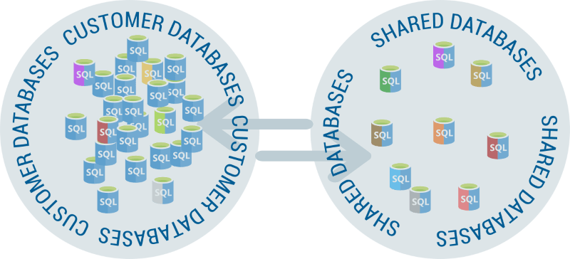
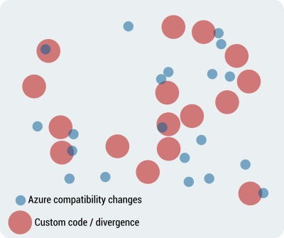
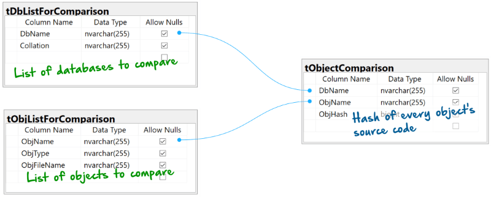
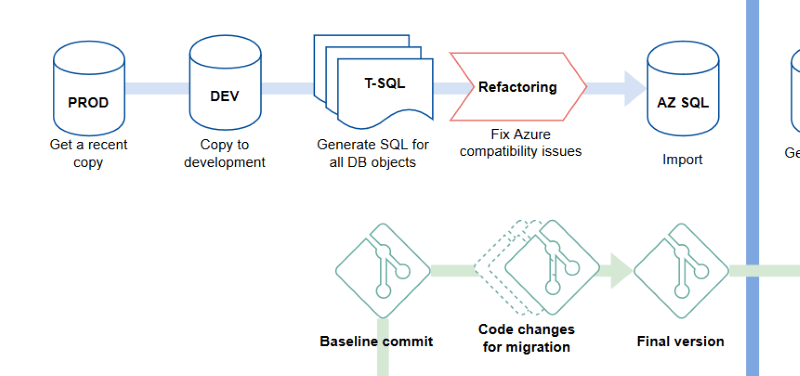
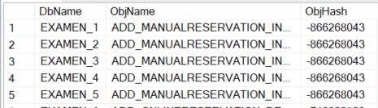
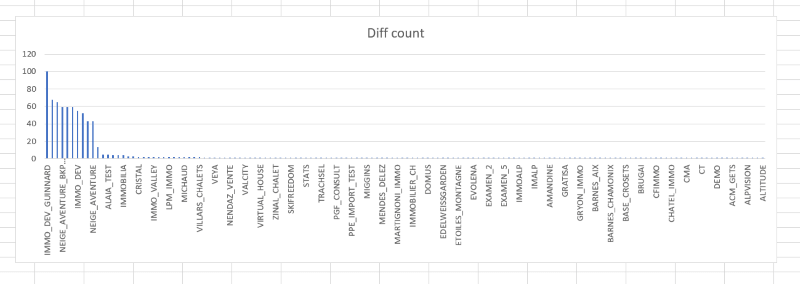
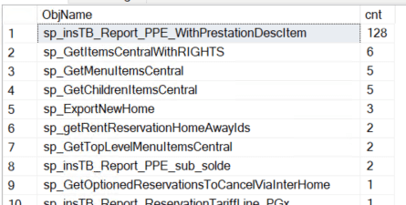
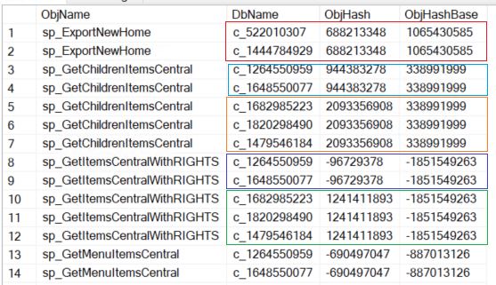

# A quick guide to comparing multiple customer DBs for cloud migration
#### If you think your customer DBs codebase is identical, what are the odds it isn't?

*Anyone working on a cloud migration of a system with one DB per customer will come to a point where knowing if the DBs are actually identical becomes critical. This guide offers one way of solving this problem with a few lines of code.* 




In my case all customer DBs were **supposed to be identical**, but we decided to check. I can think of some common reasons why the codebase may diverge: 

1. Customer-specific code was introduced over the lifetime of the system
2. Some DBs didn't get updated because of DevOps failures
3. New untracked changes have been introduced since the start of the migration

My task was to **identify all changes since the beginning of the migration project** and find the most optimal way of merging any divergent code.

Let's divide all SQL code into 3 categories:

* The code shared by all DBs in the production snapshot before migration changes (*grey*)
* Changes made for Azure compatibility (*red*)
* Small differences between individual customer DB (*blue*)



*For the purpose of cloud migration we are only interested in the overlap of Azure changes and the individual differences (blue over red).*

### Data to collect

1. The list of customer DBs
2. The list of objects changed for migration
3. Source code for those objects from all customer DBs

It should then be trivial to compare the source code if we have it all in one place.



Create these three tables:

```sql
-- A table to hold hashes for all objects
if exists (select 1 from sys.tables where [name] = 'tObjectComparison') drop table tObjectComparison
GO
create table tObjectComparison (
DbName nvarchar(255),
ObjName nvarchar(255),
ObjHash bigint
)
GO

-- A list of DBs to include in the search
if exists (select 1 from sys.tables where [name] = 'tDbListForComparison') drop table tDbListForComparison
GO
create table tDbListForComparison (
DbName nvarchar(255),
Collation nvarchar(255) -- checksum over different collations will produce different results !!!
)
GO

-- A list of objects to include in the search
if exists (select 1 from sys.tables where [name] = 'tObjListForComparison') drop table tObjListForComparison
GO
create table tObjListForComparison (
ObjName nvarchar(255),
ObjType nvarchar(255),
ObjFileName nvarchar(255)
)
GO
```

**Getting the list of objects** (SPs, UFNs and Views ) is done through the Git repository. This script assumes that your very first commit is the original state of the snapshot DB before migration and the very last commit (HEAD) is what should be migrated to AZ.



Let's clear some **naming confusion**.

* *Base Snapshot DB* - a copy of a customer production DB taken while ago to work on for migration.
* *Customer DB* - a copy of the most recent customer DB from production.
* *AZ Import DB* - a modified copy of *Base Snapshot DB* that can be imported into Azure.

**The ultimate goal** is to bring all customer DBs to the importable state. They may or may not be identical to *AZ import DB*, depending on the code divergence.

#### For the purpose of this exercise we will be comparing our *Base Snapshot DB* to all *Customer DBs* one by one.

This script compares the *baseline commit* with the *final, importable version* and **generates the list of objects** (those colored *red* in the bubble diagram) as SQL *insert* statements for *tObjectComparison* table:

```powershell
# get the ID of the initial commit
$allCommits = git rev-list HEAD
$initialCommit = $allCommits.split()[-1]
# get list of all modified files
$modFiles = git diff --name-only $initialCommit HEAD
# generate an insert per file
$modFiles.split() | ForEach-Object {
  if ($_ -match "[^\.\s]+\.([^\.]+)\.([^\.]+)\.sql") {
    "insert into tObjListForComparison (ObjName, ObjType, ObjFileName) values ($($Matches.1), $($Matches.2), $_)"
    # $_ - a built-in var for the current object in the loop
    # $($Matches.1) - the extra $ wrapper is needed to convert the hash table to string
  }
}
```
In our case there were 199 *insert* statements in the output, similar to this example:

```sql
insert into tObjListForComparison (ObjName, ObjType, ObjFileName) values ('TEST', 'View', 'dbo.TEST.View.sql')
```

Run the *insert* script to get the data into *tObjectComparison*.

**Our SQL server with all the customer DBs had some other non-customer DBs**, so we had to deduct which ones were *"customers"* and which ones should be ignored by getting them all in and then removing those that shouldn't be there: 

```sql
truncate table tDbListForComparison
-- get all the DBs hosted by this server
insert into tDbListForComparison select [name], collation_name, null from master.sys.databases order by 2

-- remove DBs that are obviously not "customers"
delete from tDbListForComparison where DbName in ('master', 'model', 'model', 'msdb', 'tempdb', 'ReportServer', 'ReportServerTempDB')
```

After running this script you may still have some "non-customer" DBs lurking in the list. Ignore that for now.

Let's collect all the source code in table *tObjectComparison*. We don't actually need the source code as text, so we'll [hash it](https://docs.microsoft.com/en-us/sql/t-sql/functions/checksum-transact-sql?view=sql-server-ver15) into a *bigint*.

```sql
truncate table tObjectComparison

-- generate dynamic SQL per DB
-- We have to use dynamic SQL because the DB name is variable
declare @dbName nvarchar(255)
declare allDbs_cursor cursor for select DbName from tDbListForComparison
open allDbs_cursor
fetch next from allDbs_cursor into @dbName

while @@FETCH_STATUS = 0  
begin  

	declare @query nvarchar(max)

	set @query = 'insert into tObjectComparison (DbName, ObjName, ObjHash) select ''' + @dbName + ''', ol.ObjName, sum(cast(checksum(com.text) as bigint))
	from ' + @dbName + '.sys.all_objects obj 
	join ' + @dbName + '.sys.syscomments com on obj.object_id = com.id
	join tObjListForComparison ol on ol.ObjName = obj.name
	group by ol.ObjName'
	-- Longer object text is split into multiple rows in syscomments. Ideally, we need to concatenate the string and then
	-- calculate the hash. Adding up multiple hashes is a cop-out.

	EXEC sp_executesql @query

	fetch next from allDbs_cursor into @dbName  
end  
  
close allDbs_cursor  
deallocate allDbs_cursor
```

Table *tObjectComparison* should have results similar to this dataset:



Having the data all in one place makes it easier to get some idea of what the differences and similarities are.

**The main query** for this is built around a temporary table that places hashes from the snapshot DB (*ObjHashBase*) and each of the customer DBs (*ObjHash*) side by side. 

```sql
declare @tcomp table (ObjName nvarchar(255), ObjFileName nvarchar(255), DbName nvarchar(255), ObjHash bigint, ObjHashBase bigint)

insert into @tcomp
select o1.ObjName, olc.ObjFileName, o1.DbName, o1.ObjHash, o2.ObjHash 
from tObjectComparison o1 full join tObjectComparison o2 on (o1.ObjName = o2.ObjName)
join tObjListForComparison olc on (o1.ObjName = olc.ObjName)
where (o1.DbName != o2.DbName and o1.ObjHash!=o2.ObjHash and o2.DbName = DB_NAME())
order by 1, DbName
```

From there we can get a feel for **how different each of the DBs codebase is** to the base snapshot DB:

```sql
select DBname, count(*) as cnt from @tcomp group by DBname order by 2 desc
```

In our case it returned an interesting result. Most of the DBs had differences in single digits, while a small number ran into tens or hundreds of divergent objects. Note, that absence of an object would be counted as *"difference"*.



Upon closer inspection, the outliers were either not *"customer"* DBs or were no longer in use. We added them to this delete statement 
```sql
delete from tDbListForComparison where DbName in ('master', 'model', 'model', 'msdb', 'tempdb', 'ReportServer', 'ReportServerTempDB', 'not_a_customer_db_1', 'not_a_customer_db_2', 'not_a_customer_db_3')
```
and re-ran the process.

Another useful query was to get ***Object Name* counts** where the hash is different to the base snapshot:

```sql
select ObjName, count(*) as cnt from @tcomp group by ObjName order by 2 desc
```
returned a few outliers and a dozen of single-DB differences



So far we compared all objects to the base snapshot DB. You may need to perform **cross-comparison between all customer DBs** to identify clusters of identical code.

```sql
select * from @tcomp t1 
where exists 
	(select 1 from @tcomp t2 
	 where t1.ObjHash = t2.ObjHash and t1.DbName != t2.DbName)
and t1.ObjHash != t1.ObjHashBase
order by ObjName, ObjHash
```



Knowing how the divergent code is clustered around your databases can help with either converging it or minimizing any *"cherry-picking"* effort to make it all work with AZ.


### What we missed

There is always a chance that recent changes to any of the customer DBs introduced **new incompatibilities** in **new objects**. Our script **would miss them** and that's OK. Those issues would be picked up by [SqlPackage utility](https://docs.microsoft.com/en-us/sql/tools/sqlpackage) when the DBs are exported to *bacpac* format.

---

*It took me a whole day to make the comparison scripts work, test and trawl through the data. I hope this post saves you a few hours to do other fun things!*
