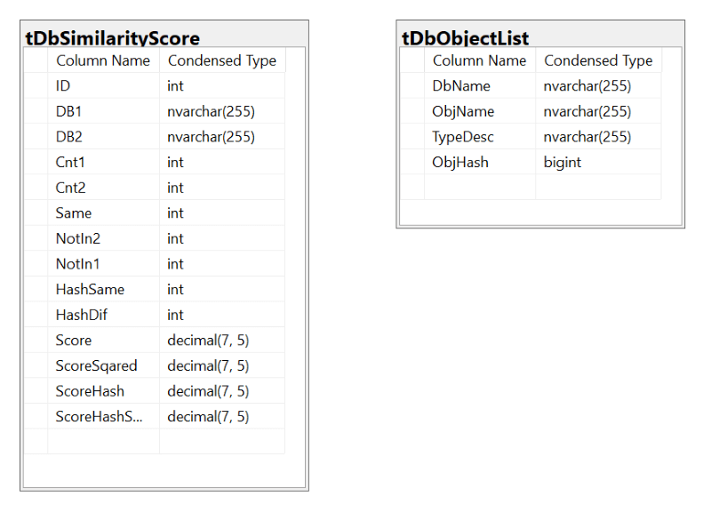
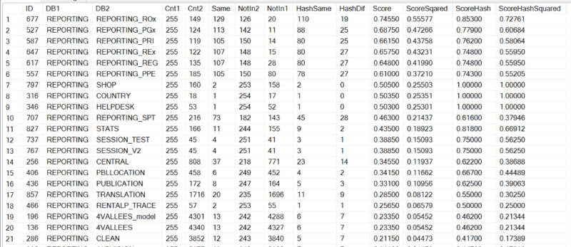
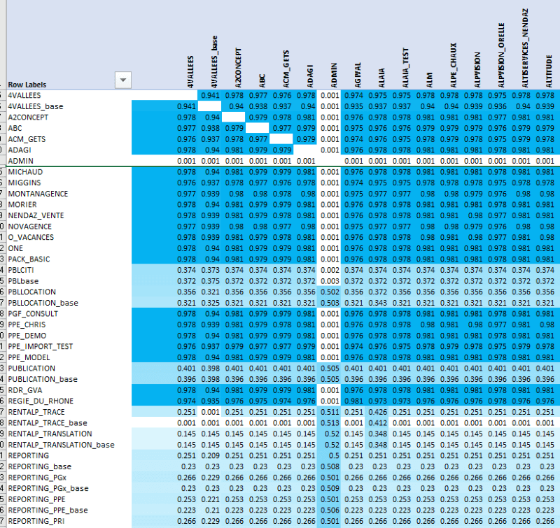
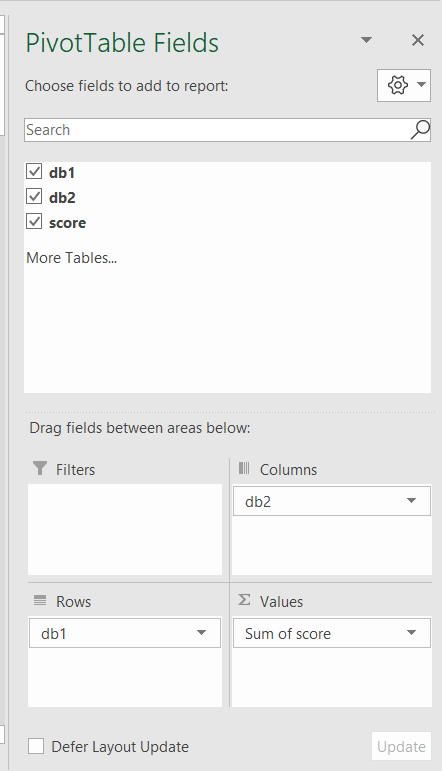
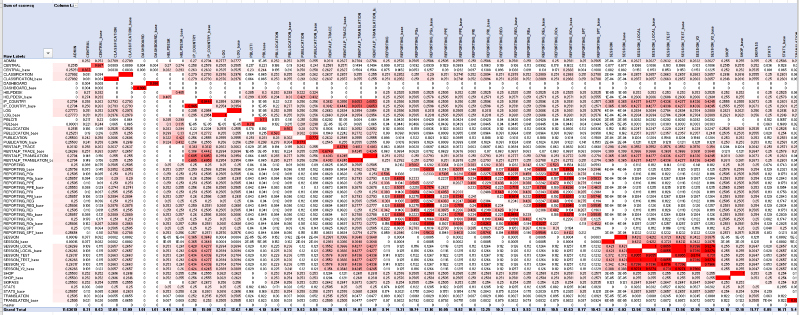
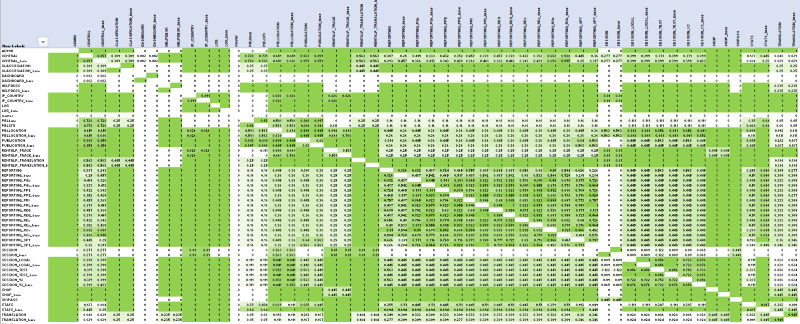

# Visualising differences and similarities in multiple database schemas
#### A primer with code examples for cloud and micro-services migration

> We inherited this server with 1190 MSSQL databases after a small acquisition a few years ago. The database names are not very descriptive and we don't really know how it all works. We'd like to migrate it the cloud.

I faced a similar problem on another project with multiple customer DBs sharing the same codebase and schema in theory, but not in practice. Most tools like [RedGate](https://www.red-gate.com/products/sql-development/sql-compare/) or [Apex](https://www.apexsql.com/sql-tools-diff.aspx) are good at comparing one DB to another. We wanted to compare them all to each other with visualisation, so I had to make my own tool.

#### Task at hand
1. identify groups of similar DBs 
2. calculate their similarity and divergence
3. visualise the results

#### Solution overview
A database schema is comprised of "objects" like user tables, views, stored procedures or functions. They are all listed in `sys.objects` table and their source code or definitions are stored in `sys.syscomments`. We could use data from those two tables to compare one DB to another:

## Collecting DB object data

We'll need 2 tables: one to hold the list of objects, another to hold the numbers on how those objects are distributed across all the DBs.



First, create a table that holds all object names from all databases.

```sql
drop table if exists tDbObjectList
GO

create table tDbObjectList (
DbName nvarchar(255),
ObjName nvarchar(255),
TypeDesc nvarchar(255),
ObjHash bigint
)
```

Populating the list of objects from all DBs can be done with very handy, but unofficial SP called `sp_MSforeachdb`. It is [not the most elegant and reliable method](https://www.mssqltips.com/sqlservertip/2201/making-a-more-reliable-and-flexible-spmsforeachdb/), but it works OK most of the time. 

```sql
exec master.sys.sp_MSforeachdb 
'USE [?];

insert into master.dbo.tDbObjectList
select DB_NAME(), obj.name, obj.type_desc, sum(ABS(cast(checksum(com.text) as bigint)))
from sys.objects obj left outer JOIN sys.syscomments com on obj.object_id = com.id
where type_desc in (''VIEW'', ''SQL_TABLE_VALUED_FUNCTION'', ''SQL_STORED_PROCEDURE'', ''USER_TABLE'', ''SQL_SCALAR_FUNCTION'')
and DB_NAME() not in (''model'', ''tempdb'', ''msdb'')
group by obj.name, obj.type_desc'
```
The above code uses `sys.objects` table to get the list of objects of certain types and `sys.syscomments` table to get the source T-SQL code in a form of a checksum. Some system DBs are excluded. `master` DB is included in the list because it is quite common to create objects in it by mistake.

We used two different metrics to calculate the similarity score: object names and object T-SQL code match. The score is permanently stored in `tDbSimilarityScore` table. 

```sql
drop table if exists tDbSimilarityScore
GO

create table tDbSimilarityScore (
ID int identity, -- row id in the table
DB1 nvarchar(255), -- DB names for cross-comparing
DB2 nvarchar(255), --  them in pairs
Cnt1 int, -- total count of objects in DB1
Cnt2 int, -- total count of objects in DB2
Same int, -- how many object names they share
NotIn2 int, -- how many object names are in DB1 and not in DB2
NotIn1 int, -- how many object names are in DB2 and not in DB1
HashSame int, -- how many shared objects with the same name have the same T-SQL code
HashDif int, -- how many shared objects with the same name have different T-SQL code
Score decimal(7,5), -- overall similarity score
ScoreSqared decimal(7,5), -- the score from above squared
ScoreHash decimal(7,5), -- T-SQL code similarity score
ScoreHashSquared decimal(7,5) -- T-SQL score squared
)
```

Initially `tDbSimilarityScore` table is populated with *N x N* combinations of all DB names from `tDbObjectList`.

```sql
insert into tDbSimilarityScore (db1, db2)
select distinct ol1.DbName, ol2.DbName from tDbObjectList ol1 join tDbObjectList ol2 on (ol1.DbName != ol2.DbName)
```

There will be some duplicate rows in an *N x N* matrix because *db1/db2* pairs are symmetrical - comparing *DB A* with *DB B* is equivalent to comparing *DB B* with *DB A*. The following line of code deletes the duplication and reduces the number of records from *N^2* to *N!*:

```sql
delete from tDbSimilarityScore 
from tDbSimilarityScore tss 
where exists (select 1 from tDbSimilarityScore tss2 where tss2.db1 = tss.db2 and tss2.db2 = tss.db1 and tss2.id < tss.id)
```
It is an optional step. **Do not remove the duplication yet** - we will need the full *N x N* matrix for a pivot table later.

## Calculating the score

The rest of the fields in `tDbSimilarityScore` are populated with update statements. It is a simpler and faster way than a single INSERT statement. The number of records involved is small enough not to worry about the performance.

1. Update the total number of objects for *DB1* and *DB2*:

```sql
update tDbSimilarityScore set Cnt1 = ta.Cnt
from tDbSimilarityScore tss
left outer join 
(select DbName, count(*) as Cnt from master.dbo.tDbObjectList group by DbName) as ta 
on (tss.DB1 = ta.DbName)

update tDbSimilarityScore set Cnt2 = ta.Cnt
from tDbSimilarityScore tss
left outer join 
(select DbName, count(*) as Cnt from master.dbo.tDbObjectList group by DbName) as ta 
on (tss.DB2 = ta.DbName)
```

2. Update the numbers for *similarity*:

```sql
update tDbSimilarityScore set Same = isnull(ts.Same,0)
from tDbSimilarityScore tss
left outer join 
  (select ol1.DbName as DB1, ol2.DbName as DB2, count(*) as Same
  from tDbObjectList ol1 join tDbObjectList ol2 on ol1.DbName != ol2.DbName and ol1.ObjName = ol2.ObjName
  group by ol1.DbName, ol2.DbName) as ts
on (tss.DB1 = ts.DB1 and tss.DB2 = ts.DB2)

update tDbSimilarityScore set HashSame = isnull(ts.same,0)
from tDbSimilarityScore tss
left outer join 
  (select ol1.DbName as DB1, ol2.DbName as DB2, count(*) as Same
  from tDbObjectList ol1 join tDbObjectList ol2 on ol1.DbName != ol2.DbName and ol1.ObjName = ol2.ObjName and ol1.ObjHash = ol2.ObjHash
  group by ol1.DbName, ol2.DbName) as ts
on (tss.DB1 = ts.DB1 and tss.DB2 = ts.DB2)
```

3. Update the numbers for *dissimilarity*

```sql
update tDbSimilarityScore set notin2 = cnt1-same, notin1 = cnt2 - same, hashdif = same - hashsame
```

4. Calculate the overall score

```sql
update tDbSimilarityScore set Score = convert(decimal(13,3), (Same / ((convert(float, Cnt1) + convert(float, Cnt2))/2)) + (isnull(convert(float, HashSame)/ nullif(Same,0),0))) / 2.000

update tDbSimilarityScore set ScoreSqared =power( convert(decimal(13,3), (Same / ((convert(float, Cnt1) + convert(float, Cnt2))/2)) + (isnull(convert(float, Hashsame)/ nullif(Same,0),0))) / 2.000, 2)

update tDbSimilarityScore set ScoreHash = convert(decimal(13,3), (isnull(convert(float, HashSame)/ nullif(Same,0),0)))

update tDbSimilarityScore set ScoreHashSquared =power(convert(decimal(13,3), isnull(convert(float, HashSame)/ nullif(Same,0),0)), 2)
```

## Sample results

In this example we compared the main reporting database with other reporting and shared DBs. 

```sql
select * from tDbSimilarityScore where db1 = 'reporting' order by db1, score desc
```



The correlation between all *REPORTING_...* DBs was quite high, but so was their code divergence. For example REPORTING and REPORTING_ROx have 19 objects with the same names, but different TSQL code. The other *REPORTING_...* DBs share approximately 1/2 of its object names with *REPORTING*, but 20% of them have differences in the source code. Some of the differences are there by design, but most of them can be merged onto a single code base.

## Similarity matrix
The similarity and divergence between DBs can be visualised in an MS Excel matrix. This example uses a pivot table with conditional formatting. It takes only a couple of minutes to make.



1. Copy results of `select * from tDbSimilarityScore order by db1, score desc` into a blank Excel spreadsheet.
2. Choose your comparison metric, e.g. *score*, and delete the others. You should have 3 columns left: *DB1*, *DB2*, *Score*
3. Create a pivot table in a new worksheet (click top menu *Insert*, then *Pivot table* on the far left)
4. Drag column names (*DB1*, *DB2*, *Score*) inside the pivot table field panel to arrange them into a matrix.
   
  
  * You should get a matrix view similar to the one above, except for colouring.
5. Select all the cells with *Score* values inside the matrix and add colour conditional on the cell's value (click on top menu *Home*, *Conditional Formatting*, *Colour Scales*) 

In the following example we compared only shared databases using different metrics.
* **Score**: how similar they are in their intent
* **ScoreSquared**: same as above, but more spread out
* **ScoreHash**: code divergence between similar DBs
* **ScoreHashSquared**: same as above, but more spread out

**Similarity** (ScoreSquared)



**Divergence** (ScoreHashSquared)



These simple colour graphs are only really useful for a quick visual overview. They helped us grasp the extent of the problem and highlighted areas of interest for further investigation. The rest of the work was done by trawling through the source code, not without help of more scripts. For example, much of the code divergence was due to differences in white space, casing and line endings. So something as simple as [normalising all T-SQL code](https://stackoverflow.com/questions/1580017/how-to-replace-multiple-characters-in-sql#answer-1580062) with `LOWER(REPLACE(REPLACE(REPLACE(com.text,' ',''),CHAR(10),''),CHAR(13),''))` before calculating the similarity score may save you hours down the track.

----
*I regret not using this approach earlier in our cloud migration project. We wasted too much time reviewing and fixing very similar code when it could be all converged to the same code base first. I hope this post will save you from making the same mistake.*