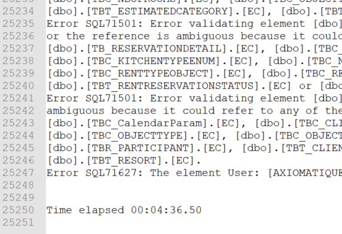

# Cloud migration assessment with Microsoft DMA and SqlPackage tools

#### A short guide for anyone tasked with assessing migration to Azure SQL for the first time


*I was looking at a seemingly endless list of customer DBs and a dozen or so of shared DBs - 500GB of data spread over hundreds of databases, some of them 15 years old and very tightly linked to each other. My job was to give a rough estimate for migrating them all to Azure SQL Pool.*

My first port of call was [Database Migration Assistant](https://docs.microsoft.com/en-us/sql/dma/dma-overview). Simply point it at your DB and get a report after a few minutes.


It gave me a pretty good overview of compatibility issues between our on-prem DBs Azure SQL. 


Unfortunately, the UI doesn't make it easy to look deeper into details of individual issues and the only other viewing option is a JSON report file that is not easy to parse either.

There is also another tool by Microsoft that give me a different view of the compatibility issues - [SQL Package Utility](https://docs.microsoft.com/en-us/sql/tools/sqlpackage). Its main purpose is to export MS SQL databases into `bacpac` format for importing into Azure SQL, but its error report can be used for migration insight as well.

## sqlpackage.exe as a DMA alternative

*SqlPackage* is a command line utility that can be run on Win, Mac and Linux platforms.

`sqlpackage.exe /Action:Export /ssn:127.0.0.1 /su:sa /sp:sapwd /sdn:test_db /tf:test_db.bacpac`

An attempt to export my DB with *sqlpackage.exe* ended up in a screen full of red gibberish. There were clearly some compatibility issues there ...


Viewing the output in *Notepad++* made it a bit clearer, but not clear enough to make sense of it. There was little chance of me getting any useful info from 25,000 lines of very dense verbiage.



### Prettifying the output

Somehow *SQL Package tool* has a problem with large error reports. They come out with broken lines and are hard to parse. There is a simple way to tidy them up in *Notepad++*:

1. Remove the summary info at the top and bottom of the file.
2. Replace all new lines with a single space.
3. Replace `Error SQL` with `\nError SQL` in *extended* find-n-replace mode.

Your document should then have one error message per line. My 25,000 lines shrunk to "just" 11,673 lines of very repetitive error messages, so my next step was to find some patterns.


### Making sense of the output

My key questions for the estimation were:
* How many tables, views, procedures and other objects are affected?
* What are the common issues?
* Can they be fixed by automatically refactoring the code?

Applying this regex `Error[^\[]*(\[[^\]]+\]\.\[[^\]]+\])` to the error report converted long verbose messages

```
Error SQL71561: Error validating element [dbo].[tbt_estimatedCategory].[label]: Computed Column: [dbo].[tbt_estimatedCategory].[label] has an unresolved reference to object [CITI_CENTRAL].[dbo].[tbt_estimatedCategory].[label]. External references are not supported when creating a package from this platform.
```

into a relatively clean list of affected object names

```
[dbo].[VW_RENTRESERVATION_CALENDAR]
[dbo].[VW_RENTRESERVATION_CALENDAR]
[dbo].[tbt_estimatedCategory]
[dbo].[tbt_estimatedCategory]
[dbo].[tbt_estimatedCategory]
[dbo].[tbt_estimatedCategory]
[dbo].[tbt_estimatedCategory]
[dbo].[tbt_estimatedCategory]
[dbo].[VW_RENTRESERVATION_CALENDAR_NL]
```

which can be further de-duped to a unique list of object names that need attention

```
VW_RENTRESERVATION_CALENDAR
tbt_estimatedCategory
VW_RENTRESERVATION_CALENDAR_NL
```

### Finding patterns

I had to scroll up and down the report and run some keyword searches trying to quantify common issues. A clear pattern of top problems emerged within a few minutes:

* cross-db references
* references to non-existent table columns from view definitions
* references to other non-existent objects like functions and SPs

Those references to non-existent columns and functions may sound strange, but I was dealing with a 15 years old codebase. MS SQL allows objects to be dropped without checking their dependents, unless [WITH SCHEMA BINDING](https://www.mssqltips.com/sqlservertip/4673/benefits-of-schemabinding-in-sql-server/) option was specified. 

Identifying objects with broken references was actually good news. If we know that a certain object is broken now it is probably no longer used and can be safely deleted.

> Partitioning the report into different kinds of migration problems gave me the numbers I needed to come up with an early estimate.

### A note on correct estimation

500 identical code changes can be done in 15 minutes with global search and replace. A small number of unique issues may take days of work. Then don't forget testing, staging and changes to DevOps. I simply [quadrupled my initial estimate](https://en.wikipedia.org/wiki/Pareto_principle) to account for that. In the hind sight, it was a correct step. We spent as much time on approximately 800 lines of unique errors from the report as we spent on fixing the other 10,000.


----

## Data Migration Assistant vs. SQL Package

*I wouldn't say that one tool is better than the other - they are quite complimentary and I recommend using them both.*

### DMA
* more issue types covered
* recommendations
* summary per type of issue
* detailed info is hard to extract
* many of the problems are just "warnings" and do not affect the migration as such
* [doesn't work with the latest MS SQL (2019)](https://social.msdn.microsoft.com/Forums/sqlserver/en-US/6a4a6106-7335-4e39-aa56-65c20c90df53/upgrade-advisory-report-failure-on-sql-server-2019) as the source

  #### Watch out for deprecated data types 

  DMA puts deprecated data types like `text`, `ntext` and `image` into *warnings* section. You can still migrate those to AZ as-is, but expect some of the code to fail where those types are involved. We had to completely eliminate them from all our parameters in functions and procedures. *Text* became *nvarchar(max)* and *image* became *varbinary(max)*.

### SQL Package

* only issues stopping you from migrating now are listed
* the output is easier to parse
* no recommendations
* not concerned with the quality of the code
* not concerned with issues that will become apparent only after the migration
