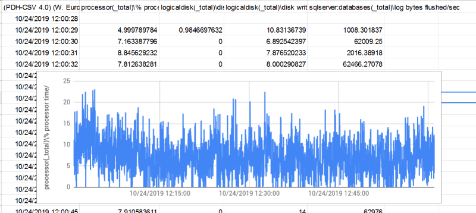

# On-prem to Azure SQL migration assessment report
#### A report from a real-life migration project involving multiple MS SQL databases

*The project started with what may seem like a reasonable question ...*

> How much would it cost to migrate our MS SQL databases to Azure CosmosDB?

*For anyone familiar with both, MS SQL and CosmosDB that question would instantly "raise a red flag" because MS SQL and CosmosDB are two very different database technologies and are not a direct substitute for one another.*

## From MS SQL to CosmosDB

It wasn't the first project where we suspected the initial question was wrong. We had to step back to understand the nature of the problem before suggesting any solution.

#### System overview


* **MS SQL servers**: 2
* **Combined DB size**: 469GB
* **Number of DBs**: 184 (19 shared DBs, 165 customer DBs, 1 per customer)
* **Tables**: 2,000
* **Stored procedures**: 3,900
* **Lines of T-SQL code**: 390,000
* **System age**: 15+ years

That didn't look like CosmosDB material to us, not from a database migration point of view. It would have to be a completely new implementation for the system to work with CosmosDB.

A new implementation was out of the question. 

## From on-prem MS SQL to the cloud

The main objective of the project was to migrate the system to the cloud because the monolithic on-prem architecture held back business development and meeting new customer needs. CosmosDB was just one of the technology options under consideration. Our task was to help the client consider alternatives and choose the most appropriate solution.

#### Core Requirements

1. hosted on Azure
2. up to 3 months to completion
3. under $10,000 budget

#### Available options

* CosmosDB
* Azure SQL DB
* Azure SQL VM
* Postgres SQL
* A No-SQL DB

#### Objectives for migrating to Azure

* Better scalability 
* Reduced maintenance
* Cost / performance optimization
* Simpler resource provisioning for new clients

#### Report objectives

* Identify suitable DB technology on Azure
* Assess cost and feasibility

#### Assessment methodology

* Analyse the DB size and complexity.
* Consider suitable types of cloud DB technology
* Estimate cost
* Assess performance
* Identify possible areas of improvement in the existing code

#### Main metrics

* **Technical feasibility**:
  * Technology stack
  * Scalability impact
  * Performance impact

* **Migration cost**:
  * DB
  * Application back-end
  * Application front-end

* **Ongoing cost**:
  * DB
  * Compute
  * Storage
  * Logging, security and auxiliary services

*Quite often, cloud-migration projects are assessed for feasibility and upfront costs. The running cost is ignored until the resources are fully deployed and the monthly bills start coming in. It could be particularly troublesome when [CosmosDB is seen as an "SQL DB"](https://docs.microsoft.com/en-us/azure/cosmos-db/sql-query-getting-started). It does support a subset of SQL, but [it is not an RDBMS](https://docs.microsoft.com/en-us/azure/cosmos-db/relational-nosql) and anything other than a simple read/write by a primary key will come at a high monetary cost.*

## Quantifying the current environment

Knowing the size and utilization of the current resources helps with understanding what kind of cloud resources would match the current performance level and how the system can be scaled horizontally or vertically within Azure.

**Server I**: *customer databases*
* 2 x 16 cores @ 2.00 GHz = 32 logical processors
* 128 GB RAM / 369 GB of DB storage used
* Microsoft SQL Server 2012 (SP4) Standard Edition (64-bit)

**Server II**: *shared databases*
* 2 x 8 cores = 16 logical processors
* 128 GB RAM / 100 GB of DB storage used
* Microsoft SQL Server 2014 (SP2) Standard Edition (64-bit)

The server utilisation graph below is based on Windows System Monitor logs.



#### Utilisation metrics
* processor(_total)\% processor time
* logicaldisk(_total)\disk reads/sec
* logicaldisk(_total)\disk writes/sec
* sqlserver:databases(_total)\log bytes flushed/sec

A representative sample of performance data was collected over several days. A combination of performance logs and hardware configuration can be used as a reliable guide to server sizing.

## SQL code inside customer and shared databases

**One of the biggest challenges** in migrating relational databases to a different environment or a different technology stack is the SQL code inside the databases and their client applications. Although, there is such a thing as [SQL Standard](https://en.wikipedia.org/wiki/SQL), T-SQL used by MS SQL server is not directly portable to other SQL flavors.   


The complexity of the code in any given database can be estimated by looking up system views like `sys.objects` and `sys.comments`. Some metrics of interest: 

* object counts for user tables, views, SPs and UFNs
* amount of code (number of lines)
* specific language features that are hard to port or refactor

This query **counts the number of user objects** across all databases on the server:
```sql
use master
GO

drop table if exists tDbObjectCount
create table tDbObjectCount (DbName nvarchar(255), TypeDesc nvarchar(255), Cnt bigint)

exec master.sys.sp_MSforeachdb 
'USE [?];

insert into master.dbo.tDbObjectCount
select DB_NAME(), type_desc, count(*)
from sys.objects
where type in (''U'',''FN'',''P'',''TF'',''V'')
	and DB_NAME() not in (''model'', ''tempdb'', ''msdb'', ''master'')
	and name not in (''fn_diagramobjects'', ''sp_alterdiagram'', ''sp_creatediagram'',
		''sp_dropdiagram'', ''sp_helpdiagramdefinition'', ''sp_helpdiagrams'', 
		''sp_renamediagram'', ''sp_upgraddiagrams'', ''sysdiagrams'')
group by type_desc'

select TypeDesc, sum(Cnt) from tDbObjectCount group by TypeDesc
drop table tDbObjectCount
```

This query **counts the number of lines** of code per object type:

```sql
use master
GO
drop table if exists tDbObjectLines
create table tDbObjectLines (DbName nvarchar(255), TypeDesc nvarchar(255), Lines bigint)

exec master.sys.sp_MSforeachdb 
'USE [?];

insert into master.dbo.tDbObjectLines
select DB_Name(), xtype, sum(t.lines_of_code) - 1
from
(
    select o.name as sp_name, 
    (len(c.text) - len(replace(replace(c.text, char(12), ''''), char(10), ''''))) as lines_of_code, o.xtype
    from sysobjects o
    inner join syscomments c
    on c.id = o.id
    where o.xtype in (''P'', ''FN'', ''IF'', ''TF'')
		and o.category = 0
		and o.name not in (''fn_diagramobjects'', ''sp_alterdiagram'', ''sp_creatediagram'', ''sp_dropdiagram'',
			''sp_helpdiagramdefinition'', ''sp_helpdiagrams'', ''sp_renamediagram'', ''sp_upgraddiagrams'', ''sysdiagrams'')
		and DB_NAME() not in (''model'', ''tempdb'', ''msdb'', ''master'')
) t
group by xtype
order by 1 desc'

select TypeDesc, sum(Lines) from tDbObjectLines group by TypeDesc order by 2 desc
drop table tDbObjectLines
```

#### Results for a single customer databases on Server I
* stored procedures: 2,993 / 230,256 lines
* scalar functions: 212 / 12,426 lines
* table functions: 14 / 1,570 lines
* tables: 656 
* views: 18

All customer DBs were expected to share the same schema and SQL codebase, so we only included one customer database in our estimates.

#### Combined results for all shared databases on Server II
* stored procedures: 892 / 136,077 lines
* scalar functions: 212 / 8,188 lines
* table functions: 17 / 668 lines
* tables: 1,568 
* views: 84

**Total number of lines of code**: 389,185

### Code complexity

A global text search through C# code in client apps interfacing with the databases returned only a few simple `select` statements. Most of the database calls were done via stored procedures shifting the migration effort to the T-SQL code within the databases.


| select | insert | update | delete | join | union | commit |
|--------|--------|--------|--------|------|-------|--------|
| 50     | 4      | 9      | 1      | 47   | 0     | 0      |


The same exercise was repeated with the T-SQL code inside databases. We looked for `cursor`, `transaction`, `freetext`, `for xml` and `.query` as they are the ones to most likely cause compatibility issues.


| cursor | transaction | freetext | for xml | .query |
|--------|-------------|----------|---------|--------|
| 391    | 102         | 9        | 14      | 0      |


Additional searches to consider: 
* Select by key fields
* Select by non-key fields
* Select with JOIN
* Select with GROUP BY
* Select with UNION

Automated code refactoring could be an option for migrating between platforms, but due to the obvious complexity of the T-SQL code (389,185 lines over 4,340 objects) the amount of manual refactoring would still be significant.

The presence of 391 *cursors* in the T-SQL code indicates there is room for performance improvement. T-SQL cursors are potential performance hogs and would have to be reviewed manually for any inefficiencies.

## Summary of Azure database products

We considered only the most popular SQL and NoSQL DBMS packaged as fully managed Azure services.

| Azure DB type | Migration complexity | Timeframe | Comments                                   |
|---------------|----------------------|-----------|--------------------------------------------|
| MS SQL        | Low                  | Days      | The running cost may be an issue           |
| PostgreSQL    | Moderate             | Weeks     | ½ the price of MS SQL                      |
| CosmosDB      | Paradigm change      | Months    | A complete rewrite                         |
| MySQL/MariaDB | Downgrade            | Months    | Extensive code refactoring                 |
| ElasticSearch | Paradigm change      | Months    | A complete rewrite + a transactional RDBMS |
| mongoDB       | Paradigm change      | Months    | A complete rewrite + a transactional RDBMS |

## Azure database products in detail

This section looks into more detail of each of the options listed in the table above.

### CosmosDB
*CosmosDB* is a no-schema DB with auto-indexing and SQL-like query language. **It is a key-value store for JSON documents, not an RDBMS**. CosmosDB is too different from MS SQL server for direct migration and will require a complete redesign and re-write of all DB-related codebase and the client apps.

The **primary purpose of CosmosDB** and similar NoSQL DBs is horizontal scaling for large or unpredictable workloads. Our load is small enough for even a modest SQL server to handle and is very predictable.

* CosmosDB **SQL syntax** is very limited compared to T-SQL.
* **Triggers** would have to be re-written in JavaScript.
* ACID **transactions** are supported in a different way from T-SQL.
* All **procedures** would have to be re-written in JavaScript.
* **JOINs** in the SQL sense are not supported.
* The **cost of queries** (measured in *Request Units* or *RU* per query) escalates with the number of criteria in WHERE clause. The most cost-efficient CosmosDB queries are those retrieving values by key. The ongoing cost of a CosmosDB database can be further estimated by creating a sample DB and running some typical queries against it to see their RU values.

#### Redesign option

* Switch from the current highly normalised data model to a hierarchical structure (JSON).
* Move all the business logic from *stored procedures* to the application layer.
* Use CosmosDB with a small RDBMS for important ACID transactions for consistency.
This would be a **long term option** and is equivalent to re-building the entire application from scratch.


#### Re-factoring option
Let's assume it takes a very optimistic 1 minute to re-write and re-test one line of existing SQL code. 380,000 lines of code would take 6,300 man-hrs or 787 days. Most likely it will be x4 of that because of the programming paradigm change.
CosmosDB will be forced to act as an SQL server, which it is not. This would be a **costly dead-end solution** that takes a very long time to implement. 


### MySQL/MariaDB
The cost of migrating 380,000+ lines of code to a different SQL flavor with fewer features is likely to be high. The running cost is about the same as the normal cost for Azure compute + storage.

**Disadvantages**:
* A significant downgrade in functionality and capabilities
* Extensive code refactoring

### ElasticSearch or mongoDB
It would take a complete redesign and re-write of all DB-related codebase to make it work with a No-SQL database. Even then, a small RDBMS with ACID support is likely to be required. No-SQL products will need significantly more compute and storage to provide comparable performance.

**Disadvantages**:
* paradigm change with complete code re-write
* may still require an RDBMS for critical transactions
* months to complete

### MS SQL

Migrating an on-prem MS SQL server to an Azure MS SQL server is a reasonably straightforward process as they are only slightly different flavors of the same RDBMS technology.


#### Migration issues
*Elastic DB pool* and *Managed SQL* may require some changes to the T-SQL code. The changes are not technically challenging, but there may be many thousands of lines to refactor:

* changes to cross-DB queries
* computed columns
* minor syntax edits
* references to system SPs
* use of CLR functions

#### Cost estimates
The pricing below is "per month" in West Europe availability zone. The server sizing is approximate and would have to be re-calculated more accurately using [SQL server sizing calculator](https://dtucalculator.azurewebsites.net).

| ElasticPool         | Managed SQL         | VM + SQL                                                             |
|---------------------|---------------------|----------------------------------------------------------------------|
| $2,646 (1200DTU)    |                     |                                                                      |
| $3,123 (vCore x 16) | $3,123 (vCore x 16) | $3,571 (1 E20 v3 (20 vCPU(s), 160 GB RAM) + SQL Std + extra storage) |
|                     |                     | $5,551 (1 E32 v3 (32 vCPU(s), 256 GB RAM) + SQL Std + extra storage) |

### PostgreSQL
PgSQL is comparable in scale and performance to MS SQL. Its main advantage is its lower running cost because it is a free open source product. PgSQL lower running cost is the only reason to consider it for this project. Azure offers managed PostgreSQL at the price of "compute + storage", which is approximately ½ of MS SQL cost.

The server sizing in the table below is very approximate and was included to illustrate the price range.


| Managed PostgreSQL                | Managed MS SQL                   | RH Ent Linux + PostgreSQL      |
|-----------------------------------|----------------------------------|--------------------------------|
| 16 core, 160GB RAM, 800GB storage | 16 core, 81GB RAM, 800GB storage | 16 cores, 128GB RAM, 400GB SSD |
| $1,669                            | $3,228                           | $1,213                         |


#### Migration to PostgreSQL
PostgreSQL comes with an additional cost of the initial migration. It can take anywhere between 2 - 6 months:
* migrate data
* review and modify indexes
* review and modify views
* convert T-SQL into PgSQL, which is closer to ANSI SQL
* create a testing framework (a side benefit for future development)

The in-house team would have to upskill during the migration. Most MS SQL developers can start programming for PostgreSQL within hours of setting it up. Mastering Postgres administration may take longer, but most of the concepts are very similar to MS SQL.

## Conclusion

**The only viable migration option that meets our time and budget constraints is Azure SQL**. It is the closest in terms of  technology and requires the least change compared to all the other options. Azure SQL has three different types of MS SQL products:

* **Azure SQL Pool** - most optimal and cost-effective
* **Azure VM + MS SQL** - the quickest and least risky
* **Azure SQL Managed Instance** - a compromise on cost and risk

Further investigation is required to choose the right Azure SQL product and estimate its cost.

---

*This post is based on my recent experience migrating a real estate management system with hundreds of MS SQL databases from on-prem to Azure SQL. Read my other articles for more learnings from that project.*