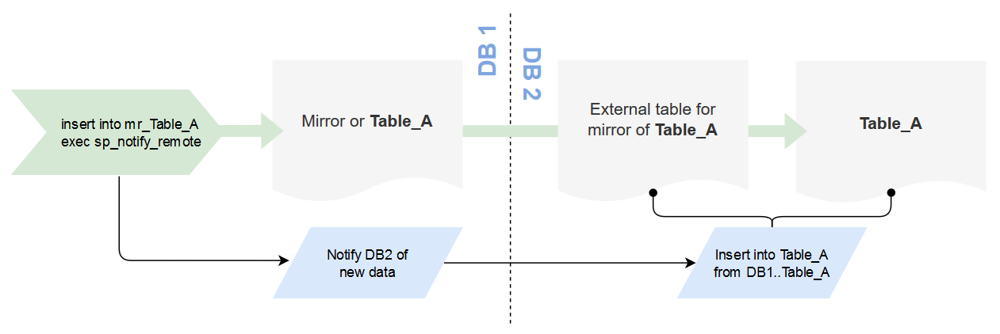
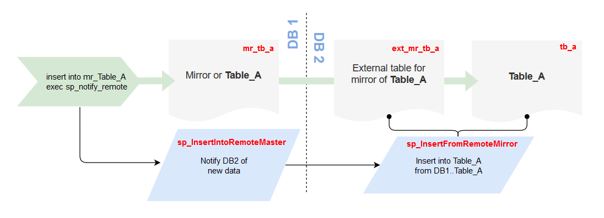
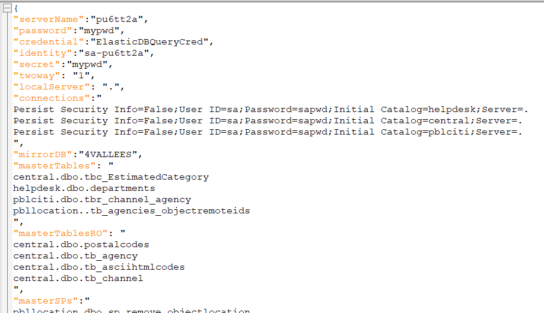

# Migration of Cross-DB Queries and Linked Servers from on-prem MS SQL to Azure ElasticQuery
#### A practical guide for migrating SELECT, INSERT, UPDATE, DELETE and EXEC statements to ElasticQuery

This guide is based on experience gained during migration of a real-estate management system with 184 MS SQL databases from on-prem to Azure. It focuses on cross-database queries which became the major issue for the migration due to limitation of Azure SQL and Azure ElasticQuery.

On-prem cross-DB query example:

```sql
select  *  from srv_sql2008.central.dbo.tb_agency where code_version = @ver
```
The FROM clause of the above query contains a standard [multipart table name](https://docs.microsoft.com/en-us/sql/t-sql/language-elements/transact-sql-syntax-conventions-transact-sql#multipart-names):
* linked server name: `srv_sql2008`
* remote database name: `central`
* owner + table name: `dbo.tb_agency`

Running the same statement on Azure SQL will return an error: 
```
Msg 40515, Level 15, State 1, Line 16
Reference to database and/or server name in 'srv_sql2008.central.dbo.tb_agency' is not supported in this version of SQL Server.
```

The problem here is that Azure SQL uses a slightly different framework for accessing data between databases called [Elastic Query](https://docs.microsoft.com/en-us/azure/sql-database/sql-database-elastic-query-overview). It is similar to [Linked Server](https://docs.microsoft.com/en-us/sql/relational-databases/linked-servers/linked-servers-database-engine) concept used by MSSQL with one major limitation - **it does not support INSERT, UPDATE or DELETE statements**. This limitation has some major implications for most on-prem multi-database systems trying to migrate to Azure.

*It is puzzling why Microsofts has not implemented such important and commonly used feature of MS SQL in Azure. Their suggested workaround is to use a remote procedure call, which doesn't fully address the problem. Migrating a system with hundreds or thousands of INSERT / UPDATE / DELETE statements that have to be converted into remote SP calls is bound to be costly.*

**We implemented a solution that allowed us to minimize the cost of migration by automating the code refactoring in views, functions and stored procedures to comply with Azure ElasticQuery limitations.**

# Mirror-tables alternative for ElasticQuery INSERT/UPDATE/DELETE

The core idea was to create mirror objects for tables and stored procedures to make DML (INSERT/UPDATE/DELETE) operations appear local and abstract the remote part of the interaction.


#### Terminology

* `Table_A` - a table in DB2 we want to insert data into from DB1
* `mirror table` - a table with the same definition as the table it is mirroring

#### Explanation

The 3 or 4 part table names like `DB2..Table_A` won't work on Azure. We create a mirror of *Table_A* in *DB1* and perform local INSERTs into it instead of the remote table. Then we invoke an SP in *DB2* to let it know there is new data in the mirror table. The remote SP in *DB2* reads the new data from the mirror table in *DB1* via an external table and inserts it into *Table_A*, which is the intended destination for the data.



**The main advantage** of this method is the ease of refactoring the existing T-SQL codebase:
* mirror tables, external tables and both SPs can be auto-generated
* the 3 and 4-part names in INSERT, DELETE and UPDATE statements can changed using global search and replace
* the more lines of T-SQL code you need to change the more time this approach saves you

The **disadvantages** are:

* a large number of tables and SPs are added to the DB schema
* slower DML performance

## Practical example

We will create two test DBs in Azure SQL (`test_master` and `test_mirror`) and insert data from *test_mirror* into *test_master* using a mirror table.

#### Tables

We'll need an equivalent of `Table_A` from the diagram above in `test_master` database. Let's call it `tb_a` for brevity. Our goal is to insert data into `tb_a` in `test_master` from an SQL statement in `test_mirror`.

```sql
-- USE test_master
DROP TABLE IF EXISTS [dbo].[tb_a]

CREATE TABLE [dbo].[tb_a](
	[key] [int] NULL,
	[value] [nvarchar](255) NULL,
	mirror_key uniqueidentifier NULL
) ON [PRIMARY]
```

Table `mr_tb_a` is the exact copy of `tb_a`.

```sql
-- USE test_mirror
DROP TABLE IF EXISTS [dbo].[mr_tb_a]

CREATE TABLE [dbo].[mr_tb_a](
	[key] [int] NULL,
	[value] [nvarchar](255) NULL,
	mirror_key uniqueidentifier NULL
) ON [PRIMARY]
```

Table `ext_mr_tb_a` is an external table to access `mr_tb_a` from `test_master` DB. It has exactly the same definition as `mr_tb_a` and `tb_a`. Assume that `TestMirrorSrc` [external data source](https://docs.microsoft.com/en-us/sql/t-sql/statements/create-external-data-source-transact-sql) was created earlier.

```sql
-- USE test_master
CREATE EXTERNAL TABLE ext_mr_tb_a (
	[key] [int] NULL,
	[value] [nvarchar](255) NULL,
	mirror_key uniqueidentifier NULL
)
WITH ( DATA_SOURCE = TestMirrorSrc, SCHEMA_NAME = N'dbo', OBJECT_NAME = N'mr_tb_a' )
```

#### Stored Procedures

An SP from `test_mirror` calls an SP on `test_master` with a value for `mirror_key` field for new records. It is not possible to pass a recordset with ElasticQuery remote procedure call, so we mark multiple records with a unique ID and pass it as a single parameter.

```sql
-- USE test_master
DROP PROCEDURE IF EXISTS sp_InsertFromRemoteMirror
GO

CREATE PROCEDURE sp_InsertFromRemoteMirror
(@mirror_key AS UNIQUEIDENTIFIER)
AS
BEGIN
    insert into tb_a select * from ext_mr_tb_a where mirror_key = @mirror_key 
END
```

The following SP calls `sp_InsertFromRemoteMirror` when new data is inserted into `mr_tb_a` on `test_mirror`.

```sql
-- USE test_mirror
DROP PROCEDURE IF EXISTS sp_InsertIntoRemoteMaster
GO

CREATE PROCEDURE sp_InsertIntoRemoteMaster
AS
BEGIN

	declare @mirror_key_local AS UNIQUEIDENTIFIER
	set @mirror_key_local = NEWID()

	update mr_tb_a set mirror_key = @mirror_key_local where mirror_key is null

   	exec sp_execute_remote @data_source_name  = N'TestMasterSrc', 
		@stmt = N'sp_InsertFromRemoteMirror @mirror_key', 
		@params = N'@mirror_key AS UNIQUEIDENTIFIER',
		@mirror_key = @mirror_key_local; 

	delete from mr_tb_a where mirror_key = @mirror_key_local

END
```

The DELETE statement in `sp_InsertFromRemoteMirror` is optional to keep the mirror table small. It can be removed to maintain the full mirror of the remote data for tracking updates and deletes. Consider adding indexes to `mr_tb_a` if you want to keep all records.

It may be hard to follow the code examples presented above. This diagram should help you understand how all the parts hang together.



#### Test DML statement

Before migrating to Azure SQL:
```sql
USE test_mirror
insert into test_master.dbo.tb_a ([key],[value]) values (10,'x')
```

Refactored code for ElasticQuery on Azure SQL:
```sql
-- USE test_mirror
insert into mr_tb_a ([key],[value]) values (10,'x')
exec sp_InsertIntoRemoteMaster
```

### UPDATE and DELETE statements

The example above demonstrates how to use mirror tables to modify INSERT statements for ElasticQuery. We experimented with UPDATE and DELETE statements using a very similar approach.

### EXEC statements

Refactoring remote procedure calls can be done by creating local proxy SPs and changing only object names in the existing code.

Before migrating to Azure SQL:
```sql
exec PBL_Location.dbo.sp_RemoveObjectLocation @ObjectLocationId, @ChannelId
```

Refactored code for ElasticQuery on Azure SQL:
```sql
exec ext__PBL_Location__sp_RemoveObjectLocation @ObjectLocationId,@ChannelId
```

via a local proxy SP
```sql
CREATE PROCEDURE ext__PBL_Location__sp_RemoveObjectLocation
@p_Id_ObjectLocation numeric(18,0),@p_Id_Channel numeric(18,0)
AS
    exec sp_execute_remote @data_source_name  = N'RemoteDB_pbl_location', 
		@stmt = N'exec sp_RemoveObjectLocation (@p_Id_ObjectLocation,@p_Id_Channel)', 
		@params = N'@p_Id_ObjectLocation numeric(18,0),@p_Id_Channel numeric(18,0)'
		,
@p_Id_ObjectLocation=@p_Id_ObjectLocation,@p_Id_Channel=@p_Id_Channel; 
```

The main advantages of this approach are:
* minimal changes to the existing code
* auto-generation of code for proxy SPs

# Automated T-SQL code refactoring for ElasticQuery

Popular tools like [RedGate](https://www.red-gate.com/products/sql-development/sql-prompt/) and [Apex](https://www.apexsql.com/sql-tools-refactor.aspx) offer code refactoring, but what we needed for this task was too specific. We built a C# CLI utility (AZPM) to automate the process. You can find the source code under https://github.com/rimutaka/onprem2az-elastic-query

#### Refactoring steps

1. Identify all statements that need refactoring
2. Prepare code templates and config files for AZPM utility
3. Generate mirror and proxy objects
4. Change object names throughout the entire codebase
5. Export to Azure

#### A note on testing

Testing SQL code after making manual changes would be very expensive. We had nothing in terms of test harness or even understanding what the code does. Some SPs ran into hundreds of lines of code with very intricate business logic. It wouldn't take much to break that.

**Our goal was to devise a robust refactoring process** that can be tested on a small subset of code and then applied to the entire codebase with minimal risk of breaking anything.

## Step 1: Code analysis

The target for our search were multipart object names in SQL statements. We used two different search methods:

* Look for dependencies in system tables. E.g. https://www.red-gate.com/simple-talk/blogs/discovering-three-or-four-part-names-in-sql-server-database-code/
* Use Regex to look through the source code. 

Regex was the primary method with system table search as backup and for validation of Regex results.

Our very first step was to script all DB objects from all DBs and add them to Git. 

Suitable scripting tools:
* SSMS Script DB objects feature via [MS Docs](https://docs.microsoft.com/en-us/sql/ssms/tutorials/scripting-ssms)
* PowerShell/TSQL via [MSSQL Tips](https://www.mssqltips.com/sqlservertip/4606/generate-tsql-scripts-for-all-sql-server-databases-and-all-objects-using-powershell/)
* SchemaZen via [Github](https://github.com/sethreno/schemazen) / C#
* MSSQL Scripter via [Github](https://github.com/Microsoft/mssql-scripter) / Python

#### Important considerations for scripting

1. **Consistency** - all scripts must follow the same pattern to produce meaningful diffs.
2. **Idempotency** - generate DROP with IF EXISTS for every CREATE to re-run the scripts as many times as you need.
3. **No** *USE [db name]* - it is not supported by AZ SQL and will get in the way if you need to re-create objects there.
4. **Minimalism** - generate scripts only for what you need. Any extra code or comments will get in the way.
5. **One file per DB object**: you will need to diff and apply changes per object, so it's better to store them as separate files. 

We committed the very first output of the script generator to Git, one repo per DB. Then we combined them all under a single SSMS solution, one DB per project. That gave us the full power of SSMS UI while giving us a complete track record of all changes from then on.

#### Search strategies

I don't think a single winning strategy for finding multipart names exists because of the myriad of ways the code can be written. We started our search in SSMS to at least get some understanding of the codebase. It was an easy way to search for keywords and look up the affected code. Once we knew what exactly we were looking for we started using GREP to output the search results in a structured form.

**Sample GREP query**
```bash
grep -i -r -n --include '*.sql'  -E '\binsert\s*into\s*\[?CITI_\w+\]?\.\[?\w*\]?\.\[?\w*\]?' . > cross-db-insert-grep.txt
```
Our search was aided by a simple naming convention that all DB names were starting with prefix `CITI_`. You will encounter that prefix in a few places in few of our examples. Modify our Regex to match your naming convention, if such exists.

**Sample GREP output** 
```
./citi_4vallees/dbo.sp_AddChannelInPBL.StoredProcedure.sql:28:	INSERT INTO CITI_PBLCITI.dbo.TBR_CHANNEL_AGENCY
./citi_4vallees/dbo.sp_AddChannelInPBL.StoredProcedure.sql:110:	INSERT INTO CITI_PBLCITI.dbo.TBR_CHANNEL_AGENCY
./citi_4vallees/dbo.sp_getPrestationForPPE.StoredProcedure.sql:129:INSERT INTO citi_reporting_PPE.[dbo].[TB_VIEW_PPE_BILAN]
./citi_4vallees/dbo.sp_InsertPastaLight.StoredProcedure.sql:20:INSERT INTO CITI_STATS..TB_PastaLightData
```

Every line of the output contains:
* source DB name (*citi_4vallees*)
* procedure name (*sp_AddChannelInPBL*)
* the exact line number where the change to the object name must be made (*:28:*)

The grep output was used as input into AZPM utility that did the name changes from 4-part to mirror/proxy. That gave us a chance to review the code and remove lines that didn't need to be modified. It was a more robust way of doing global renaming than running a blind search-and-replace.

#### Search variations

T-SQL queries can vary syntactically, while being semantically equivalent. We encountered the following variations in our code:

* INSERT vs INSERT INTO
* EXEC vs EXECUTE
* optional schema name, e.g. DB_Name..sp_DoSomething
* mixing `[name]` and `name`
* commented out lines

There was also the **bugbear of dynamic SQL** ... 

```sql
SET @Query = 'update [' + @dbName + '].dbo.[tb_Rent] SET RO_CONFIRMEDCATEGORY = 0 WHERE ConfDate < ''' + @ValidDate + ''''
EXEC (@Query)
```

Those queries can be extremely hard to find. We were lucky because all 4-part names in our dynamic SQL had the same `@dbName` variable.

#### Some handy Regex queries
These are a few examples of regex queries we used on our GREP output to clean it up.

* Files ending in 'Database.sql': `^.*\.Database\.sql:.*$` 
* Lines with SPs: `^[^:]*:\d*:.*(\[?(\bCITI_\w*)\]?\.\[?(\w*)\]?\.(\[?\w*\]?))\s*\(`
* Same-DB references (multipart names that can be simplified to a 1-part name): `^\.\/([\w\d]+)\/.*(\[?\b\1\]?\..*)`
* Various name parts as groups: `^\.\/(\w*).*(\[?(\bCITI_\w*)\]?\.\[?(\w*)\]?\.(\[?\w*\]?))` and `^(\.\/([^\/]*)[^:]*):(\d*):(.*)$`
* Empty lines: `^\.\/[^\/]*[^:]*:\d*:\s*$`
* Commented-out lines: `^[^:]*:\d*:\s*--.*`
* Table names for config files: `^\.\/(\w*).*(\[?(\bCITI_\w*)\]?\.\[?(\w*)\]?\.(\[?\w*\]?))`

*I am infinitely grateful for existence of https://regexr.com and highly recommend it for your Regex experimentation.*

#### Unused SQL code

There was a good part of the codebase that was no longer used. We just didn't know which one. Removing tables, views, functions and procedures that were no longer used could save us a lot of pain later in the process. In the hind sight, we should have invested some time in identifying and removing them before doing the 4-part name analysis.

Dropping unused objects is risky. It may take a while to trace application errors to missing objects if they were dropped by mistake. Instead of dropping we replaced the body with an error message in Stored Procedures:
```sql
THROW 51000, 'Removed for Azure SQL compatibility. See Jira issues for details.', 1;
```
and an error-generation statements in User Defined Functions (can't use *THROW* in those):
```sql
BEGIN
		declare @x int
		set @x = cast('Removed for Azure SQL compatibility. See Jira issues for details.' as int);
		return null
END
```
We also set an alarm in Azure Monitor to look for those error messages in the log stream to catch them quickly.

#### End result

The truth is that the code analysis "ended" only when the DBs were successfully imported into AZ SQL. We had to come back to fix the grep output, re-run the global replace and re-create SQL objects again and again until all the issues were resolved. It was very important to keep the process idempotent and fully scripted.

## Steps 2-3: Generating mirror / proxy templates

AZPM, the CLI utility we created to help with refactoring generated all the proxy and mirror objects using config files and SQL templates. For example, to create an external table you have to provide the full table definition with field names and their data types. We automated the process by using templates and automatically retrieving table definitions.

The following is a template for generating an external table:

```sql
if exists(select 1 from sys.external_tables where [name] ='ext_{0}__{2}')
	begin
		DROP EXTERNAL TABLE ext_{0}__{2}
	end
	else
	begin
		DROP TABLE IF EXISTS ext_{0}__{2}
	end
GO

CREATE EXTERNAL TABLE ext_{0}__{2}(
	{3}
)WITH ( DATA_SOURCE = RemoteDB_{0}, SCHEMA_NAME = N'dbo', OBJECT_NAME = N'mr_{1}__{2}')
```
The utility would take the list of objects from a config file, connect to the DB in question, retrieve the table definition and replace `{0}`, `{1}` and other `{n}` placeholders with proper values.

This is an example of a config file from one our databases:



Both, templates and config files can be modified to suit the specifics of your project.

The CLI utility also generates PowerShell scripts for applying the SQL scripts and adding them to the repo on success:

```powershell
sqlcmd -b -S "pu6tt2a.database.windows.net" -U 'sa-pu6tt2a' -d central -i "CreateExtTable__central__4VALLEES__tbc_EstimatedCategory.sql"
if ($LASTEXITCODE -eq 0) {git add "CreateExtTable__central__4VALLEES__tbc_EstimatedCategory.sql"}
```

#### Sample process

1. Run a GREP query to extract 4-part names in a particular context, e.g. for INSERTs.
2. Extract object names from the GREP results and put them into config files.
3. Generate mirror and proxy objects.
4. Add the objects to their respective DBs.
5. Review and commit the changes.

The process proved to be robust and consistent to be run again and again, in part or in full until we resolved all incompatibility issues.

## Step 4: Global replace

By this time in the process, we had all necessary mirror and proxy objects generated and applied by AZPM utility. The actual replacing of the names was also [fully automated](https://github.com/rimutaka/onprem2az-elastic-query#replace) using a single command line in PowerShell.

```powershell
azpm.exe replace -t ext_{1}__{2} -g C:\migration-repo\cross-db-exec-grep-4v.txt
```
where `ext__{1}__{2}` is the renaming template and `cross-db-exec-grep-4v.txt` is sanitised grep output from the previous steps.

The utility goes through every line in the grep output file and modifies the original names according to the template like in this example:
```sql
exec PBL_Location.dbo.sp_RemoveObjectLocation @ObjectLocationId, @ChannelId
exec ext__PBL_Location__sp_RemoveObjectLocation @ObjectLocationId,@ChannelId
```

All modified files can be applied using auto-generated PowerShell scripts similar to this one:

```powershell
sqlcmd -b -S "."  -d citi_central -i "dbo.sp_InsertPasta.StoredProcedure.sql" 
if ($LASTEXITCODE -ne 0) {git reset "dbo.sp_InsertPasta.StoredProcedure.sql"}
```

## Step 5: Exporting for Azure SQL

The export process is simple enough and fits into a single PowerShell line:
```powershell
sqlpackage.exe /Action:Export /ssn:127.0.0.1 /su:sa /sp:$pwd /sdn:$db /tf:$fileName #/d:True
```

We used a slightly longer script to export multiple DBs at once.
```powershell
<# .DESCRIPTION
This script exports .bacpack files for importing into AZ SQL DB
The list of DBs is taken from `$dbs` variables specified in `vars.ps1`.
`.bacpack` files are exported into `./bacpac`k folder, but are not overwritten
Put your sql server `sa` account pwd into $env:SA_PWD or store it right inside this file
Use ` *>&1 | Tee-Object -FilePath bacpac\error-report-xxx.txt` for file/console output.
Run it from the root of the solution.
#>
. (Join-Path $PSScriptRoot vars.ps1)

# output folder
$folder = "bacpac"

# create the output forlder on the first run
if (!(Test-Path -Path $folder )) {
  New-Item -Path . -Name $folder -ItemType "directory" -Force
}

foreach ($db in $dbs) {

  #  SA password is taken from env var called `SA_PWD`
  $pwd = $env:SA_PWD
  $fileName = "$folder\$db.bacpac"

  # do not overwrite existing files
  if (Test-Path -Path $fileName) {
    Write-Host "`n$fileName exists.`n" -ForegroundColor Yellow
    continue
  }

  $_fileName = "$folder\_" + "$db.bacpac"
  # do not overwrite existing files
  if (Test-Path -Path $_fileName) {
    Write-Host "`n$_fileName exists.`n" -ForegroundColor Yellow
    continue
  }

  sqlpackage.exe /Action:Export /ssn:127.0.0.1 /su:sa /sp:$pwd /sdn:$db /tf:$fileName #/d:True
  # You may want to enable `/d:True` flag if the utility fails with no good explanation to why
}
```

There is a good chance you'll have to run this script quite a few times before all of the incompatibilities get resolved. Keep in mind that SqlPackage utility does not parse dynamic SQL. Your DB may export successfully and then fail to work as expected because of the multipart names in those parts of your code.

---

*It took me close to 3 months of dogged pursuit and going down numerous rabbit holes to get to the point where I could take all the 184 production DBs, run them through the conversion process and import .bacpac files into Azure SQL with just a few clicks. I hope the information I shared here will make your migration project a bit easier.*