# Estimating Azure SQL Server Size for on-prem migration
#### A example of estimating monthly running costs for a system with multiple MS SQL databases after migrating from on-prem to Azure

*Estimating the cost of migration from "on-prem" to the cloud should always include the running cost over the lifetime of the solution, not just the cost of labor to migrate. This report demonstrates how a low-cost migration results in high running costs that can be reduced by investing in code refactoring or architectural changes.*

## Background

The real estate management system we had to migrate was hosted on 2 servers in a local data center. The data was partitioned into one DB per customer and several central DBs with shared data such as reports, lists of values and financial transactions.

Our SQL databases were spread across two servers. *Server I* contained mostly customer DBs, one per customer and *Server II* had system, reporting and other databases shared between customers and front end apps.

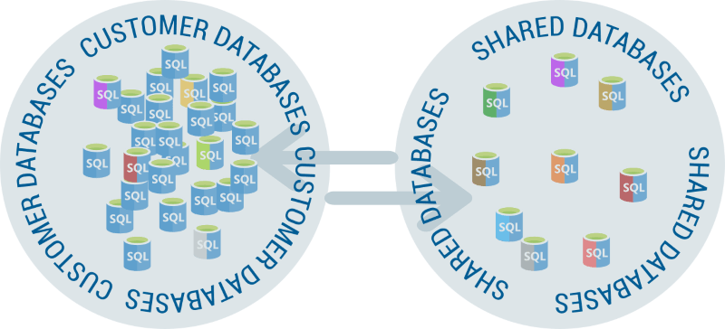

## Cost estimation methodology

Microsoft offers a unified measure of Azure SQL performance called [Data Transaction Units (DTU)](https://docs.microsoft.com/en-us/azure/sql-database/sql-database-service-tiers-dtu#single-database-dtu-and-storage-limits). Their [SQL server sizing calculator](https://dtucalculator.azurewebsites.net) can estimate the number of DTUs needed for a certain performance level. DTUs estimates can be later used to choose [service tiers](https://docs.microsoft.com/en-us/azure/sql-database/sql-database-service-tiers-dtu#compare-the-dtu-based-service-tiers) and [pricing plans](https://azure.microsoft.com/en-us/pricing/details/sql-database/elastic/). The standard process consists of 3 steps:

1. Collect some representative "on-prem" performance data using a [PowerShell script](https://dtucalculator.azurewebsites.net) for a few key metrics:
   * `Processor Total / %`,
   * `LogicalDisk Read/Write per sec`
   * `SQLServer Total\Log Bytes Flushed per sec` 
2. Upload the log files from Step 1 to [Azure DTU calculator](https://dtucalculator.azurewebsites.net)
3. Choose the best sizing option given the performance estimates.

## Estimating SQL Server I: Customer DBs

This server was running on 7-year-old hardware with Windows Server 2012 on [End of Life support](https://support.microsoft.com/en-us/lifecycle/search?alpha=Windows%20Server%202012%20Standard).

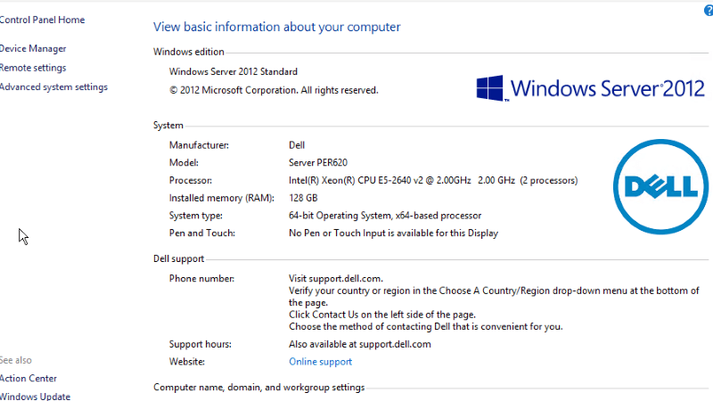 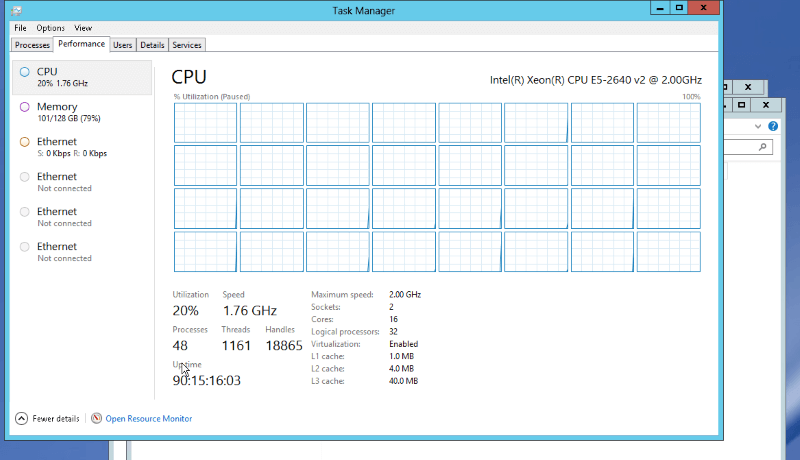

#### Server specs

* 2 x 16 cores @ 2.00 GHz = 32 logical processors
* 128 GB RAM / 369 GB storage used for 141 DBs
* Microsoft SQL Server 2012 (SP4) Standard Edition (64-bit)

#### Equivalent server size recommended by Azure calculator
This recommendation was based on Server I performance logging.
* S4 / 200 DTU
* 91.75% of the sample
* 9.25% throttling
* $1.18/hr
* $857 per month
* $10,284 per year

#### Server size based on a pessimistic assessment
Azure recommendations are too optimistic and would result in throttling. The next tier up should fully cover the peak load.

* S6 / 400 DTU
* 99.89% of the sample
* 0.11% throttling
* $2.35/hr
* $1,715 per month
* $20,580 per year

**Single DB estimate**

Azure Server Sizing Calculator has 2 options: Single DB and DB Pool. The single database option is not directly applicable here because we have multiple databases, but it is still an indication of expected performance.

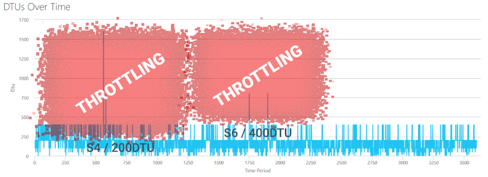

**Elastic Pool estimate**

*Elastic Pool* estimates are more complicated because there are [utilization limitations](https://docs.microsoft.com/en-us/azure/sql-database/sql-database-elastic-pool#when-should-you-consider-a-sql-database-elastic-pool) per pool as well as per single database. An *Elastic Pool* works best when DBs have low average utilization with high peaks. A constant high load requires a higher service tier than it may appear.

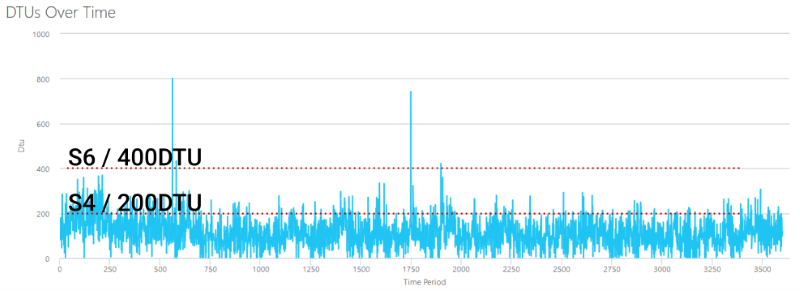

Our workload appears to be a good fit for *SQL Pool* deployment with 20% of the DBs (32 out of 146) creating 80% of the load.

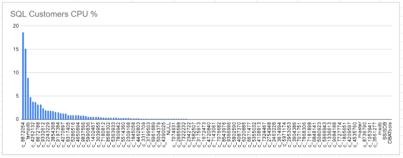

Not that the second busiest database in the graph is *tempdb*. It is obviously overused and there is [some room for improvement](https://dba.stackexchange.com/questions/19870/how-to-identify-which-query-is-filling-up-the-tempdb-transaction-log).

It may be more efficient to group the top-N databases into a separate pool to even out the performance per DB.

#### Utilization breakdown

The current on-prem hardware does not suffer from overloading and the end users are used to consistent server response time. The optimal tier choice should be the one above 100% utilization to maintain a comparable level of user experience. 

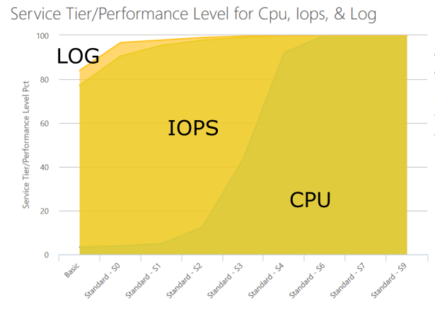

|        | *S4*   | *S6*   | *S7*   | *S9* |
|--------|--------|--------|--------|------|
| **CPU**  | 92.8%  | 100%   | 100%   | 100% |
| **IOPS** | 99.75% | 99.94% | 100%   | 100% |
| **LOG**  | 99.89% | 99.94% | 99.97% | 100% |
|       |*CPU throttling, will be noticeable*|*Minimal throttling, hardly noticeable*|*Full coverage*|*Full coverage with some to spare*|

### Performance improvements

It should be possible to optimize the current DB queries to fit all current customer DBs into a smaller server size without sacrificing the user experience.

* **Target size after improvements**: S4
* **Development cost**: ~ $3,000
* **Annual savings**: $10,000 (*$20k for S6 - $10k for S4*)

Only a small number of frequently called and poorly performing queries would need to be redesigned to get noticeable performance gains.

---

## Estimating SQL Server II: Shared DBs

This server contains databases used by front and back-end apps, but they do not contain any customer data. Several databases contain extracts from the customer data for public-facing websites.

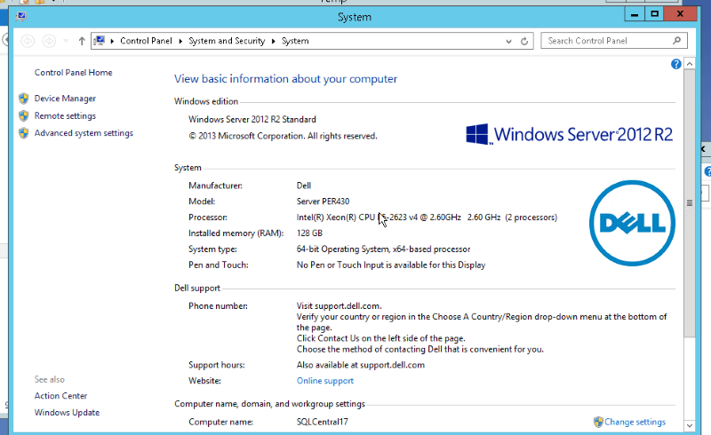 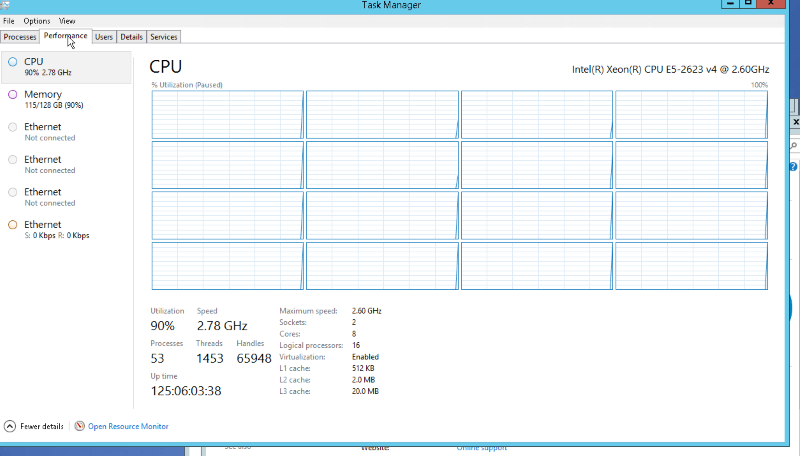

#### Server specs

* 2 x 8 cores = 16 logical processors
* 128 GB RAM / 100 GB storage used for 43 DBs
* Microsoft SQL Server 2014 (SP2) Standard Edition (64-bit)

#### Server size recommended by Azure calculator
* S6 / 400 DTU
* 99.89% of the sample
* 0.11% throttling
* $2.35/hr
* $1,715 per month
* $20,580 per year

#### Server size based on a pessimistic assessment
* S7 / 800 DTU
* 99.89% of the sample
* 0.11% throttling
* $4.70/hr
* $3,431 per month
* $41,172 per year

S6 tier is ½ price of S7 and there is no in-between size. It may be possible to split these databases into 2 smaller pools for more optimal utilization.

**Single DB estimate**

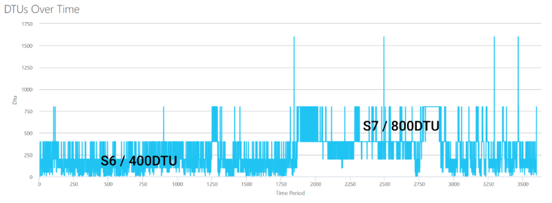

**Elastic Pool estimate**

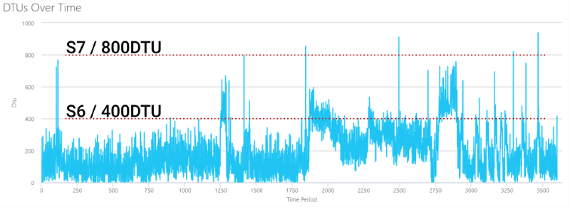

### Utilization breakdown

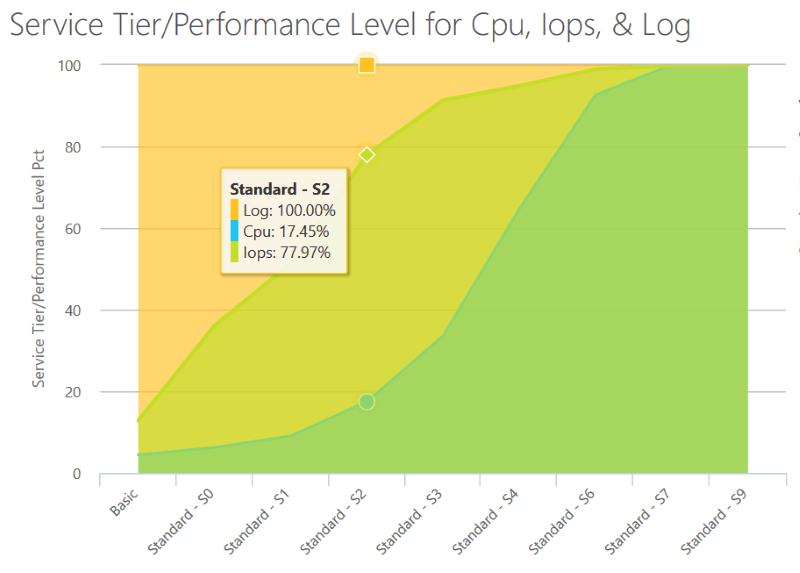 

| |S2 |S4 |S6 |S7 |
|---  |---  |---  |---  |---  |
|CPU|17.45%|64.63%|92.58%|100%|
|IOPS|77.97%|94.83%|98.89%|99.89%|
|LOG|100%|100%|100%|100%|
|Annual cost|$2,568|$10,284|$20,580|$41,172|
|   |Non-functional|Unusable|Some throttling, quite noticeable, errors|Minimal throttling, will be smoothed out|

### Performance improvements

* **Target size with no improvements**: S7
* **Target size with minor improvements**: S4
* **Target size with radical improvements**: S2

Most of the queries on *Server II* are *SELECTs*. A single database *PBLLOCATION* dominates with 67.44% of the workload for public-facing websites as evident from the graph below.

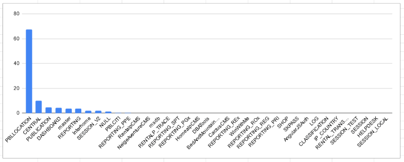

There are a few relatively simple changes that can be enacted on top of the current architecture to greatly reduce the load on the databases:

* Reduce the number of cross-DB queries ([Elastic Queries](https://docs.microsoft.com/en-us/azure/sql-database/sql-database-elastic-query-overview#preview-limitations))
* De-normalise the data model to reduce joins in SQL queries
* Re-arrange how the web pages are assembled
* Use caching, e.g. Azure Redis with 13GB would cost [only $150 a month](https://azure.microsoft.com/en-us/pricing/details/cache/)

**Target size after improvements**: S4 ($857/m).

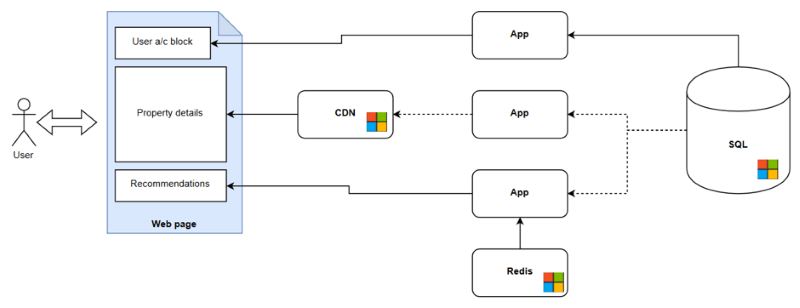

A more radical approach would be to replace heavy use of SQL databases with cheaper and more suitable technologies:

* Put all static objects behind a [CDN](https://azure.microsoft.com/en-us/services/cdn/)
* Use a [Redis](https://azure.microsoft.com/en-us/services/cache/) (or similar) cache for frequently queried data
* Use [ElasticSearch](https://azuremarketplace.microsoft.com/en-us/marketplace/apps/elastic.elasticsearch) in place of SQL DB for non-transactional data
* Limit SQL DB to being *the source of truth* and for critical transactions

**Target pool size with newer architecture**: S2 ($214/m)

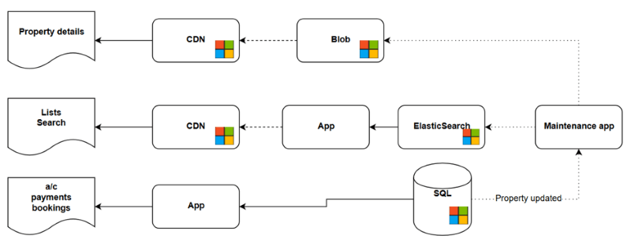

---

*This post is based on my recent experience migrating a real estate management system with hundreds of MS SQL databases from on-prem to Azure SQL. Read my other articles for more learnings from that project.*