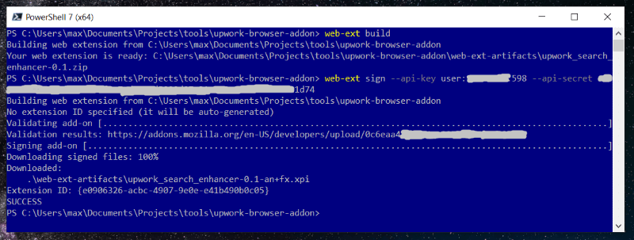
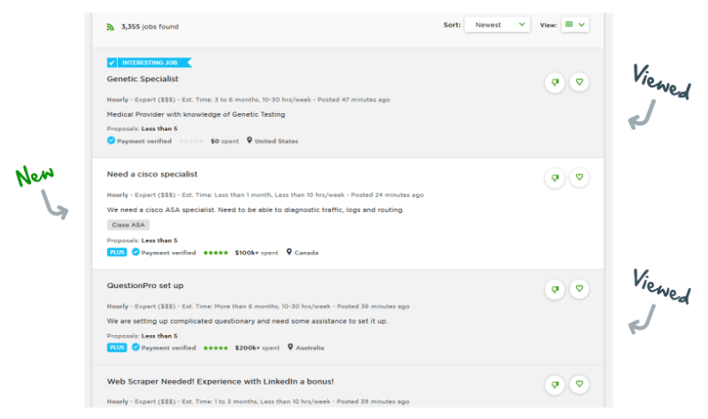

# How I fixed UpWork.com with 100 lines of code
#### A short story of learning a new skill everyone should have anyway

---

Picture getting hundreds of search results for *C#* jobs on a freelance website.

You scroll through, but nothing appeals. You click on *Full stack* category and half of the results are a repeat of the *C#* search you just went through because they were listed in both categories. Frustrating, isn't it?

The choice of options for us, end-users is limited:

1. Use some other website
2. Ask them to improve the search
3. Ignore the problem

There is one more *"secret"* option:

* **Fix it right in your browser**

## So, how hard would it be to build a browser add-on to hide job posts I already looked at?

The short answer is, **not hard at all** and I have a [proof](https://github.com/rimutaka/upwork-browser-addon) for it. Let me retrace my steps for you ...

#### Step 1: Read up on it

My browser of choice is Firefox, so I headed to MDN for [some basic add-on info](https://developer.mozilla.org/en-US/docs/Mozilla/Add-ons/WebExtensions). One hour later I knew that:

* add-ons are basically JS code that exists independent of the website
* almost anything on the web page can be read and modified by them
* most of the requests can be intercepted and modified as well
* the dev environment is the same as for front-end work (JS/TS)
* there is plenty of good *Get Started* material

#### Step 2: Set everything up

It took me about half a day to set everything up, understand how to use TypeScript compiler (ended up not needing it), [download the samples](https://github.com/mdn/webextensions-examples) and get ready for "*cutting the code*". The tool-chain is actually quite simple and easy to install: 

* VSCode + [Chrome](https://github.com/Microsoft/vscode-chrome-debug) and [Firefox](https://github.com/firefox-devtools/vscode-firefox-debug) debuggers
* Node.js + NPM
* [web-ext CLI tool](https://extensionworkshop.com/documentation/develop/getting-started-with-web-ext/)

#### Step 3: Try out some basics

I picked a suitably looking extension from a [long lineup of samples](https://developer.mozilla.org/en-US/docs/Mozilla/Add-ons/WebExtensions/Examples), fired it up in the browser via *web-ext tool* and started making small changes to the code to get a feel for it. Several hours later I felt like I was getting somewhere. The code was doing most of what I needed, but it was an unreliable mishmash of badly structured JS. 

I reached the point where I confidently could:

* make changes to the code and write some new lines
* debug
* find my way around the documentation 

#### Step 4: Drift off-course

You know how it goes. Hours pass before you realise it's a dead end. 

I managed to successfully intercept and modify XHR requests with job listings from UpWork just to realise that modifying them would not solve my problem. That wasn't a complete write-off, though. I learned something very useful for other add-on projects I have in mind (*[Xero](https://xero.uservoice.com/forums/5528-xero-accounting-api/suggestions/2884040-reconcile-via-the-api) and [Spotify](https://community.spotify.com/t5/Accounts/Play-all-songs/td-p/4770211), I'm coming for you!*).

#### Step 5: Make it work

If JS is not your main tool of trade expect it to take longer than you think. I spent a whole long day writing [107 lines of code](https://github.com/rimutaka/upwork-browser-addon/blob/v0.1/main.js) while looking up [Web API on MDN](https://developer.mozilla.org/en-US/docs/Web/API) and chasing my own tail more times that I'm prepared to admit. 

In the nutshell, the coding part is no different from writing some client-side JS script. The workflow is quite straightforward:

* make the add-on code work in your dev environment
* get a [signing key from Mozilla](https://addons.mozilla.org/en-US/developers/addon/api/key/)
* generate a [signed package](https://extensionworkshop.com/documentation/develop/web-ext-command-reference/#web-ext-sign) with one CLI command
* install in your browser and [share with others](https://extensionworkshop.com/documentation/publish/signing-and-distribution-overview/#distributing-your-addon)

## Was it worth my time?

All in all, my adventure to learn and build my first browser extension took me 2 days. Making a similar extension again would take me only a few hours. 

I don't know if the time saved by using my [UpWork extension](https://github.com/rimutaka/upwork-browser-addon) will pay back in pure economic sense, but I do know I will no longer have the frustration of looking at the same job ad more than once. So yes, it was totally worth my time.

** **

Check out https://github.com/rimutaka/upwork-browser-addon if you are an UpWork user or just want to see the source code.

