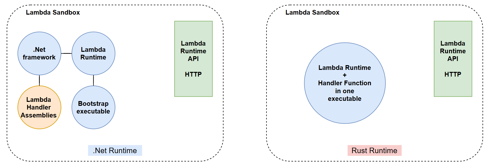
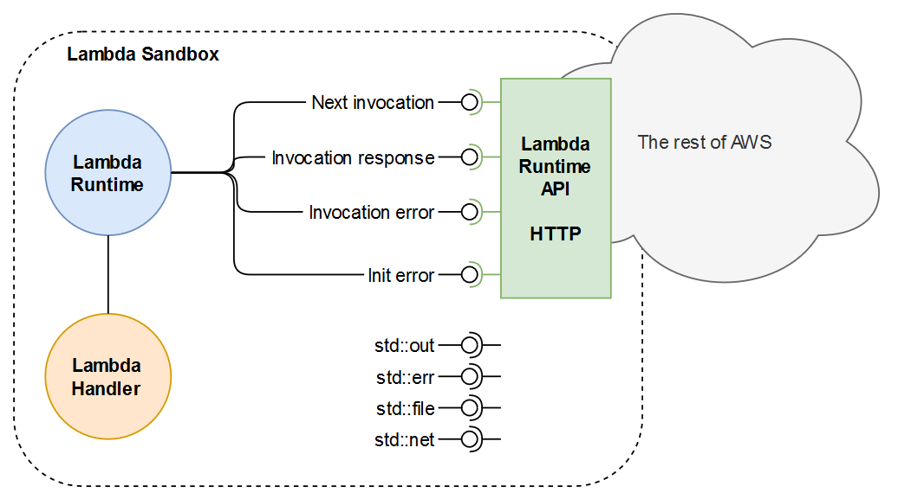
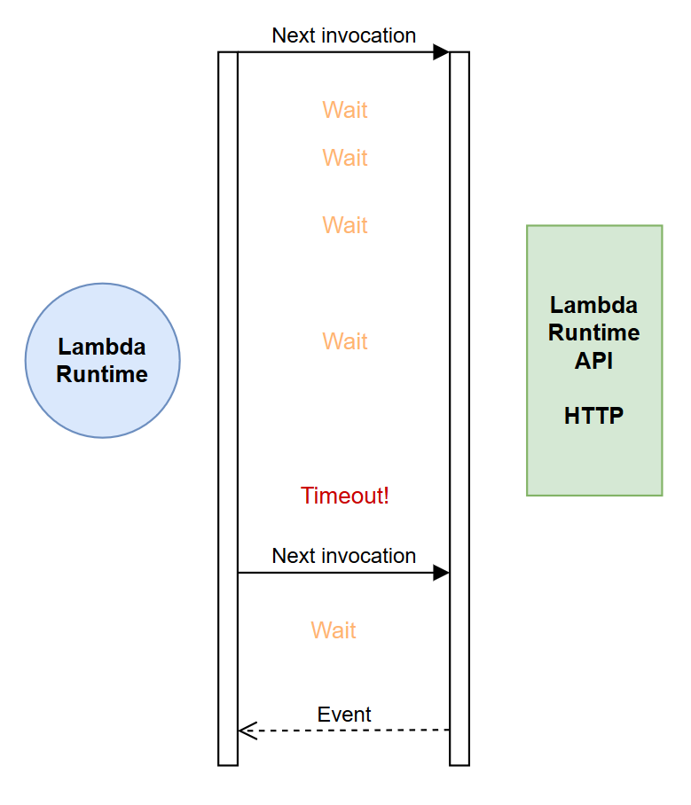
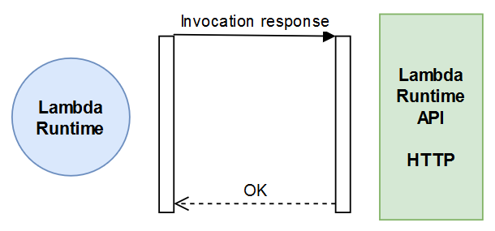
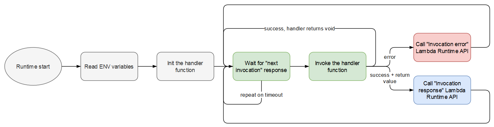
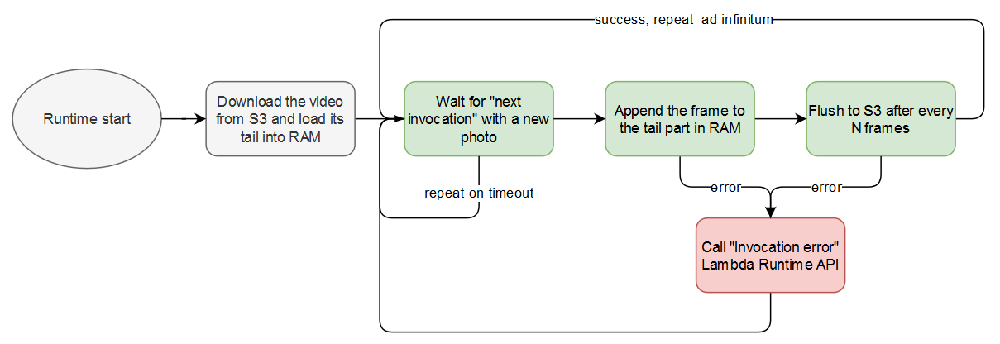

# How to run stateful AWS Lambda functions in any language using custom runtimes
#### An illustrated explanation of how Lambda environment works

AWS Lambda used to be limited to a handful of [supported languages](https://docs.aws.amazon.com/lambda/latest/dg/lambda-runtimes.html). Now almost any language can be supported through a custom runtime, which is just a Linux executable file. This article gives an overview of how those custom runtimes work.

## What is Lambda Runtime?

Lambda functions run in a sandboxed environment called [*execution context*](https://docs.aws.amazon.com/lambda/latest/dg/runtimes-context.html). It has resources specified in the function description, such as memory, timeout or the type of the runtime. The runtime is a Linux executable that conforms to a certain specification and serves as a wrapper to run the handler function within the *execution context*.

For example, C# handler code is [packaged](https://docs.aws.amazon.com/lambda/latest/dg/csharp-package.html) into a Zip file as compiled assemblies with their dependencies and `proj.runtimeconfig.json` that tells the *.NetCore runtime* what is in the package and how to run it. That runtime is provided by AWS and already resides inside the Lambda Sandbox when you upload your package.  

Rust code, on the other hand, is compiled into a single executable file named `bootstrap` and is uploaded to a Lambda function with no runtime.

In both cases, Lambda will call a file called *bootstrap* when it starts the function. The difference is that the .NetCore bootstrap is part of the runtime provided by AWS and the Rust bootstrap is provided by the user.

## Function handler invocation

The Lambda execution environment has several environmental variables that tell the runtime about the Lambda API and the environment constraints:

* AWS_LAMBDA_RUNTIME_API
* AWS_LAMBDA_FUNCTION_NAME
* AWS_LAMBDA_FUNCTION_MEMORY_SIZE
* AWS_LAMBDA_FUNCTION_VERSION
* AWS_LAMBDA_LOG_STREAM_NAME
* AWS_LAMBDA_LOG_GROUP_NAME

From there, the runtime does whatever initialization it needs to do and starts talking to Lambda API endpoints via HTTP.

The first API call for the runtime is to ask for *next invocation*.

The web client inside the runtime sends an HTTP GET request to `http://${AWS_LAMBDA_RUNTIME_API}/2018-06-01/runtime/invocation/next` and waits for a response. It waits, and waits and waits, until it either times out or the API responds with event details when something invokes that function. If it does time out it should resend the *next invocation* request in an infinite loop.

When the *next invocation* response does arrive it is up to the runtime to do something with the event details it contains. Most runtimes pass the event details to a *handler function*, but if you control the runtime you can do all the work inside the runtime itself.

If there is a response to be sent back to the caller of the Lambda function, the runtime puts the payload inside an HTTP Post, adds some headers and sends it all to a special *response endpoint* of the Lambda API: `http://${AWS_LAMBDA_RUNTIME_API}/2018-06-01/runtime/invocation/$REQUEST_ID/response`. The API responds with HTTP/202 and `{"status":"OK"}` in the body, and forwards the payload back to the caller.

If the runtime or the handler function failed, the runtime is expected to report the error to a different endpoint (`http://${AWS_LAMBDA_RUNTIME_API}/2018-06-01/runtime/invocation/$REQUEST_ID/error`).

Then the runtime restarts the process by calling *next invocation* API again.

## Custom runtimes on GitHub

The most popular custom runtime is for [Rust Lambda Functions](https://github.com/awslabs/aws-lambda-rust-runtime). I am a user and a contributor to that project and can assure you that it works just fine. GitHub has a good choice of other custom runtimes:

* [Swift](https://github.com/swift-server/swift-aws-lambda-runtime)
* [R](https://github.com/bakdata/aws-lambda-r-runtime)
* [Haskell](https://github.com/theam/aws-lambda-haskell-runtime)
* [C++](https://github.com/awslabs/aws-lambda-cpp)
* [Perl](https://github.com/rlauer6/perl-Amazon-Lambda-Runtime)
* [Elixir](https://github.com/aws-samples/aws-lambda-elixir-runtime)
* [Deno](https://github.com/hayd/deno-lambda)
* [and many more ...](https://github.com/search?p=2&q=lambda+runtime&type=Repositories)

If your language of choice has no Lambda runtime yet, you can follow [this tutorial](https://docs.aws.amazon.com/lambda/latest/dg/runtimes-walkthrough.html) and the examples above to build one yourself.

## Faster invocations and stateful Lambdas

Lambda functions are stateless by definition. You provide a handler function, it is being invoked by the runtime as one instance or 100 instances at the same time. It's great for scalability, but doesn't work well for use cases with heavy initialization. Think of functions with large dependencies or obtaining DB connections. Those can be persisted on the disk, but what if you want to keep them loaded in memory?

#### Timelapse video example

I worked on a project where a photo frame was uploaded to S3 every 1 second and had to be added at the end of a timelapse video stored in S3. We tried to use FFMPEG with C# in a Lambda function, but it was too slow because a lot of data had to be persisted on the disk between the calls and there was no way to keep it in memory using a standard .NetCore runtime. The cost/benefit of using Lambdas was not there and we ended up running an EC2 instance for that.

A custom runtime could have solved the problem by downloading the video, storing the end portion of it in memory and flushing encoded chunks only once every few frames, as long as it was within the lifetime of a single Lambda instance.

There may be many other examples where persisting large amounts of data or serialized objects on disk would be inefficient, so maintaining state between invocations is a make-or-break feature there.

Being "stateful" goes against the grain of Lambda ideology, but who cares about that if it solves your problem?

----
*I am curious about the nature of the sandbox environment used by AWS for Lambdas. Please, share in the comments if you know what it is.*