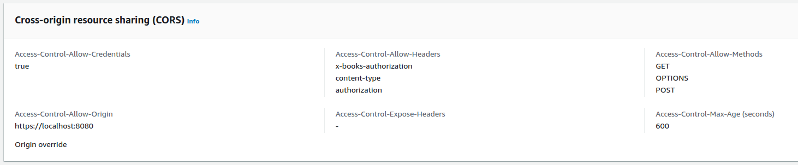

# AWS Lambda with CloudFront configuration: caching, CORS and authorization examples

This post collection of examples from different configuration options for invoking AWS Lambda via CloudFront. 

## CORS not required, no Authorization header, no caching

This simple GET request does not require the CORS protocol or authorization:
```javascript
const response = await fetch("https://d9tskged4za87.cloudfront.net/sync.html");
```

Function URL configuration:
- Auth type: AWS_IAM
- CORS disabled (irrelevant as no CORS protocol is involved)

CloudFront configuration:
- origin access with signed requests
- _CachingDisabled_ policy
- OPTIONS caching setting is irrelevant since caching is disabled via _CachingDisabled_ policy
- _Managed-AllViewerExceptHostHeader_ request policy
- No response policy

**How it works:**

1. CloudFront replaces the value of _Host_ and passes all other headers onto the lambda
2. the lambda function handler is invoked for all HTTP request types
3. all headers generated by the lambda function are forwarded back to the client

**Request headers:**
```
GET /sync.html HTTP/2
Host: d9tskged4za87.cloudfront.net
User-Agent: Mozilla/5.0 (X11; Ubuntu; Linux x86_64; rv:129.0) Gecko/20100101 Firefox/129.0
Accept: */*
Accept-Language: en-US,en;q=0.5
Accept-Encoding: gzip, deflate, br, zstd
Origin: https://localhost:8080
DNT: 1
Connection: keep-alive
Sec-Fetch-Dest: empty
Sec-Fetch-Mode: cors
Sec-Fetch-Site: cross-site
Priority: u=0
Pragma: no-cache
Cache-Control: no-cache
```

Headers in the payload passed to the lambda function:
```json
{
  "accept": "*/*",
  "accept-encoding": "gzip, deflate, br, zstd",
  "accept-language": "en-US,en;q=0.5",
  "cache-control": "no-cache",
  "cloudfront-forwarded-proto": "https",
  "cloudfront-is-android-viewer": "false",
  "cloudfront-is-desktop-viewer": "true",
  "cloudfront-is-ios-viewer": "false",
  "cloudfront-is-mobile-viewer": "false",
  "cloudfront-is-smarttv-viewer": "false",
  "cloudfront-is-tablet-viewer": "false",
  "cloudfront-viewer-address": "2406:2d40:728d:fa10::c4a:42838",
  "cloudfront-viewer-asn": "14593",
  "cloudfront-viewer-city": "Auckland",
  "cloudfront-viewer-country": "NZ",
  "cloudfront-viewer-country-name": "New Zealand",
  "cloudfront-viewer-country-region": "AUK",
  "cloudfront-viewer-country-region-name": "Auckland",
  "cloudfront-viewer-http-version": "2.0",
  "cloudfront-viewer-latitude": "-36.85060",
  "cloudfront-viewer-longitude": "174.76790",
  "cloudfront-viewer-postal-code": "1010",
  "cloudfront-viewer-time-zone": "Pacific/Auckland",
  "cloudfront-viewer-tls": "TLSv1.3:TLS_AES_128_GCM_SHA256:sessionResumed",
  "dnt": "1",
  "host": "mq75dt64puwxk3u6gjw2rhak4m0bcmmi.lambda-url.us-east-1.on.aws",
  "origin": "https://localhost:8080",
  "pragma": "no-cache",
  "priority": "u=0",
  "sec-fetch-dest": "empty",
  "sec-fetch-mode": "cors",
  "sec-fetch-site": "cross-site",
  "user-agent": "Mozilla/5.0 (X11; Ubuntu; Linux x86_64; rv:129.0) Gecko/20100101 Firefox/129.0",
  "via": "2.0 03e8784cc6fbcd65ff743e9f537e8e88.cloudfront.net (CloudFront)",
  "x-amz-cf-id": "Wtw2gvr0...o3nk-DQ==",
  "x-amz-content-sha256": "e3b0c44...852b855",
  "x-amz-date": "20240812T024912Z",
  "x-amz-security-token": "IQoJb3...yM6wdjMEg==",
  "x-amz-source-account": "512295225992",
  "x-amz-source-arn": "arn:aws:cloudfront::512295225992:distribution/E3FGXRC3VXQ2IF",
  "x-amzn-tls-cipher-suite": "ECDHE-RSA-AES128-GCM-SHA256",
  "x-amzn-tls-version": "TLSv1.2",
  "x-amzn-trace-id": "Root=1-66b97828-7217f26e68fb64c806f4daf5",
  "x-forwarded-for": "2406:2d40:728d:fa10::c4a",
  "x-forwarded-port": "443",
  "x-forwarded-proto": "https"
}
```

Request headers of interest:
- brower to CloudFront `Host: d9tskged4za87.cloudfront.net`
- CloudFront to Lambda: `host: mq75dt64puwxk3u6gjw2rhak4m0bcmmi.lambda-url.us-east-1.on.aws`
- `origin: https://localhost:8080` is the same for both

**Lambda's response:**
```json
{
  "statusCode": 200,
  "headers": {
    "x-foo-header": "bar",
    "content-type": "text/html; charset=utf-8"
  },
  "body": "Hello from client-sync",
  "isBase64Encoded": false,
  "cookies": []
}
```

**CloudFront response headers:**
```
HTTP/2 200 
content-type: text/html; charset=utf-8
content-length: 22
date: Mon, 12 Aug 2024 02:49:14 GMT
x-amzn-requestid: 28b96338-a3a6-4a6e-aad2-8b7d25a4fe13
x-foo-header: bar
vary: Origin
x-amzn-trace-id: root=1-66b97828-7217f26e68fb64c806f4daf5;parent=717724cd0dc027c2;sampled=0;lineage=a964c7ca:0
x-cache: Miss from cloudfront
via: 1.1 03e8784cc6fbcd65ff743e9f537e8e88.cloudfront.net (CloudFront)
x-amz-cf-pop: LAX3-C3
x-amz-cf-id: Wtw2gvr045gDD6eqIC6s_rDEnugktHpg0YUjmrp2jRuN6PNo3nk-DQ==
X-Firefox-Spdy: h2
```

Response headers of interest:
- `x-foo-header: bar` custom header was passed from the lambda function to the browser
- `x-cache: Miss from cloudfront` is the same for repeat requests because the caching is disabled

## CORS, no Authorization header, no caching

This request requires the CORS protocol, but the authorization is done through a custom header:
```javascript
const response = await fetch(
  "https://d9tskged4za87.cloudfront.net/sync.html",
  {
    headers: {
      "X-Books-Authorization": "dummy-book-auth4",
    },
  },
);
```

In Function URL:
- _Auth type: AWS_IAM_
- **CORS enabled**

In CloudFront (unchanged):
- origin access with signed requests
- _CachingDisabled_ policy
- OPTIONS caching is disabled
- _Managed-AllViewerExceptHostHeader_ request policy
- No response policy

**Flow changes:**

1. The web client sends the HTTP OPTIONS request first to obtain the CORS headers:

2. CORS headers are added by AWS as part of the lambda invocation

CORS-related request headers for HTTP OPTIONS:
```
OPTIONS /sync.html HTTP/2
Access-Control-Request-Method: GET
Access-Control-Request-Headers: x-books-authorization
Origin: https://localhost:8080
```

CloudFront OPTIONS response has four CORS headers generated by AWS without invoking the lambda function handler:
```
access-control-allow-origin: https://localhost:8080
access-control-allow-headers: authorization,content-type,x-books-authorization
access-control-allow-methods: GET,POST
access-control-allow-credentials: true
```

The OPTIONS request is followed by a GET request with a custom authorization header (_X-Books-Authorization_):
```
GET /sync.html HTTP/2
...
X-Books-Authorization: dummy-book-auth4
Origin: https://localhost:8080
```

The lambda function handler gets the new header inside its GET payload:
```json
{
  ...
  "x-books-authorization": "dummy-book-auth4",
}
```

The lambda's response is identical to the previous GET example with no CORS:
```json
{
  "statusCode": 200,
  "headers": {
    "x-foo-header": "bar",
    "content-type": "text/html; charset=utf-8"
  },
  "body": "Hello from client-sync",
  "isBase64Encoded": false,
  "cookies": []
}
```

CloudFront GET response has two CORS headers added to it by AWS:
```
access-control-allow-origin: https://localhost:8080
access-control-allow-credentials: true
```

### CORS, Authorization header, caching

This request uses the _Authorization_ header and requires the CORS protocol:
```javascript
const response = await fetch(
  "https://d9tskged4za87.cloudfront.net/sync.html",
  {
    headers: {
      "Authorization": "dummy-auth",
    },
  },
);
```

In Function URL:
- **Auth type: NONE**
- **CORS enabled**

In CloudFront:
- **origin access with unsigned requests**
- **custom caching policy that includes the _Authorization_ header**
- **OPTIONS caching is enabled**
- _Managed-AllViewerExceptHostHeader_ request policy
- No response policy

**Flow changes:**
- the Lambda function is public
- CloudFront no longer uses the _Authorization_ header
- repeat requests with the same value for the _Authorization_ header are served from the CloudFront cache
- repeat OPTIONS requests are served from the CloudFront cache

All the request/response headers are nearly identical to the previous example, except for the common `Authorization` header replacing the custom `X-Books-Authorization` header.
The _Authorization_ header is successfully passed onto the lambda function.

OPTIONS request/response:
- identical to the previous example

GET request:
```
GET /sync.html HTTP/2
Host: d9tskged4za87.cloudfront.net
Authorization: dummy-auth
Origin: https://localhost:8080
...
```

The _Authorization_ header is added to the lambda handler payload:
```json
{
  "authorization": "dummy-auth",
  ...
}
```

CloudFront requested OPTIONS and GET from the lambda function on the first request and returned `x-cache: Miss from cloudfront` header.

Repeat requests did not trigger the lambda function and returned `x-cache: Hit from cloudfront` header meaning that both OPTIONS and GET requests were cached.

Repeating the request with a different value of the _Authorization_ header, e.g. `Authorization: dummy-auth-2` returned `x-cache: Hit from cloudfront` for OPTIONS and `x-cache: Miss from cloudfront` for GET, as expected.


### CORS by CloudFront, custom authorization header, caching

This request uses a custom `X-Books-Authorization` header in place of the common _Authorization_ header due to the Lambda/CloudFront configuration:
```javascript
const response = await fetch(
  "https://d9tskged4za87.cloudfront.net/sync.html",
  {
    headers: {
      "X-Books-Authorization": `${token}`,
    },
  },
);
```

In Function URL:
- Auth type: AWS_IAM
- CORS disabled

In CloudFront:
- origin access with signed requests (takes over the common _Authorization_ header)
- **custom caching policy that includes the _X-Books-Authorization_ header**
  
- **OPTIONS caching is enabled**
- _Managed-AllViewerExceptHostHeader_ request policy
- Custom response policy to add CORS headers


**How it works:**
- the Lambda function access is private
- CloudFront uses the _Authorization_ header to authenticate itself to Lambda
- the lambda handler gets all requests, including OPTIONS
- CORS headers are added by CloudFront 
- repeat requests with the same value for the _Authorization_ header are served from the CloudFront cache
- repeat OPTIONS requests are served from the CloudFront cache

All the request/response headers are nearly identical to the previous example, except for the common `Authorization` header replacing the custom `X-Books-Authorization` header.
The _Authorization_ header is successfully passed onto the lambda function.

OPTIONS request:
```
OPTIONS /sync.html HTTP/2
Host: d9tskged4za87.cloudfront.net
Access-Control-Request-Method: GET
Access-Control-Request-Headers: x-books-authorization
Origin: https://localhost:8080
...
```

Payload headers in the lambda handler:
```json
{
  "access-control-request-headers": "x-books-authorization",
  "access-control-request-method": "GET",
  "host": "mq75dt64puwxk3u6gjw2rhak4m0bcmmi.lambda-url.us-east-1.on.aws",
  "origin": "https://localhost:8080",
  ...
}

Lambda handler's response:
```json
{
  "statusCode": 200,
  "headers": {
    "content-type": "text/html; charset=utf-8"
  },
  "body": "",
  "isBase64Encoded": false,
  "cookies": []
}
```

CloudFront adds the CORS headers as per its response policy:
```
access-control-allow-credentials: true
access-control-allow-headers: x-books-authorization
access-control-allow-methods: GET,OPTIONS,POST
access-control-allow-origin: https://localhost:8080
access-control-max-age: 600
vary: Access-Control-Request-Headers
vary: Access-Control-Request-Method
vary: Origin
```

GET request:
```
GET /sync.html HTTP/2
Host: d9tskged4za87.cloudfront.net
Origin: https://localhost:8080
X-Books-Authorization:  eyJhbGciOiJkaX...O0DrYwQ
...
```

The _X-Books-Authorization_ header is added to the lambda handler payload:
```json
{
  "host": "mq75dt64puwxk3u6gjw2rhak4m0bcmmi.lambda-url.us-east-1.on.aws",
  "origin": "https://localhost:8080",
  "x-books-authorization": "eyJhbGciOiJkaX...O0DrYwQ",
}
```

Lambda's response:
```json
{
  "statusCode": 200,
  "headers": {
    "x-foo-header": "bar",
    "content-type": "text/html; charset=utf-8"
  },
  "body": "Hello from client-sync",
  "isBase64Encoded": false,
  "cookies": []
}
```

CloudFront response:
```
x-foo-header: bar
x-cache: Miss from cloudfront
access-control-allow-credentials: true
access-control-allow-origin: https://localhost:8080
vary: Origin
```

Repeat requests did not trigger the lambda function and returned `x-cache: Hit from cloudfront` header meaning that both OPTIONS and GET requests were cached.

Repeating the request with a different value of the _X-Books-Authorization_ header returned `x-cache: Hit from cloudfront` for OPTIONS and `x-cache: Miss from cloudfront` for GET, as expected.
