# AWS Lambda with CloudFront configuration options explained

This post explores different configuration options for invoking AWS Lambda via CloudFront to help you understand how different CloudFront and Lambda Function URL settings affect CORS and Authorization headers.

## Overview

AWS Lambda Functions can be invoked via a public [AWS Lambda Function URL](https://docs.aws.amazon.com/lambda/latest/dg/urls-configuration.html) with an HTTP call from a browser script, e.g.

```javascript
const lambdaResponse = await fetch(
  "https://mq75dt64puwxk3u6gjw2rhak4m0bcmmi.lambda-url.us-east-1.on.aws",
  {
    headers: {
      Authorization: `Bearer ${token}`,
    },
  },
);
``` 

There are two possible downsides to this type of invocation:

1. you cannot use a custom domain - it has to be an AWS-generated URL like `https://mq75dt64puwxk3u6gjw2rhak4m0bcmmi.lambda-url.us-east-1.on.aws`
2. There is no server-side caching

Calling your lambdas via CloudFront solves both of these issues.

### Special considerations

There is quite a bit of configuration to be done upfront to make a Lambda function work with CloudFront:

- Lambda Function URL access control and CORS
- CloudFront origin and behaviors
- CloudFront caching policy
- CloudFront origin request policy
- CloudFront response headers policy

This guide complements the [official AWS documentation](https://docs.aws.amazon.com/AmazonCloudFront/latest/DeveloperGuide/DownloadDistS3AndCustomOrigins.html#concept_lambda_function_url) with examples and shortcuts.


## Core concepts

This section explains CloudFront terms and concepts that affect Lambda, CORS and the _Authorization_ header.

**General**
- CloudFront forwards all requests to the Lambda URL, including OPTIONS
- CloudFront can cache OPTIONS responses
- CloudFront can drop or overwrite some of the request and response headers
- _Authorization_, _Host_ and other headers are used by AWS in communication between CloudFront and Lambda and may conflict with the same headers used by the web client

**CORS headers** can be added in three different places creating confusion and duplication. Choose one that is most suitable for your use case:
- by the code inside the lambda function,
- by AWS if Lambda Function URL CORS were configured,
- by CloudFront via _Response Headers Policy_.

**Origin access control** settings tell CloudFront if it should sign requests sent to the Lambda Function URL.
Signing requests takes over the _Authorization_ header so that you cannot forward it from the client app to the lambda.

**Caching policy** settings of a _Behavior_ tell CloudFront which headers to use as caching keys:
- headers included in the caching key are passed onto the lambda
- you have to include your authorization key to avoid serving one user's response to another user
- even if you include the _Authorization_ header in the key it may be overtaken by the AWS signature configured in the _Origin access control_
- you do not have to have a caching policy for the CORS to work
- AWS recommends _CachingDisabled_ for Lambda URLs

**Origin request policy** settings tell CloudFront which headers to forward to the lambda:
- not all headers are forwarded by default
- you should not forward the _Host_ header (it returns an error at runtime if you do)
- CloudFront may drop or replace some headers
- _AllViewerExceptHostHeader_ policy works fine with CORS and is the default choice for Lambda URLs
- you can choose _None_ if you don't need to pass any authorization headers and generate the CORS response inside CloudFront

**Response headers policy** tells CloudFront what headers to add to the response:
- you can choose _None_ if the lambda function handles the CORS response
- you can choose a suitable managed CORS policy from the list to complement or overwrite the lambda's response
- you can create a custom policy to complement or overwrite the lambda's response

**Header quotas** set [limits](https://docs.aws.amazon.com/AmazonCloudFront/latest/DeveloperGuide/cloudfront-limits.html#limits-custom-headers) to how much data you can put into custom headers.
- Max length of a header value: 1,783 characters
- Max length of all headers: 10,240 characters


## Lambda Function URL configuration for CloudFront

Let's assume that you already have a working Lambda function with a configured URL for public access and we need to make it work with CloudFront.

## Lambda URL access control config

The following config lets CloudFront access a Lambda function via its URL in the most secure way.

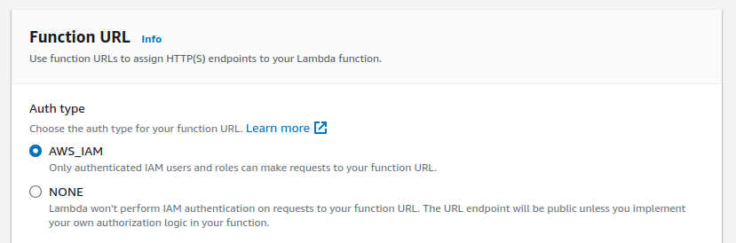

We will add the CloudFront IAM policy to the Lambda at a later stage.

Setting your function URL access control to _Auth type: NONE_ makes the function public, which also includes CloudFront.

## Lambda URL CORS headers

**Enabling CORS headers** in Lambda Function URL settings intercepts all HTTP OPTIONS requests sent to the function and returns the configured response.

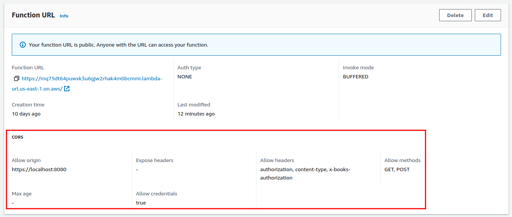

**Disabling CORS headers** forwards HTTP OPTIONS requests to the function handler.

CORS headers can be configured in CloudFront's _Response Headers Policy_.

CloudFront can cache HTTP OPTIONS responses regardless of which of the above strategies of handling CORS you choose.


## CloudFront configuration

A Lambda function should be added as an _Origin_ of a CloudFront distribution.

In this example _client-sync lambda_ origin is linked to _/sync.html_ path, so if a client app makes a `fetch()` call to `https://d9tskged4za87.cloudfront.net/sync.html` the request will be forwarded to _client-sync lambda_ for processing.

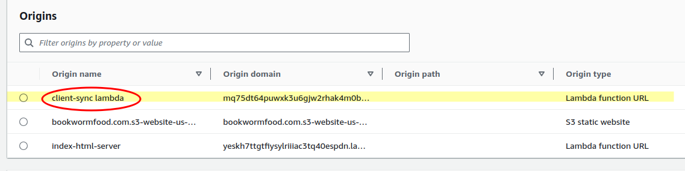

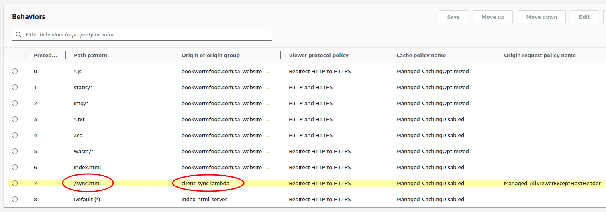

### Origin configuration

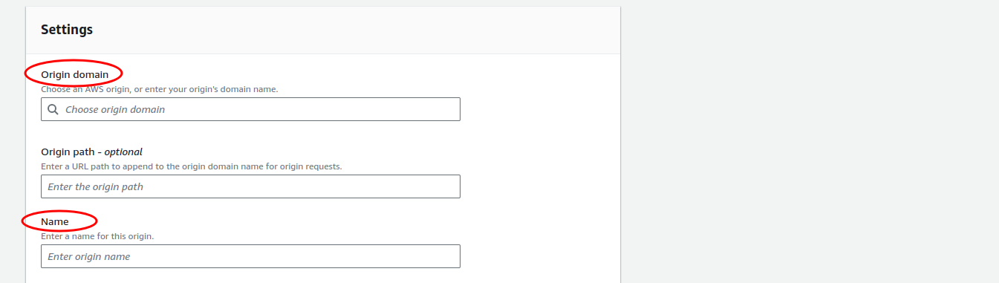

- **origin domain:** copy-paste the domain of the Lambda Function URL, e.g. `mq75dt64puwxk3u6gjw2rhak4m0bcmmi.lambda-url.us-east-1.on.aws`
- **origin path:** leave blank
- **name:** give it an informative name, spaces are OK; it will not be used as an ID

### Origin access control affects the use of Authorization header

Create a new _Origin Access Policy_ that can be shared between multiple lambda functions.

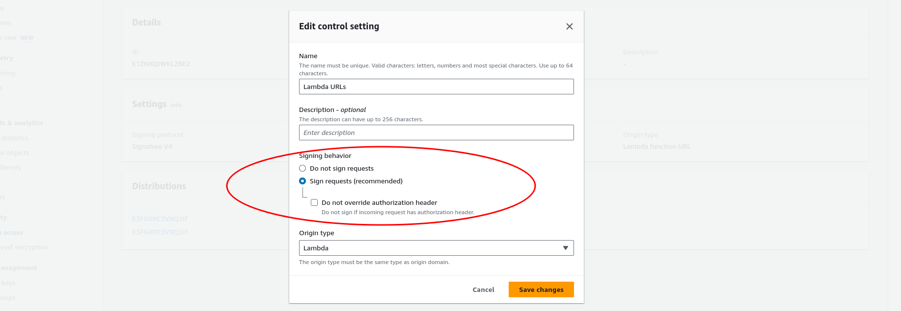

Signing CloudFront requests to the lambda function URL also uses the _Authorization_ header which can create a conflict if the web client uses the _Authorization_ header for its authorization.

__Do not sign requests__
- CloudFront passes the _Authorization_ header from the browser to the lambda
- the lambda must have _Auth type: NONE_ and a public access policy enabled

__Sign requests__
- _Authorization_ header from the browser is dropped
- CloudFront uses the _Authorization_ header to sign requests to the lambda
- _Authorization_ header is excluded from the lambda's payload
- the lambda can have _Auth type: AWS_IAM_ and no public access

__Do not override authorization header__
This is a combination of the two previous policies:
- sign if there is no _Authorization_ header coming from the browser
- do not sign if there is one coming from the browser
- the lambda must have _Auth type: NONE_ and a public access policy enabled for this option to work

The _Origin Access_ policy can be edited later from the sidebar under _Security / Origin access_ menu.

#### Lambda access policy

Copy-paste and run the template generated by the console:

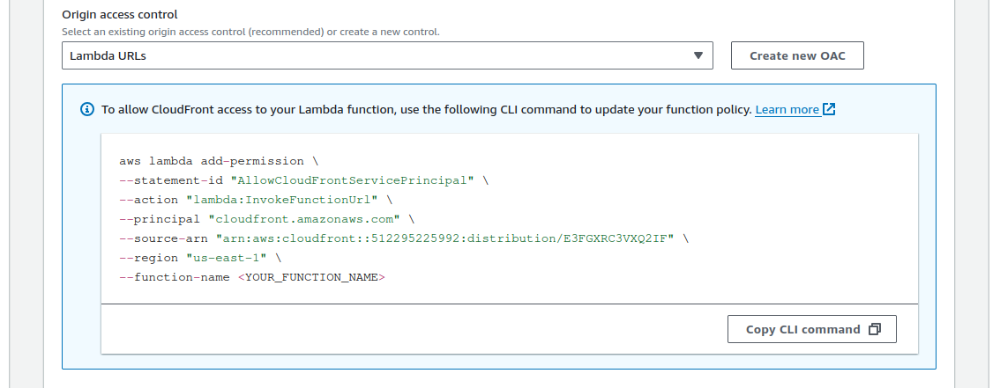

If you go back to your lambda function after running the `aws lambda add-permission` command, you should see the newly added policy:

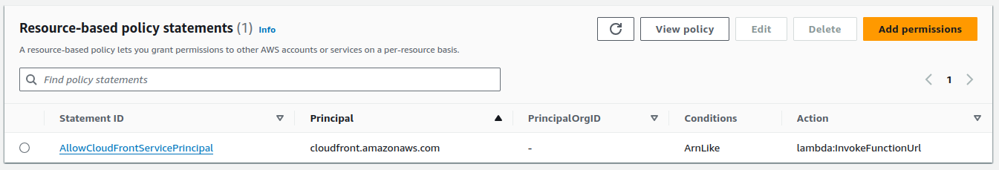

The policy should have your account and distribution IDs:

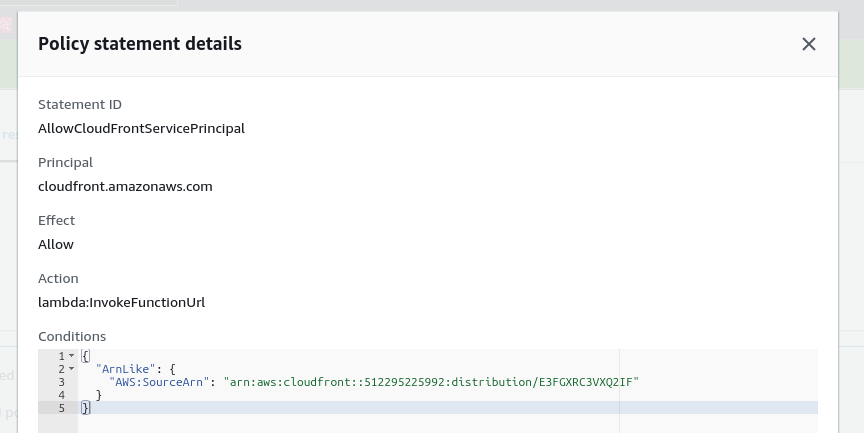


### Behavior configuration

Create a new _behavior_ with the path to the endpoint that invokes the Lambda (1) and the name of origin you created for the lambda earlier (2) as in the following example:

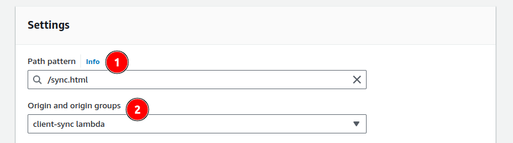

The address of this endpoint would be `https://[CF distr ID].cloudfront.net/sync.html` or `https://[custom domain]/sync.html`.

You must select an option with the _HTTP OPTIONS_ method for CORS to work.

Caching OPTIONS requests prevents sending repeat OPTIONS requests to the lambda. This option depends on the selection of the caching policy discussed further in this guide.

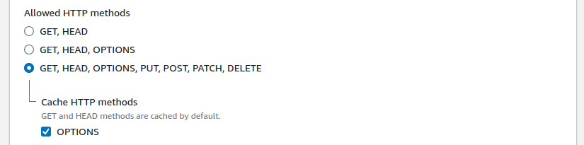

In the policies section of the form select:

- **Cache policy** _CachingDisabled_
- **Origin request policy** _AllViewerExceptHostHeader_
- **Response headers policy**: 
  - select None if the Lambda Function URL CORS option was configured, or
  - create a new policy (more on this is further in the document), select None for now anyway

[Policy selection](./cf-policies.png)

The above configuration should be sufficient to correctly process CORS and authorization requests to a lambda function via CloudFront.

## CloudFront policies and CORS headers

### Caching policies

#### Caching disabled

AWS recommends disabling caching for Lambda functions because most of the requests are unique and should not be cached. See https://docs.aws.amazon.com/AmazonCloudFront/latest/DeveloperGuide/using-managed-cache-policies.html#managed-cache-policy-caching-disabled

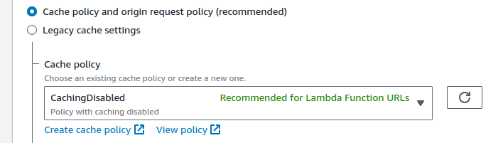

Some headers, including the _Authorization_ header, are [removed by CloudFront if caching is disabled](https://docs.aws.amazon.com/AmazonCloudFront/latest/DeveloperGuide/RequestAndResponseBehaviorCustomOrigin.html#request-custom-headers-behavior).

#### Caching enabled with Authorization header

_Authorization_ header gets [special treatment](https://docs.aws.amazon.com/AmazonCloudFront/latest/DeveloperGuide/RequestAndResponseBehaviorCustomOrigin.html#RequestCustomClientAuth) from AWS:

- CloudFront does not pass it to lambda functions for GET/HEAD requests unless it is included in the caching policy
- CloudFront forwards it with other HTTP methods

The above rule is affected by a different setting:
- AWS uses the _Authorization_ header for IAM authentication, so even if you have _Auth type: AWS_IAM_ in the Function URL settings the _Authorization_ header will not reach the lambda no matter what the caching policy says

One workaround for passing _Authorization_ header to lambdas is to:
- disable Lambda Function URL IAM authentication with _Auth type: NONE_,
- add _Authorization_ header to the caching policy.

If disabling Lambda Function URL IAM authentication is not an option:
- keep _Auth type: AWS_IAM_ in the Function URL settings
- use a custom header to pass the authentication value from your web client to your lambda, e.g. `x-myapp-auth: Bearer some-long-JWT-value`
- add the custom header to the caching policy to prevent responses to one authenticated user served to someone else

## Origin request policy

Use [AllViewerExceptHostHeader](https://docs.aws.amazon.com/AmazonCloudFront/latest/DeveloperGuide/using-managed-origin-request-policies.html#managed-origin-request-policy-all-viewer-except-host-header) or create a custom one that excludes the _Host_ header from being forwarded to lambda.

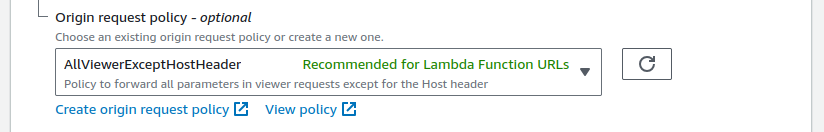

The _AllViewer-_ part of the name of that origin request policy is misleading because CloudFront removes and repurposes some of the headers, e.g. _Authorization_ and [many others](https://docs.aws.amazon.com/AmazonCloudFront/latest/DeveloperGuide/RequestAndResponseBehaviorCustomOrigin.html#request-custom-headers-behavior).


## Response headers policy

Use this policy only if you want CloudFront to add CORS and other headers to the response on top or instead of what the lambda returned in its response. For example, this sample policy adds all the necessary CORS headers to let scripts running in your local DEV environment (https://localhost:8080) call the lambda function:

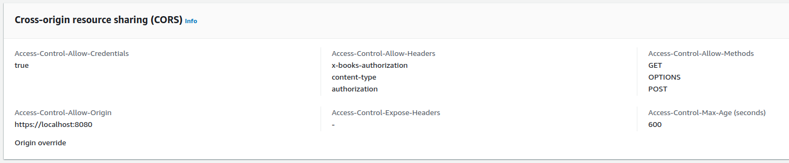

Use one of the [AWS-managed CORS policies](https://docs.aws.amazon.com/AmazonCloudFront/latest/DeveloperGuide/using-managed-response-headers-policies.html) that add the `Access-Control-Allow-Origin: *` header to allow scripts from any domain to access your lambda function. 

## References

AWS Lambda
- [AWS Lambda debugging tool](https://github.com/rimutaka/lambda-debugger-runtime-emulator)
- [Lambda URL access control](https://docs.aws.amazon.com/lambda/latest/dg/urls-auth.html#urls-auth-iam)
- [AWS Lambda CORS](https://docs.aws.amazon.com/lambda/latest/dg/urls-configuration.html?icmpid=docs_lambda_help#urls-cors)

CloudFront
- [Cache policy headers](https://docs.aws.amazon.com/AmazonCloudFront/latest/DeveloperGuide/cache-key-understand-cache-policy.html#cache-policy-headers)
- [Request and response behavior for custom origins](https://docs.aws.amazon.com/AmazonCloudFront/latest/DeveloperGuide/RequestAndResponseBehaviorCustomOrigin.html)
- [Configure CloudFront to forward the Authorization header](https://docs.aws.amazon.com/AmazonCloudFront/latest/DeveloperGuide/add-origin-custom-headers.html#add-origin-custom-headers-forward-authorization)
- [How origin request policies and cache policies work together](https://docs.aws.amazon.com/AmazonCloudFront/latest/DeveloperGuide/understanding-how-origin-request-policies-and-cache-policies-work-together.html)

CORS
- [CORS overview on MDN](https://developer.mozilla.org/en-US/docs/Web/HTTP/CORS)
- CORS request headers: 
  - [Access-Control-Request-Method](https://developer.mozilla.org/en-US/docs/Web/HTTP/Headers/Access-Control-Request-Method)
  - [Access-Control-Request-Headers](https://developer.mozilla.org/en-US/docs/Web/HTTP/Headers/Access-Control-Request-Headers)
  - [Origin](https://developer.mozilla.org/en-US/docs/Web/HTTP/Headers/Origin)
- Required CORS response headers: 
  - [Access-Control-Allow-Methods](https://developer.mozilla.org/en-US/docs/Web/HTTP/Headers/Access-Control-Allow-Methods)
  - [Access-Control-Allow-Headers](https://developer.mozilla.org/en-US/docs/Web/HTTP/Headers/Access-Control-Allow-Headers)
  - [Access-Control-Allow-Origin](https://developer.mozilla.org/en-US/docs/Web/HTTP/Headers/Access-Control-Allow-Origin)
- Optional CORS response headers: 
  - [Access-Control-Max-Age](https://developer.mozilla.org/en-US/docs/Web/HTTP/Headers/Access-Control-Max-Age)
  - [Access-Control-Expose-Headers](https://developer.mozilla.org/en-US/docs/Web/HTTP/Headers/Access-Control-Expose-Headers)
  - [Access-Control-Allow-Credentials](https://developer.mozilla.org/en-US/docs/Web/HTTP/Headers/Access-Control-Allow-Credentials)
