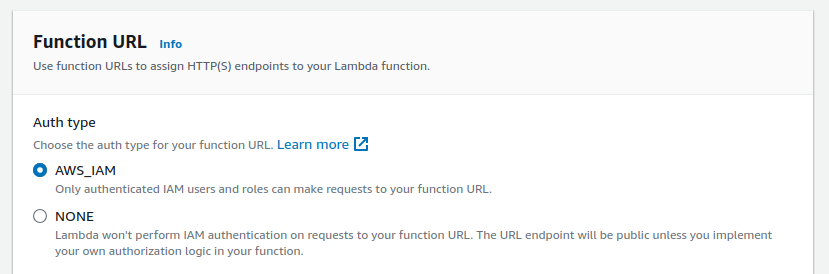
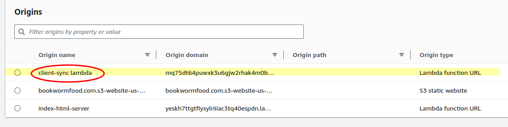
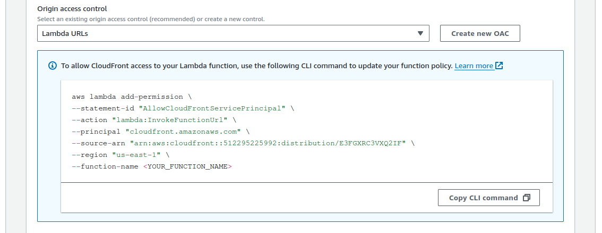
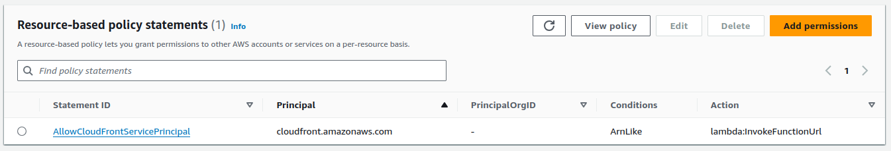
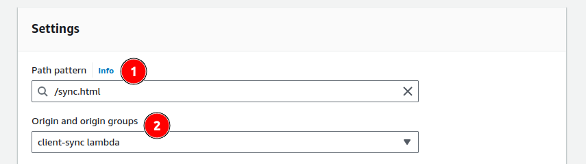
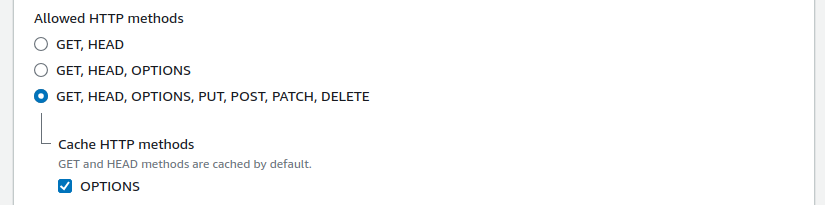

# AWS Lambda with CloudFront: caching, CORS and authorization by example

This post explores different configuration options for invoking AWS Lambda via CloudFront to help you understand how different CloudFront and Lambda Function URL settings affect CORS and Authorization headers.

## Overview

AWS Lambda Functions can be invoked via a public [AWS Lambda Function URL](https://docs.aws.amazon.com/lambda/latest/dg/urls-configuration.html) with an HTTP call from a browser script, e.g.

```javascript
const lambdaResponse = await fetch(
  "https://d9tskged4za87.cloudfront.net/sync.html",
  {
    headers: {
      Authorization: `Bearer ${token}`,
    },
  },
);
``` 

There are two possible downsides to that type of invocation:

1. you cannot use a custom domain - it has to be an AWS-generated URL like `https://mq75dt64puwxk3u6gjw2rhak4m0bcmmi.lambda-url.us-east-1.on.aws`
2. There is no server-side caching (higher cost, slower response time, etc)

Calling your lambdas via CloudFront solves both of those issues.

### Special considerations

There is quite a bit of configuration to be done upfront to make a Lambda function work with CloudFront:

- Lambda Function URL (access control, CORS)
- CloudFront origin
- CloudFront behaviors
- CloudFront caching policy
- CloudFront origin request policy
- CloudFront response policy

It is not too hard a task, but it can take some time to figure out what is what if you are new to this.
Also, getting the CORS headers right may be not very intuitive.

This guide complements the [official AWS documentation](https://docs.aws.amazon.com/AmazonCloudFront/latest/DeveloperGuide/DownloadDistS3AndCustomOrigins.html#concept_lambda_function_url) with examples and shortcuts.

About Lambda URLs: https://docs.aws.amazon.com/lambda/latest/dg/urls-configuration.html

## Core concepts

This section CloudFront terms and concepts that affect Lambda, CORS and Authorization headers.

**General**
- CloudFront forwards all requests to the Lambda URL, including OPTIONS
- CloudFront can cache OPTIONS responses
- CloudFront can drop or overwrite some of the headers it received from either the client app or the lambda function
- _Authorization_, _Host_ and other headers are used by AWS in communication between CloudFront and Lambda and may conflict with the same headers used by the web client

**CORS headers** can be added in three places. Choose one that is most suitable for your use case:
- by the code inside the lambda function
- by AWS if Lambda Function URL CORS were configured
- by CloudFront via _Response Headers Policy_ (most flexible)

**Origin access control** Lambda Origin setting tells CloudFront if it should sign requests sent to the Lambda Function URL.
Signing requests takes over _Authorization_ header so that you cannot forward it from the client app to the lambda.

**Caching policy** of a Behavior tells CloudFront which headers to use as caching keys.
- headers included in the caching key are passed onto the lambda
- you have to include your authorization key to avoid serving one user's response to another user
- even if you include the _Authorization_ header in the key it may be overtaken by the AWS signature configured in _Origin access control_
- you do not have to have a caching policy for the CORS to work
- AWS recommends _CachingDisabled_ for Lambda URLs

**Origin request policy** tells CloudFront which headers to forward to the lambda.
- you should not forward the _Host_ header (it returns an error at runtime if you do)
- CloudFront may drop or replace some headers
- _AllViewerExceptHostHeader_ policy works fine with CORS and is the default choice for Lambda URLs
- you can choose _None_ if you don't need to pass any authorization headers and generate the CORS response inside CloudFront

**Response headers policy** tells CloudFront what headers to add to the response. It can add or overwrite CORS headers after the lambda function.
- you can choose _None_ if the lambda function handles the CORS response
- you can choose a suitable managed CORS policy from the list to complement or overwrite the lambda's response
- you can create your own policy to complement or overwrite the lambda's response


## Quick recipes

This section lists different combinations of settings depending on the desired outcome.

### CORS not required, no Authorization header, no caching

This request does not require the CORS protocol or authorization:
```javascript
const response = await fetch("https://d9tskged4za87.cloudfront.net/sync.html");
```

Function URL configuration:
- _Auth type: AWS_IAM_
- CORS disabled (irrelevant, can be enabled)

CloudFront configuration:
- origin access with signed requests
- OPTIONS caching is irrelevant
- _CachingDisabled_ policy
- _Managed-AllViewerExceptHostHeader_ request policy
- No response policy

**How it works:**

1. CloudFront passes all headers except _Host_ onto the lambda
2. the lambda function code gets all requests
3. all headers generated by the lambda function are forwarded back to the client

**Request headers:**
```
GET /sync.html HTTP/2
Host: d9tskged4za87.cloudfront.net
User-Agent: Mozilla/5.0 (X11; Ubuntu; Linux x86_64; rv:129.0) Gecko/20100101 Firefox/129.0
Accept: */*
Accept-Language: en-US,en;q=0.5
Accept-Encoding: gzip, deflate, br, zstd
Origin: https://localhost:8080
DNT: 1
Connection: keep-alive
Sec-Fetch-Dest: empty
Sec-Fetch-Mode: cors
Sec-Fetch-Site: cross-site
Priority: u=0
Pragma: no-cache
Cache-Control: no-cache
```

**Lambda's request:**
```json
{
  "accept": "*/*",
  "accept-encoding": "gzip, deflate, br, zstd",
  "accept-language": "en-US,en;q=0.5",
  "cache-control": "no-cache",
  "cloudfront-forwarded-proto": "https",
  "cloudfront-is-android-viewer": "false",
  "cloudfront-is-desktop-viewer": "true",
  "cloudfront-is-ios-viewer": "false",
  "cloudfront-is-mobile-viewer": "false",
  "cloudfront-is-smarttv-viewer": "false",
  "cloudfront-is-tablet-viewer": "false",
  "cloudfront-viewer-address": "2406:2d40:728d:fa10::c4a:42838",
  "cloudfront-viewer-asn": "14593",
  "cloudfront-viewer-city": "Auckland",
  "cloudfront-viewer-country": "NZ",
  "cloudfront-viewer-country-name": "New Zealand",
  "cloudfront-viewer-country-region": "AUK",
  "cloudfront-viewer-country-region-name": "Auckland",
  "cloudfront-viewer-http-version": "2.0",
  "cloudfront-viewer-latitude": "-36.85060",
  "cloudfront-viewer-longitude": "174.76790",
  "cloudfront-viewer-postal-code": "1010",
  "cloudfront-viewer-time-zone": "Pacific/Auckland",
  "cloudfront-viewer-tls": "TLSv1.3:TLS_AES_128_GCM_SHA256:sessionResumed",
  "dnt": "1",
  "host": "mq75dt64puwxk3u6gjw2rhak4m0bcmmi.lambda-url.us-east-1.on.aws",
  "origin": "https://localhost:8080",
  "pragma": "no-cache",
  "priority": "u=0",
  "sec-fetch-dest": "empty",
  "sec-fetch-mode": "cors",
  "sec-fetch-site": "cross-site",
  "user-agent": "Mozilla/5.0 (X11; Ubuntu; Linux x86_64; rv:129.0) Gecko/20100101 Firefox/129.0",
  "via": "2.0 03e8784cc6fbcd65ff743e9f537e8e88.cloudfront.net (CloudFront)",
  "x-amz-cf-id": "Wtw2gvr0...o3nk-DQ==",
  "x-amz-content-sha256": "e3b0c44...852b855",
  "x-amz-date": "20240812T024912Z",
  "x-amz-security-token": "IQoJb3...yM6wdjMEg==",
  "x-amz-source-account": "512295225992",
  "x-amz-source-arn": "arn:aws:cloudfront::512295225992:distribution/E3FGXRC3VXQ2IF",
  "x-amzn-tls-cipher-suite": "ECDHE-RSA-AES128-GCM-SHA256",
  "x-amzn-tls-version": "TLSv1.2",
  "x-amzn-trace-id": "Root=1-66b97828-7217f26e68fb64c806f4daf5",
  "x-forwarded-for": "2406:2d40:728d:fa10::c4a",
  "x-forwarded-port": "443",
  "x-forwarded-proto": "https"
}
```

**Lambda's response:**
```json
{
  "statusCode": 200,
  "headers": {
    "x-foo-header": "bar",
    "content-type": "text/html; charset=utf-8"
  },
  "body": "Hello from client-sync",
  "isBase64Encoded": false,
  "cookies": []
}
```

**CloudFront response headers:**
```
HTTP/2 200 
content-type: text/html; charset=utf-8
content-length: 22
date: Mon, 12 Aug 2024 02:49:14 GMT
x-amzn-requestid: 28b96338-a3a6-4a6e-aad2-8b7d25a4fe13
access-control-allow-origin: https://localhost:8080
x-foo-header: bar
vary: Origin
x-amzn-trace-id: root=1-66b97828-7217f26e68fb64c806f4daf5;parent=717724cd0dc027c2;sampled=0;lineage=a964c7ca:0
access-control-allow-credentials: true
x-cache: Miss from cloudfront
via: 1.1 03e8784cc6fbcd65ff743e9f537e8e88.cloudfront.net (CloudFront)
x-amz-cf-pop: LAX3-C3
x-amz-cf-id: Wtw2gvr045gDD6eqIC6s_rDEnugktHpg0YUjmrp2jRuN6PNo3nk-DQ==
X-Firefox-Spdy: h2
```

### CORS, no Authorization header, no caching

This request requires the CORS protocol, but the authorization is done through a custom header:
```javascript
const response = await fetch(
  "https://d9tskged4za87.cloudfront.net/sync.html",
  {
    headers: {
      "X-Books-Authorization": "dummy-book-auth4",
    },
  },
);
```

In Function URL:
- _Auth type: AWS_IAM_
- **CORS enabled**

In CloudFront:
- origin access with signed requests
- OPTIONS caching is disabled
- _CachingDisabled_ policy
- _Managed-AllViewerExceptHostHeader_ request policy
- No response policy

**How it works:**

1. CloudFront passes all headers except _Host_ onto the lambda
2. all OPTIONS requests are handled by AWS as part of the lambda invocation, if not cached by CloudFront
3. CORS headers are added by AWS as part of the lambda invocation

The web client sends the HTTP OPTIONS request first to obtain the CORS headers:


CORS-related headers for the OPTIONS request:
```
OPTIONS /sync.html HTTP/2
Access-Control-Request-Method: GET
Access-Control-Request-Headers: x-books-authorization
Origin: https://localhost:8080
```

CloudFront response with CORS headers generated by AWS without invoking the lambda function (see 4 last lines for CORS):
```
HTTP/2 200 
content-type: application/json
content-length: 0
date: Mon, 12 Aug 2024 03:03:17 GMT
x-amzn-requestid: 701284ed-1679-4ae7-9e19-06d315682622
vary: Origin
x-cache: Miss from cloudfront
via: 1.1 42f9f0e9bd0296c3bb45648019b2dce4.cloudfront.net (CloudFront)
x-amz-cf-pop: LAX3-C3
x-amz-cf-id: ADSgmIGO7yX7TQXzPU8zcNwr6BhrXRPHKKiSiDrIYw8Zv9tvaWfqng==
X-Firefox-Spdy: h2
access-control-allow-origin: https://localhost:8080
access-control-allow-headers: authorization,content-type,x-books-authorization
access-control-allow-methods: GET,POST
access-control-allow-credentials: true
```

The OPTIONS request is followed by a GET request with a custom authorization header (_X-Books-Authorization_):
```
GET /sync.html HTTP/2
...
X-Books-Authorization: dummy-book-auth4
Origin: https://localhost:8080
```

Inside Lambda request payload (only some properties are shown):
```json
{
  "host": "mq75dt64puwxk3u6gjw2rhak4m0bcmmi.lambda-url.us-east-1.on.aws",
  "origin": "https://localhost:8080",
  "x-books-authorization": "dummy-book-auth4",
  "x-forwarded-for": "2406:2d40:728d:fa10:14d0:822f:3b51:ad63",
  "x-forwarded-port": "443",
  "x-forwarded-proto": "https"
  ...
}
```

The lambda's response is identical to the previous example with no CORS:
```json
{
  "statusCode": 200,
  "headers": {
    "x-foo-header": "bar",
    "content-type": "text/html; charset=utf-8"
  },
  "body": "Hello from client-sync",
  "isBase64Encoded": false,
  "cookies": []
}
```

CloudFront response:
```
HTTP/2 200 
content-type: text/html; charset=utf-8
content-length: 22
date: Mon, 12 Aug 2024 03:03:19 GMT
x-amzn-requestid: 87cb1ad7-107d-4e78-9c90-dcd426eea39b
access-control-allow-origin: https://localhost:8080
x-foo-header: bar
vary: Origin
x-amzn-trace-id: root=1-66b97b76-6a635575781af79e01df7aa2;parent=7cbfef93b296cbe5;sampled=0;lineage=a964c7ca:0
access-control-allow-credentials: true
x-cache: Miss from cloudfront
via: 1.1 42f9f0e9bd0296c3bb45648019b2dce4.cloudfront.net (CloudFront)
x-amz-cf-pop: LAX3-C3
x-amz-cf-id: PSfImgUKvapzcIHCVI_1pbOEWUEZZNDXO8iIT_TXp0JKvGXlxuwhGg==
X-Firefox-Spdy: h2
```


### CORS, Authorization header, caching

This request uses the _Authorization_ header and requires the CORS protocol:
```javascript
const response = await fetch(
  "https://d9tskged4za87.cloudfront.net/sync.html",
  {
    headers: {
      "Authorization": "dummy-auth",
    },
  },
);
```

In Function URL:
- **Auth type: NONE**
- **CORS enabled**

In CloudFront:
- **origin access with unsigned requests**
- **OPTIONS caching is enabled**
- **custom caching policy that includes the _Authorization_ header**
- _Managed-AllViewerExceptHostHeader_ request policy
- No response policy

All the request/response headers are nearly identical to the previous example, except for the common `Authorization` header replacing the custom `X-Books-Authorization` header.
The _Authorization_ header is successfully passed onto the lambda function.

GET request:
```
GET /sync.html HTTP/2
Host: d9tskged4za87.cloudfront.net
Authorization: dummy-auth
Origin: https://localhost:8080
...
```

Inside Lambda request payload (only some properties are shown):
```json
{
  "authorization": "dummy-auth",
  "host": "mq75dt64puwxk3u6gjw2rhak4m0bcmmi.lambda-url.us-east-1.on.aws",
  "origin": "https://localhost:8080",
  ...
}
```

CloudFront requested OPTIONS and GET from the Lambda on the first request and returned `x-cache: Miss from cloudfront` header.

Repeat requests did not trigger the lambda function and returned `x-cache: Hit from cloudfront` header meaning that both OPTIONS and GET requests were cached.

Repeating the request with a different value of the _Authorization_ header, e.g. `Authorization: dummy-auth-2` returned `x-cache: Hit from cloudfront` for OPTIONS and `x-cache: Miss from cloudfront` for GET, as expected.


## Lambda Function URL configuration for CloudFront

Let's assume that you already have a working Lambda function with a configured URL for public access and we need to make it work with CloudFront.

## Lambda URL access control config

The following config lets CloudFront access a Lambda function via its URL.



We will add the CloudFront IAM policy to the Lambda at a later stage.


Setting your function URL access control to _Auth type: NONE_ will allow CloudFront access, but will also make it public.

## Lambda URL CORS headers

Enabling CORS headers in Lambda Function URL settings will intercept HTTP OPTIONS requests sent to the function and return the configured response.

Disabling CORS will forward HTTP OPTIONS to the function for handling inside the code.

The same CORS headers can be configured inside CloudFront with more flexibility.

CloudFront can cache HTTP OPTIONS responses regardless of which of the above strategies of handling CORS you choose.


## CloudFront configuration

A Lambda function becomes an origin in a CloudFront distribution.

You need to configure _Origins_, _Behaviors_ and _Policies_ to make it work. There should be no changes to the general distribution settings, security or error pages.

In this example _client-sync lambda_ origin is linked to _/sync.html_ path, so if a client app makes a `fetch()` call to `https://d9tskged4za87.cloudfront.net/sync.html` the request will be forwarded to _client-sync lambda_ for processing.




### Origin configuration

The origin in this case is our lambda function.

- origin domain: copy-paste the domain of the Lambda Function URL, e.g. `mq75dt64puwxk3u6gjw2rhak4m0bcmmi.lambda-url.us-east-1.on.aws`
- origin path: leave blank
- name: give it an informative name, spaces are OK; it will not be used as an ID
- origin access control: create a new one that can be shared between multiple lambda functions ()

#### Origin access control and Authorization header

The origin access control settings affect the use of _Authorization_ header. This can be a sticking point because signing CloudFront requests to the lambda function URL also uses the same _Authorization_ header.


__Do not sign requests__
- _Authorization_ header from the browser can be passed to the lambda
- the lambda must have _Auth type: NONE_ and a public access policy enabled

__Sign requests__
- _Authorization_ header is used for CloudFront signatures
- the lambda code does not get the _Authorization_ header at all
- _Authorization_ header from the browser is dropped
- the lambda can have _Auth type: AWS_IAM_ and no public access

__Do not override Authorization header__
This is a combination of the two previous policies:
- sign if there is no _Authorization_ header coming from the browser
- do not sign if there is one coming from the browser
- the lambda must have _Auth type: NONE_ and a public access policy enabled

The _Origin Access_ policy can be edited later from the sidebar under _Security / Origin access_ menu.

#### Lambda access policy

Copy-paste and run the `aws lambda add-permission` command displayed after you create the _Origin access policy_:



If you go back to your lambda function, you should see the policy:



and its contents with your account and distribution IDs:


### Behavior configuration

Create a new _behavior_ with the path to the endpoint that invokes the Lambda (1) and the name of origin you created for the lambda earlier (2). In our case, the names are:



Further down the form, choose the allowed methods. You have to select an option with the _HTTP OPTIONS_ method for CORS to work.

Select the additional OPTIONS caching if you want to avoid sending repeat OPTIONS requests to the origin.  
CloudFront cache OPTIONS if this box is checked and a caching policy is enabled.  
Selecting _CachingDisabled_ policy disables OPTIONS caching as well.



In the policies section of the form select:

- Cache policy _CachingDisabled_
- Origin request policy _AllViewerExceptHostHeader_
- Response headers policy: 
  - select None if the Lambda Function URL CORS option was configured, or
  - create a new policy (more on this is further in the document), select None for now anyway

Save this intermediate configuration for a test. The policy details and how they relate to CORS are explained further in this guide.

### Initial test without CORS headers

You should be able to send an HTTP GET request to the endpoint configured in the behavior.

In the following example, an HTTP GET call to `https://d9tskged4za87.cloudfront.net/sync.html` was successful, but no CORS headers were involved.

Request header:
```
GET /sync.html HTTP/2
Host: d9tskged4za87.cloudfront.net
User-Agent: Mozilla/5.0 (X11; Ubuntu; Linux x86_64; rv:128.0) Gecko/20100101 Firefox/128.0
Accept: text/html,application/xhtml+xml,application/xml;q=0.9,image/avif,image/webp,image/png,image/svg+xml,*/*;q=0.8
Accept-Language: en-US,en;q=0.5
Accept-Encoding: gzip, deflate, br, zstd
DNT: 1
Connection: keep-alive
Upgrade-Insecure-Requests: 1
Sec-Fetch-Dest: document
Sec-Fetch-Mode: navigate
Sec-Fetch-Site: none
Sec-Fetch-User: ?1
Priority: u=0, i
Pragma: no-cache
Cache-Control: no-cache
TE: trailers
```

Response headers:
```
HTTP/2 200 
content-type: text/html; charset=utf-8
content-length: 22
date: Sat, 10 Aug 2024 05:08:34 GMT
x-amzn-requestid: 92ae3496-94da-48a6-bad1-1c748494317c
x-foo-header: bar
x-amzn-trace-id: root=1-66b6f5d0-1c878c6156e181385f463732;parent=70e0f9130d30c060;sampled=0;lineage=a964c7ca:0
x-cache: Miss from cloudfront
via: 1.1 db929e55bb40b085896b8e336fba2ab6.cloudfront.net (CloudFront)
x-amz-cf-pop: LAX3-C3
x-amz-cf-id: B4ZPZi4JWABlIkxFhveTqWO4HTSbocYlLKBs8US1SitsR-uvDyfPiw==
vary: Origin
X-Firefox-Spdy: h2
```

## CloudFront policies and CORS headers

### Caching policy

#### Default: caching disabled

AWS recommends disabling caching for Lambda functions because most of the requests are unique and should not be cached. See https://docs.aws.amazon.com/AmazonCloudFront/latest/DeveloperGuide/using-managed-cache-policies.html#managed-cache-policy-caching-disabled


Caching of HTTP OPTIONS requests can be configured separately from the caching policy. Checking the OPTIONS box will cache OPTIONS requests even with _CachingDisabled_ policy:


Some headers, including the _Authorization_ header, are [removed by CloudFront if caching is disabled](https://docs.aws.amazon.com/AmazonCloudFront/latest/DeveloperGuide/RequestAndResponseBehaviorCustomOrigin.html#request-custom-headers-behavior).

#### Caching enabled + Authorization

_Authorization_ header gets special treatment from AWS:

- CloudFront does not pass it to lambda functions for GET/HEAD requests unless it is included in the caching policy
- CloudFront forwards it for DELETE, PATCH, POST, and PUT requests

The above statements are negated by a different setting:
- AWS uses _Authorization_ header for IAM authentication, so even if you have _Auth type: AWS_IAM_ in the Function URL settings the _Authorization_ header will not reach the lambda no matter what the caching policy says

Workaround for passing _Authorization_ header to lambdas:
- disable Lambda Function URL IAM authentication with _Auth type: NONE_
- add _Authorization_ header to the caching policy

If disabling Lambda Function URL IAM authentication is not an option:
- keep _Auth type: AWS_IAM_ in the Function URL settings
- use a custom header to pass the authentication value from your web client to your lambda, e.g. `x-myapp-auth: Bearer some-long-JWT-value`
- add the custom header to the caching policy to prevent responses to one authenticated user served to someone else


https://docs.aws.amazon.com/AmazonCloudFront/latest/DeveloperGuide/RequestAndResponseBehaviorCustomOrigin.html#RequestCustomClientAuth


## References

- AWS Lambda debugging tool I used to experiment and capture requests and responses: [Github](https://github.com/rimutaka/lambda-debugger-runtime-emulator)
- Lambda URL access control: https://docs.aws.amazon.com/lambda/latest/dg/urls-auth.html#urls-auth-iam
- Cache policy: https://docs.aws.amazon.com/AmazonCloudFront/latest/DeveloperGuide/cache-key-understand-cache-policy.html#cache-policy-headers
- Cache policy disabled: https://docs.aws.amazon.com/AmazonCloudFront/latest/DeveloperGuide/using-managed-cache-policies.html#managed-cache-policy-caching-disabled
- Custom headers in origin requests: https://docs.aws.amazon.com/AmazonCloudFront/latest/DeveloperGuide/add-origin-custom-headers.html#add-origin-custom-headers-forward-authorization
- Request and response behavior for custom origins: https://docs.aws.amazon.com/AmazonCloudFront/latest/DeveloperGuide/RequestAndResponseBehaviorCustomOrigin.html
- Configure CloudFront to forward the Authorization header: https://docs.aws.amazon.com/AmazonCloudFront/latest/DeveloperGuide/add-origin-custom-headers.html#add-origin-custom-headers-forward-authorization
- How origin request policies and cache policies work together: https://docs.aws.amazon.com/AmazonCloudFront/latest/DeveloperGuide/understanding-how-origin-request-policies-and-cache-policies-work-together.html
- 
- 

- Helpful answers: 
  - https://serverfault.com/questions/1053906/how-to-whitelist-authorization-header-in-cloudfront-custom-origin-request-policy
  - https://www.reddit.com/r/aws/comments/1axx5c9/how_to_forward_authorization_header_using/


- AWS Lambda CORS docs: https://docs.aws.amazon.com/lambda/latest/dg/urls-configuration.html?icmpid=docs_lambda_help#urls-cors
- CORS overview on MDN: https://developer.mozilla.org/en-US/docs/Web/HTTP/CORS
- CORS protocol spec: https://fetch.spec.whatwg.org/#http-cors-protocol
- CORS request headers
  - [Access-Control-Request-Method](https://developer.mozilla.org/en-US/docs/Web/HTTP/Headers/Access-Control-Request-Method)
  - [Access-Control-Request-Headers](https://developer.mozilla.org/en-US/docs/Web/HTTP/Headers/Access-Control-Request-Headers)
  - [Origin](https://developer.mozilla.org/en-US/docs/Web/HTTP/Headers/Origin)
- Required CORS response headers
  - [Access-Control-Allow-Methods](https://developer.mozilla.org/en-US/docs/Web/HTTP/Headers/Access-Control-Allow-Methods)
  - [Access-Control-Allow-Headers](https://developer.mozilla.org/en-US/docs/Web/HTTP/Headers/Access-Control-Allow-Headers)
  - [Access-Control-Allow-Origin](https://developer.mozilla.org/en-US/docs/Web/HTTP/Headers/Access-Control-Allow-Origin)
- Optional CORS response headers
  - [Access-Control-Max-Age](https://developer.mozilla.org/en-US/docs/Web/HTTP/Headers/Access-Control-Max-Age)
  - [Access-Control-Expose-Headers](https://developer.mozilla.org/en-US/docs/Web/HTTP/Headers/Access-Control-Expose-Headers)
  - [Access-Control-Allow-Credentials](https://developer.mozilla.org/en-US/docs/Web/HTTP/Headers/Access-Control-Allow-Credentials)


Authorization header is removed.
See https://docs.aws.amazon.com/AmazonCloudFront/latest/DeveloperGuide/add-origin-custom-headers.html#add-origin-custom-headers-forward-authorization
But, forwarding all headers forwards HOST and returns 403.
https://repost.aws/knowledge-center/cloudfront-authorization-header

Can forward ALL and disable HOST as per https://www.reddit.com/r/aws/comments/1axx5c9/how_to_forward_authorization_header_using/


Max length of the header value:  	1,783 characters
All headers: 10,240 characters
See https://docs.aws.amazon.com/AmazonCloudFront/latest/DeveloperGuide/cloudfront-limits.html#limits-custom-headers

Similar questions:

- https://stackoverflow.com/questions/78428354/aws-cors-configuration-with-lambda-function-url-and-a-cname-in-cloudfront-distri
- search for "cloudfront lambda cors"
- https://stackoverflow.com/questions/73360269/aws-cloudfront-on-lambda-function-via-the-function-url-url-returning-403-fobidde