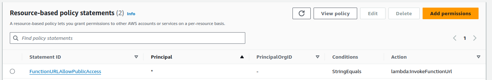
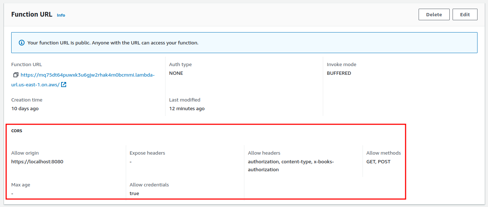
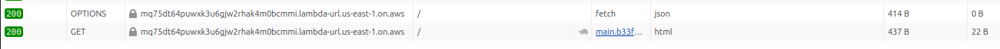

# AWS Lambda Function URL with CORS explained by example

This post explores different configuration options for invoking AWS Lambda via a URL.

## Overview

### Why we need CORS

AWS Lambda Functions can be invoked via [AWS Lambda URLs](https://docs.aws.amazon.com/lambda/latest/dg/urls-configuration.html) with an unauthenticated HTTP call from a browser script, e.g.

```javascript
const lambdaResponse = await fetch(
  "https://mq75dt64puwxk3u6gjw2rhak4m0bcmmi.lambda-url.us-east-1.on.aws/",
  {
    headers: {
      Authorization: `Bearer ${token}`,
    },
  },
);
``` 

Since the calling script and the lambda URL are running on different domains, the web browser would require the right [CORS headers](https://developer.mozilla.org/en-US/docs/Web/HTTP/CORS) (also called [CORS protocol](https://fetch.spec.whatwg.org/#http-cors-protocol)) to be present for the call to succeed.

The CORS protocol would involve sending an [HTTP OPTIONS request](https://developer.mozilla.org/en-US/docs/Web/HTTP/Methods/OPTIONS) to the lambda with these three CORS headers to confirm that the lambda accepts requests from the script's domain:

```
Access-Control-Request-Method: GET
Access-Control-Request-Headers: authorization
Origin: https://localhost:8080
```
The lambda is expected to respond with this set of headers:
```
Access-Control-Allow-Methods: GET
Access-Control-Allow-Headers: authorization
Access-Control-Allow-Origin: https://localhost:8080
```

### Option 1: Returning CORS from the lambda function's code

It is not hard to return a few headers from your lambda code. For example, these 4 lines of Rust code do the job:
```rust
    let mut headers = HeaderMap::new();
    headers.append("Access-Control-Allow-Origin", HeaderValue::from_static("https://localhost:8080"));
    headers.append("Access-Control-Allow-Methods", HeaderValue::from_static("GET, POST"));
    headers.append("Access-Control-Allow-Headers",HeaderValue::from_static("authorization"));
```

On the other hand, it is an extra coding, testing and maintenance effort. Any changes to the CORS settings would require code changes as well.

If your client sends one OPTIONS request for every GET/POST it doubles the number of invocations.
You can use [Access-Control-Max-Age](https://developer.mozilla.org/en-US/docs/Web/HTTP/Headers/Access-Control-Max-Age) to reduce repeat calls by the same client.

This may be a good option if you need extra control over handling the OPTIONS requests.

### Option 2: Configuring CORS headers in AWS Lambda settings

This is a simpler and more reliable option for most use cases.
AWS can handle CORS preflight requests (HTTP OPTIONS) and add necessary headers to all the other HTTP methods after your lambda returns its response.

This option does not require any changes to the function's code.


## Custom domain names for Lambda URLs

It is not possible to use custom domain names with Lambda URLs because the web server that invokes the lambda relies on the _Host_ HTTP header to identify which lambda to invoke, e.g. `host: mq75dt64puwxk3u6gjw2rhak4m0bcmmi.lambda-url.us-east-1.on.aws`.

__Example__

- lambda URL: _mq75dt64puwxk3u6gjw2rhak4m0bcmmi.lambda-url.us-east-1.on.aws_
- CNAME record: `lambda.example.com CNAME mq75dt64puwxk3u6gjw2rhak4m0bcmmi.lambda-url.us-east-1.on.aws`
- _host_ header sent to AWS: `host: lambda.example.com`

The web server handling that request at the AWS end would not know which lambda function to invoke by looking at `host: lambda.example.com` and would return an error or time out.

Use _ApiGateway_ or _CloudFront_ as the proxy if using lambda Function URLs is not an option.


## Access control configuration for Lambda Function URL

Let's assume that our function is exposed to the internet and does not require AWS IAM authentication.

The following config allows public access to the function via its URL.




You need both the _Auth type: NONE_ setting and a resource-based policy statement to allow public access.
Having one or the other results in _403 Permission Denied_.

AWS automatically adds the required _FunctionURLAllowPublicAccess_ access policy when you choose _Auth type: NONE_ in the console.

## Request/response examples for different configuration options in detail

This section contains examples of HTTP headers exchanged between the web browser, AWS and the lambda function to help us understand how different configuration options affect the headers.

### A basic Lambda URL request/response example, no CORS

1. Enable public access to your lambda function URL as explained earlier
2. Do not enable CORS settings
3. Send a request to the lambda URL displayed in the config screen


Your Function URL config should look similar to this:


A sample lambda URL call that does not require the CORS protocol
```javascript
const lambdaResponse = await fetch("https://mq75dt64puwxk3u6gjw2rhak4m0bcmmi.lambda-url.us-east-1.on.aws/");
``` 

Your request may look similar to this example:

```
GET / HTTP/1.1
Host: mq75dt64puwxk3u6gjw2rhak4m0bcmmi.lambda-url.us-east-1.on.aws
User-Agent: Mozilla/5.0 (X11; Ubuntu; Linux x86_64; rv:128.0) Gecko/20100101 Firefox/128.0
Accept: text/html,application/xhtml+xml,application/xml;q=0.9,image/avif,image/webp,image/png,image/svg+xml,*/*;q=0.8
Accept-Language: en-US,en;q=0.5
Accept-Encoding: gzip, deflate, br, zstd
DNT: 1
Connection: keep-alive
Upgrade-Insecure-Requests: 1
Sec-Fetch-Dest: document
Sec-Fetch-Mode: navigate
Sec-Fetch-Site: same-origin
Sec-Fetch-User: ?1
Priority: u=4
Pragma: no-cache
Cache-Control: no-cache
```

The lambda function received all the headers sent by the browser as part of the request payload and some additional AWS headers (see 6 headers starting with _x-_ at the end of the list).

```json
{
  "accept": "text/html,application/xhtml+xml,application/xml;q=0.9,image/avif,image/webp,image/png,image/svg+xml,*/*;q=0.8",
  "accept-encoding": "gzip, deflate, br, zstd",
  "accept-language": "en-US,en;q=0.5",
  "authorization": "foo-bar",
  "cache-control": "no-cache",
  "dnt": "1",
  "host": "mq75dt64puwxk3u6gjw2rhak4m0bcmmi.lambda-url.us-east-1.on.aws",
  "pragma": "no-cache",
  "priority": "u=4",
  "sec-fetch-dest": "document",
  "sec-fetch-mode": "navigate",
  "sec-fetch-site": "same-origin",
  "sec-fetch-user": "?1",
  "upgrade-insecure-requests": "1",
  "user-agent": "Mozilla/5.0 (X11; Ubuntu; Linux x86_64; rv:128.0) Gecko/20100101 Firefox/128.0",
  "x-amzn-tls-cipher-suite": "TLS_AES_128_GCM_SHA256",
  "x-amzn-tls-version": "TLSv1.3",
  "x-amzn-trace-id": "Root=1-66b44063-116ea8667f4b70e405b1b19a",
  "x-forwarded-for": "222.154.108.14",
  "x-forwarded-port": "443",
  "x-forwarded-proto": "https"
}
```

This basic Lambda URL configuration allows passing all headers for all methods, including OPTIONS.
Use it if your lambda handles responses to the _HTTP OPTIONS_ method with the [CORS protocol](https://developer.mozilla.org/en-US/docs/Web/HTTP/CORS).


### Example of CORS request/response handled by function code

This example has the same Lambda URL configuration as in the previous example:


This time we include an optional _Authorization_ header to trigger the CORS protocol:

```javascript
const lambdaResponse = await fetch("https://mq75dt64puwxk3u6gjw2rhak4m0bcmmi.lambda-url.us-east-1.on.aws/",
  { headers: { Authorization: `Bearer ${token}` } },
);
``` 

The new request/response flow:
- a browser script running on https://localhost:8080 attempts to invoke the lambda via its URL
- the browser initiates the CORS protocol by sending an HTTP OPTIONS request to the lambda
- the lambda replies with the necessary CORS headers
- the browser sends the GET request

The HTTP OPTIONS request would be very similar to the previous example with the addition of a few CORS headers:

- **host**: mq75dt64puwxk3u6gjw2rhak4m0bcmmi.lambda-url.us-east-1.on.aws
- **origin**: https://localhost:8080
- **access-control-request-headers**: authorization
- **access-control-request-method**: GET

The browser is asking the server (our lambda): can I send you a GET request with the _authorization_ header from a web page located at _https://localhost:8080_?

This is the full list of headers forwarded to the lambda with the OPTIONS request:
```json
{
  "accept": "*/*",
  "accept-encoding": "gzip, deflate, br, zstd",
  "accept-language": "en-US,en;q=0.5",
  "access-control-request-headers": "authorization,x-books-authorization",
  "access-control-request-method": "GET",
  "cache-control": "no-cache",
  "dnt": "1",
  "host": "mq75dt64puwxk3u6gjw2rhak4m0bcmmi.lambda-url.us-east-1.on.aws",
  "origin": "https://localhost:8080",
  "pragma": "no-cache",
  "priority": "u=4",
  "sec-fetch-dest": "empty",
  "sec-fetch-mode": "cors",
  "sec-fetch-site": "cross-site",
  "user-agent": "Mozilla/5.0 (X11; Ubuntu; Linux x86_64; rv:128.0) Gecko/20100101 Firefox/128.0",
  "x-amzn-tls-cipher-suite": "TLS_AES_128_GCM_SHA256",
  "x-amzn-tls-version": "TLSv1.3",
  "x-amzn-trace-id": "Root=1-66b42e1d-56f894f802ecd9bc345ef57a",
  "x-forwarded-for": "222.154.108.14",
  "x-forwarded-port": "443",
  "x-forwarded-proto": "https"
}
```

Assuming that our lambda function can handle CORS protocol and is happy with the request, the response would have the necessary CORS headers starting with _access-control-allow-_ to tell the browser that the lambda is happy to receive the GET request, as in this example (see last 4 lines):

```
HTTP/1.1 200 OK
Date: Thu, 08 Aug 2024 18:18:41 GMT
Content-Type: text/html; charset=utf-8
Content-Length: 5
Connection: keep-alive
x-amzn-RequestId: 9f50a878-597b-4fd9-8a07-717e078a2ab0
X-Amzn-Trace-Id: root=1-66b50c01-207a612c605445d738495a39;parent=5ff8d4e2feb9297b;sampled=0;lineage=a964c7ca:0
access-control-allow-origin: https://localhost:8080
access-control-allow-headers: authorization
access-control-allow-methods: GET
access-control-allow-credentials: true
```

The browser receives the above response and follows with HTTP GET asking the lambda to do some work, e.g. return some data.
The GET request contains the _Authorization_ header with a truncated JWT token:

```
GET / HTTP/1.1
Host: mq75dt64puwxk3u6gjw2rhak4m0bcmmi.lambda-url.us-east-1.on.aws
User-Agent: Mozilla/5.0 (X11; Ubuntu; Linux x86_64; rv:128.0) Gecko/20100101 Firefox/128.0
Accept: */*
Accept-Language: en-US,en;q=0.5
Accept-Encoding: gzip, deflate, br, zstd
Authorization: Bearer eyJhbGci...ba3mp4OQ
Origin: https://localhost:8080
DNT: 1
Connection: keep-alive
Sec-Fetch-Dest: empty
Sec-Fetch-Mode: cors
Sec-Fetch-Site: cross-site
Priority: u=0
Pragma: no-cache
Cache-Control: no-cache
```

The lambda does its work and returns some payload with the following headers:

```
HTTP/1.1 200 OK
Date: Thu, 08 Aug 2024 22:44:38 GMT
Content-Type: text/html; charset=utf-8
Content-Length: 22
Connection: keep-alive
x-amzn-RequestId: 7307ef70-161c-431c-a7ac-b6ef4838549e
Vary: Origin
X-Amzn-Trace-Id: root=1-66b54a56-2822789c217e2f0847d6b03f;parent=0e288bd87a583781;sampled=0;lineage=a964c7ca:0
Access-Control-Allow-Origin: https://localhost:8080
Access-Control-Allow-Credentials: true
```

Any HTTP response with CORS has to contain `Access-Control-Allow-Origin: https://localhost:8080` and `Access-Control-Allow-Credentials: true` headers for the browser to accept it, as in the above example (last 2 lines).
Those headers have to be added by the lambda code, which is not hard, but why write that extra code when AWS can handle the CORS for us as shown in the next example?


### Example of CORS request/response handled by AWS outside of the lambda code

In this example, we added CORS to the Lambda Function URL configuration that says that the lambda is happy to receive HTTP GET/POST requests containing _Authorization_ and other headers from https://localhost:8080. It is also happy to receive some credentials.



The client calls the lambda URL with the same _fetch()_ as before:
```javascript
const lambdaResponse = await fetch("https://mq75dt64puwxk3u6gjw2rhak4m0bcmmi.lambda-url.us-east-1.on.aws/",
  { headers: { Authorization: `Bearer ${token}` } },
);
``` 

The browser does the same CORS protocol as before with the same CORS headers:



Unlike the previous example where the OPTIONS request was handled by the lambda code, no lambda invocation takes place for HTTP OPTIONS requests. They are handled by AWS and the response contains the settings configured in the CORS section of the Function URL:

```
HTTP/1.1 200 OK
Date: Thu, 08 Aug 2024 18:53:07 GMT
Content-Type: application/json
Content-Length: 0
Connection: keep-alive
x-amzn-RequestId: 215426b9-920c-4d1f-b994-54ccd29b2612
Access-Control-Allow-Origin: https://localhost:8080
Access-Control-Allow-Headers: authorization,content-type,x-books-authorization
Vary: Origin
Access-Control-Allow-Methods: GET,POST
Access-Control-Allow-Credentials: true
```

The response has everything the browser needs to continue with the exchange.

Unlike the previous example, the lambda code was not involved in handling the CORS protocol - it was handled by AWS outside of the function's code.


## A few "gotchas"

This section lists a few minor things that can suck up a lot of your time.

### Add one header per line in the CORS configuration form

Since the HTTP headers are sent as a comma-separated list it seems logical to enter the list in the _Allow headers_ box (red highlight).
AWS will let you save the invalid config and produce an incorrect response to the OPTIONS request.

Enter one header per line (green highlight). Remember that header names are case-insensitive.


### Don't allow `localhost` CORS in production

It is not trivial to exploit this, but it is possible if the site has XSS vulnerability or a reverse proxy is involved.

See https://stackoverflow.com/questions/39042799/cors-localhost-as-allowed-origin-in-production for detailed explanations.

### Adding and deleting _FunctionURLAllowPublicAccess_ access policy

_FunctionURLAllowPublicAccess_ access policy is added by AWS when you choose _Auth type: NONE_ for the Function URL, but it is not removed if you change to _Auth type: AWS_IAM_, but the public access is no longer available.


Removing _FunctionURLAllowPublicAccess_ access policy while _Auth type: NONE_ blocks public access to the lambda's URL. 

### Header double-up

AWS adds `access-control-allow-origin` and `access-control-allow-credentials` CORS headers regardless of their presence in the response from the lambda. 

If our lambda returned CORS headers and the Function URL was configured to return CORS as well, the response would become invalid because `access-control-allow-origin` and `access-control-allow-credentials` would be included twice (see 4 last line):

```
HTTP/1.1 200 OK
Date: Thu, 08 Aug 2024 18:53:09 GMT
Content-Type: text/html; charset=utf-8
Content-Length: 22
Connection: keep-alive
Vary: Origin
x-amzn-RequestId: f1d1d6ce-1208-450d-8c61-e5a51f878090
X-Amzn-Trace-Id: root=1-66b51414-3998ea28145bd0d8661c065f;parent=7df2ad2039925c82;sampled=0;lineage=a964c7ca:0
access-control-allow-headers: x-books-authorization,authorization,content-type
access-control-allow-methods: GET, OPTIONS, POST
access-control-allow-origin: https://localhost:8080
access-control-allow-origin: https://localhost:8080
access-control-allow-credentials: true
access-control-allow-credentials: true
```

## References

- An awesome AWS Lambda debugging tool I used to experiment and capture requests and responses: https://github.com/rimutaka/lambda-debugger-runtime-emulator
- AWS Lambda CORS docs: https://docs.aws.amazon.com/lambda/latest/dg/urls-configuration.html?icmpid=docs_lambda_help#urls-cors
- CORS request headers
  - https://developer.mozilla.org/en-US/docs/Web/HTTP/Headers/Access-Control-Request-Method
  - https://developer.mozilla.org/en-US/docs/Web/HTTP/Headers/Access-Control-Request-Headers
  - https://developer.mozilla.org/en-US/docs/Web/HTTP/Headers/Origin
- Required CORS response headers
  - https://developer.mozilla.org/en-US/docs/Web/HTTP/Headers/Access-Control-Allow-Methods
  - https://developer.mozilla.org/en-US/docs/Web/HTTP/Headers/Access-Control-Allow-Headers
  - https://developer.mozilla.org/en-US/docs/Web/HTTP/Headers/Access-Control-Allow-Origin
- Optional CORS response headers
  - https://developer.mozilla.org/en-US/docs/Web/HTTP/Headers/Access-Control-Max-Age
  - https://developer.mozilla.org/en-US/docs/Web/HTTP/Headers/Access-Control-Expose-Headers
  - https://developer.mozilla.org/en-US/docs/Web/HTTP/Headers/Access-Control-Allow-Credentials