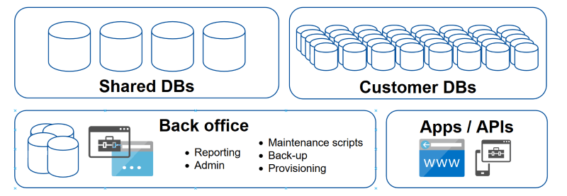
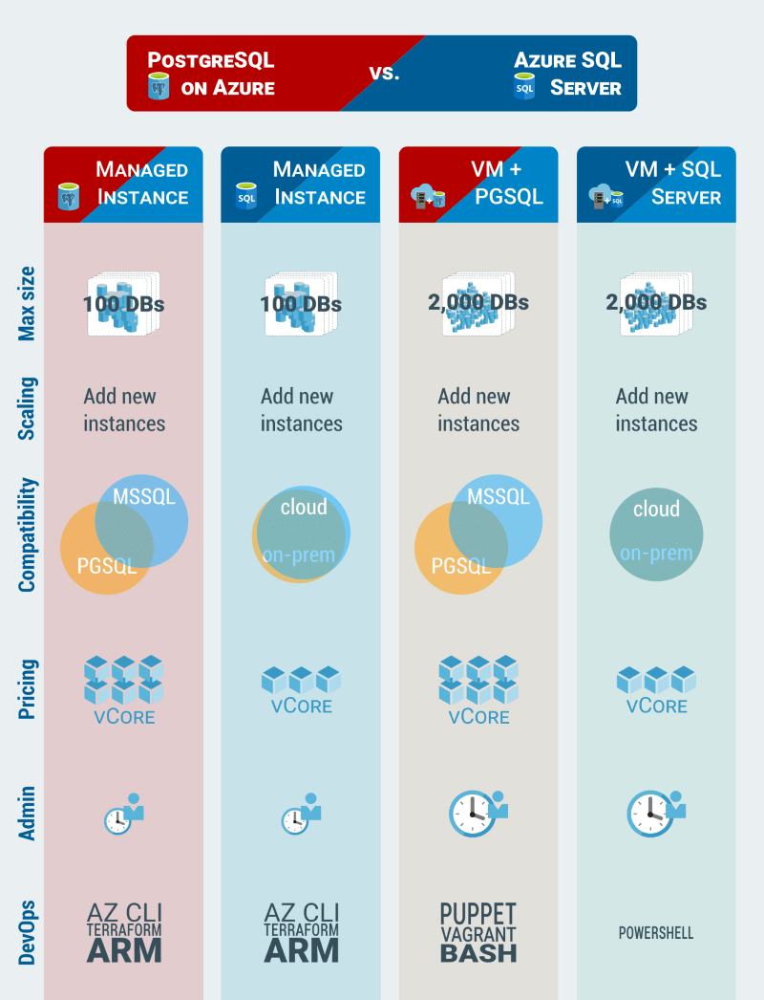

# On-prem to Azure SQL migration assessment
#### This post is a reducted copy from a real-life project involving 184 MS SQL databases

*The project started with what may seem like a reasonable question ...*

> How much will it cost to migrate our MS SQL DBs to Azure CosmosDB?

*For anyone who knows both MS SQL and CosmosDB that question raises an instant red flag because they are two very different database technologies and are not a direct substitute from one to another.*

> Why CosmosDB?

> We want to migrate our real estate management system to the cloud.

## The task at hand

*It wasn't the first engagement where we suspected the initial question was wrong and had to step back to understand the nature of the problem before suggesting a solution. After a few days of digging into their system and infrastructure we had a slightly better picture.*



* **MS SQL servers**: 2
* **Combined DB size**: 469GB
* **Number of DBs**: 184 (19 shared DBs, 165 customer DBs, 1 per customer)
* **Tables**: 2,000
* **Stored procedures**: 3,900
* **Lines of T-SQL code**: 390,000
* **System age**: 15+ years

*That didn't look like CosmosDB material to us, not from a database migration point of view. It would have to be a completely new implementation for the DB, clients and the front-end.*

> A new implementation is out of question. What other options do we have?

#### Core Requirements

* hosted on Azure
* up to 3 months to completion
* under $10,000 budget

#### Available options

1. CosmosDB
2. Azure SQL DB
3. Azure SQL VM
4. PostGRES SQL
5. A No-SQL DB

We decided not to make too many assumptions and go through a quick costing exercise for all five options.

## Goals, objectives and the methodology

> What are the main drivers for migrating to the cloud?

> The current on-prem architecture holds back business development and meeting new customer needs.


### Objectives for migrating to Azure
* Better scalability 
* Reduced maintenance
* Cost / performance optimisation
* Simpler resource provisioning for new clients

**Assessment objective**: identify suitable DB technology on Azure

### Methodology

* Analyse the DB size and complexity.
* Consider suitable types of cloud DB technology
* Estimate cost
* Assess performance
* Identify possible areas of improvement for existing code

### Main metrics

* **Technical feasibility**:
  * Technology stack
  * Scalability impact
  * Performance impact

* **Migration cost**:
  * DB
  * Application back-end
  * Front-end

* **Ongoing cost**:
  * DB
  * Compute
  * Storage
  * Logging, security, other auxilliary services

*Usually, a migration project is assessed for feasibility and upfront costs. The running cost is ignored until the resources are fully deployed. It could be particularly troublesome when CosmosDB [is seen as an "SQL DB"](https://docs.microsoft.com/en-us/azure/cosmos-db/sql-query-getting-started). It does support a subset of SQL, but [it is not an RDBMS](https://docs.microsoft.com/en-us/azure/cosmos-db/relational-nosql) and anything other than a simple read/write by a primary key comes at a high monetary cost.*

## Quantifying the current environment

*Knowing the size and utilisation of the current resources helps with understanding what kind of cloud resources would match the current performance and how the system can be scaled horizontally or vertically within Azure.* 

**Server I**: customer DBs
* 2 x 16 cores @ 2.00 GHz = 32 logical processors
* 128 GB RAM / 369 GB of DB storage used
* Microsoft SQL Server 2012 (SP4) Standard Edition (64-bit)

**Server II**: shared DBs
* 2 x 8 cores = 16 logical processors
* 128 GB RAM / 100 GB of DB storage used
* Microsoft SQL Server 2014 (SP2) Standard Edition (64-bit)

The server utilisation graph below is based on Windows System Monitor logs.


#### Utilisation metrics
* processor(_total)\% processor time
* logicaldisk(_total)\disk reads/sec
* logicaldisk(_total)\disk writes/sec
* sqlserver:databases(_total)\log bytes flushed/sec

A representative sample of performance data was collected over a span of several days. The current hardware configuration can be used as a reliable guide to server sizing.

## SQL code inside customer and shared databases

**The biggest challenge** in migrating relational databases to a different environment or a different technology stack is the SQL code inside the DBs and their client applications. Although, there is such a thing as [SQL Standard](https://en.wikipedia.org/wiki/SQL) T-SQL used by MS SQL server is not directly portable to other SQL flavours.   


The complexity of the code in any given database can be estimated by looking up system views like `sys.objects` and `sys.comments`. The metrics of interest: 

* object counts like user tables, views, SPs and UFNs
* amount of code
* specific language features that are hard to port or refactor

This query **counts user objects** across all databases on the server:
```sql
use master
GO

drop table if exists tDbObjectCount
create table tDbObjectCount (DbName nvarchar(255), TypeDesc nvarchar(255), Cnt bigint)

exec master.sys.sp_MSforeachdb 
'USE [?];

insert into master.dbo.tDbObjectCount
select DB_NAME(), type_desc, count(*)
from sys.objects
where type in (''U'',''FN'',''P'',''TF'',''V'')
	and DB_NAME() not in (''model'', ''tempdb'', ''msdb'', ''master'')
	and name not in (''fn_diagramobjects'', ''sp_alterdiagram'', ''sp_creatediagram'',
		''sp_dropdiagram'', ''sp_helpdiagramdefinition'', ''sp_helpdiagrams'', 
		''sp_renamediagram'', ''sp_upgraddiagrams'', ''sysdiagrams'')
group by type_desc'

select TypeDesc, sum(Cnt) from tDbObjectCount group by TypeDesc
drop table tDbObjectCount
```

This query **counts the lines** of code per object type:

```sql
use master
GO
drop table if exists tDbObjectLines
create table tDbObjectLines (DbName nvarchar(255), TypeDesc nvarchar(255), Lines bigint)

exec master.sys.sp_MSforeachdb 
'USE [?];

insert into master.dbo.tDbObjectLines
select DB_Name(), xtype, sum(t.lines_of_code) - 1
from
(
    select o.name as sp_name, 
    (len(c.text) - len(replace(replace(c.text, char(12), ''''), char(10), ''''))) as lines_of_code, o.xtype
    from sysobjects o
    inner join syscomments c
    on c.id = o.id
    where o.xtype in (''P'', ''FN'', ''IF'', ''TF'')
		and o.category = 0
		and o.name not in (''fn_diagramobjects'', ''sp_alterdiagram'', ''sp_creatediagram'', ''sp_dropdiagram'',
			''sp_helpdiagramdefinition'', ''sp_helpdiagrams'', ''sp_renamediagram'', ''sp_upgraddiagrams'', ''sysdiagrams'')
		and DB_NAME() not in (''model'', ''tempdb'', ''msdb'', ''master'')
) t
group by xtype
order by 1 desc'

select TypeDesc, sum(Lines) from tDbObjectLines group by TypeDesc order by 2 desc
drop table tDbObjectLines
```

#### Results for a single customer DB on Server I
* stored procedures: 2,993 / 230,256 lines
* scalar functions: 212 / 12,426 lines
* table functions: 14 / 1,570 lines
* tables: 656 
* views: 18

#### Combined results for all shared DBs on Server II
* stored procedures: 892 / 136,077 lines
* scalar functions: 212 / 8,188 lines
* table functions: 17 / 668 lines
* tables: 1,568 
* views: 84

**Total lines of code**: 389,185

### Code complexity

A global text search through C# code in client apps interfacing with the DBs returned only a few simple `select` statements and a lot of calls to *stored procedures*.


| select | insert | update | delete | join | union | commit |
|--------|--------|--------|--------|------|-------|--------|
| 50     | 4      | 9      | 1      | 47   | 0     | 0      |


The same exercise was repeated with the SQL code in the DBs. We looked for `cursor`, `transaction`, `freetext`, `for xml` and `.query` as they they are the ones to most likely cause issues.


| cursor | transaction | freetext | for xml | .query |
|--------|-------------|----------|---------|--------|
| 391    | 102         | 9        | 14      | 0      |


Additional searches to consider: 
* Select by key fields
* Select by non-key fields
* Select with JOIN
* Select with GROUP BY
* Select with UNION

Automated code refactoring could be an option for migrating between platforms, but due to the obvious complexity of the T-SQL code (389,185 lines over 4,340 objects) it is unlikely to apply in this case.

Presence of 391 *cursors* in T-SQL code indicates there is room for performance improvement. T-SQL cursors are often a performance hog and have to be reviewed manually for any potential issues.

## Suitable Azure DB products

We considered only most popular SQL and NoSQL DBMS offered by Azure, specially those packaged as a fully managed service.

| Azure DB type | Migration complexity | Timeframe | Comments                                   |
|---------------|----------------------|-----------|--------------------------------------------|
| MS SQL        | Low                  | Days      | The running cost may be an issue           |
| PostgreSQL    | Moderate             | Weeks     | ½ the price of MS SQL                      |
| CosmosDB      | Paradigm change      | Months    | A complete rewrite                         |
| MySQL/MariaDB | Downgrade            | Months    | Extensive code refactoring                 |
| ElasticSearch | Paradigm change      | Months    | A complete rewrite + a transactional RDBMS |
| mongoDB       | Paradigm change      | Months    | A complete rewrite + a transactional RDBMS |


### CosmosDB
*CosmosDB* is a no-schema DB with auto-indexing and SQL-like query language. Essentially, **it is a key-value store for JSON documents**. It is too different from MS SQL server for direct migration and will require a complete redesign and re-write of all DB-related codebase and the client apps.

The **primary purpose of CosmosDB** and similar NoSQL DBs is horizontal scaling for large or unpredictable load. This is not a consideration for us - our load is small enough for even a modest SQL server to handle and is very predictable.

* CosmosDB **SQL syntax** is very limited compared to T-SQL.
* Any **triggers** will have to be re-written in JavaScript.
* ACID **transactions** are supported in a different way from T-SQL.
* All **procedures** would have to be re-written in JavaScript.
* **JOINs** in the SQL sense are not supported.
* The **cost of queries** (RU or Request Units per query) escalates with the number of criteria in WHERE clause. The most cost efficient queries are retrieving values by key. The ongoing cost of a CosmosDB database can be further estimated by creating a sample DB and running some typical queries against it to see the RU values.

#### Redesign option

* Switch from the current highly normalised data model to a hierarchical structure (JSON).
* Move all the business logic from SPs into the application layer.
* Use a small RDBMS for important ACID transaction to guarantee consistency.
This would be a **long term option** and is equivalent to re-building the entire application from scratch.


#### Re-factoring option
Let's assume it takes a very optimistic 1 minute to re-write and re-test one line of existing SQL code. 380,000 lines of code would take 6,300 man-hrs or 787 days. Most likely it will be x4 that because it is a programming paradigm change.
CosmosDB will be forced to act as an SQL server, which it is not. This is a **dead end solution** that takes a very long time to implement. 


### MySQL/MariaDB
The cost of migrating 380,000+ lines of code to a different SQL flavour with fewer features is likely to be high. The running cost is about the same as the normal cost for Azure compute + storage.

* A significant downgrade in functionality and capabilities
* Extensive code refactoring

### ElasticSearch or mongoDB
It would take a complete redesign and re-write of all DB-related codebase to make it work with a No-SQL DB. Even then, a small RDBMS with ACID support is likely to be required. Most likely, these products will need significantly more compute and storage to provide comparable performance.

* paradigm change with complete code re-write
* may still require an RDBMS for critical transactions
* months to complete

### MS SQL

Migrating an on-prem MS SQL server to an Azure MS SQL server is a reasonably straightforward process as they are essentially slightly different flavours of the same technology.


#### Migration issues
*Elastic DB pool* and *Managed SQL* may require some changes to the T-SQL code. The changes are not technically challenging, but there may be many thousands of lines to refactor.

* Changes to cross-DB queries
* Computed columns
* Minor syntax edits
* Refs to system SPs
* CLR functions

#### Cost estimates
The pricing below is per month for West Europe availability zone. The server sizing is approximate and has to be calculated more accurately using [SQL server sizing calculator](https://dtucalculator.azurewebsites.net).

| ElasticPool         | Managed SQL         | VM + SQL                                                             |
|---------------------|---------------------|----------------------------------------------------------------------|
| $2,646 (1200DTU)    |                     |                                                                      |
| $3,123 (vCore x 16) | $3,123 (vCore x 16) | $3,571 (1 E20 v3 (20 vCPU(s), 160 GB RAM) + SQL Std + extra storage) |
|                     |                     | $5,551 (1 E32 v3 (32 vCPU(s), 256 GB RAM) + SQL Std + extra storage) |

### PostgreSQL
PgSQL is comparable in scale and performance to MS SQL. Its main advantage is lower running cost because it is a free open source product. There is no other reason to consider it for this project. Azure offers managed PostgreSQL at the price of compute + storage, which is approximately ½ of MS SQL cost.


| PostgreSQL, managed               | MS SQL, managed                  | RH Ent Linux + PostgreSQL      |
|-----------------------------------|----------------------------------|--------------------------------|
| 16 core, 160GB RAM, 800GB storage | 16 core, 81GB RAM, 800GB storage | 16 cores, 128GB RAM, 400GB SSD |
| $1,669                            | $3,228                           | $1,213                         |

The server sizing is very approximate and is included to illustrate the price range.



#### Migration to PostgreSQL
PostgreSQL comes with an additional cost of the initial migration. It can take anywhere between 1 - 3 months:
* Migrate data
* Review and modify indexes
* Review and modify views
* Convert T-SQL into PgSQL, which is closer to ANSI SQL
* Create a testing framework (a side benefit for future development)

The team would need to upskill during the migration. Most MS SQL developers can start programming for PostgreSQL within hours of setting it up. Mastering Postgres administration may takes longer, but most of the concepts are very similar.

## Conclusion

The only viable migration option given the time and budget constraints is to migrate Azure MS SQL. It is closest in terms of the technology stack and requires minimum code changes compared to all the other options. The most optimal and cost effective option would be Azure SQL Pool. The quickest and least risky - Azure VM + MS SQL.