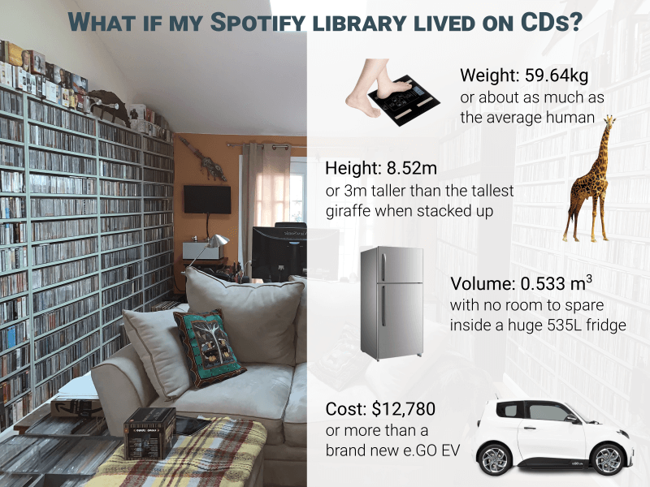
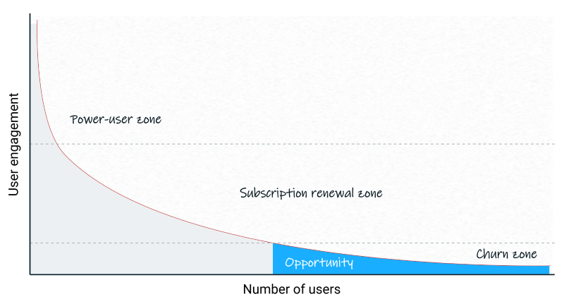

# Are you a power-user? You are not wanted any more.
#### How to focus on a bigger market and not leave your early adopters behind

I love Spotify. I've been a paying user from the day their service became available on this rock at the bottom of the Pacific called New Zealand. It's been a while and I amassed a sizable collection in my Spotify library - 852 albums, to be precise.

Can you imagine owning 852 albums on CDs?

### A collection of that size makes me a *power-user*. It doesn't give me any superpowers - it just makes me "special-needs", from Spotify's point of view.

Sarah Travel from Benchmark Capital explained that view so well in an [interview with Patrick Oshag](https://open.spotify.com/episode/46Yi7ta1rI9vVaGRJVA0UK). She was talking about her days as an early product leader at Pinterest: 

> On the product side there is always this temptation to build for your users. Sometimes I got into trouble when I would insist on ignoring our power-users. If you want to build a company that is really big and you build all the things that your power-users are emailing you about, the product gets more and more complex and that makes it harder and harder to have that next new user come into your product and understand it. There is that constant temptation, but **you have to build for the next 100 million users, not optimize for the users you have right now**.

And power-users are a noisy bunch. They are you hear from most. Here is another quote from Sarah Travel:

> ... because your power-users are your most vocal group and **may you be so lucky to have these people as your early adopters, they are your biggest believers, the evangelists**, but because they love your product so much they are always making requests to your team about new things to build, new features, that only they would use themselves.

It is so true! We made that very mistake in one of my previous startups, [mVentory](http://mventory.com). We spent too much time and money satisfying every demand of our early adopters to the point where we lost the product-market fit for everyone else. File it under *#FAIL*. 

Reid Hoffman and his guests on [Masters of Scale podcast](https://mastersofscale.com/) tell multiple stories about [community building](https://mastersofscale.com/caterina-fake-build-a-more-human-internet/) and "[letting fires burn](https://open.spotify.com/episode/4u0S0P2gL70g6CcbeiZzM7)" with one simple message — ignore your power-users, ignore the most vocal ones and do what's right for the business.

But no one said it better than Leah Busque, founder of [TaskRabbit](https://www.taskrabbit.com/) when she [described the fallout](https://www.saastr.com/saastr-podcasts-for-the-week-with-zylo-and-taskrabbit-july-26-2019/) after a change to a much simpler bidding model:

> ... the NPS (Net Promoter Score) went from 60s-70s to negative. Everyone was really upset about the new product and the new changes. Oddly enough, the new customers and the new taskers had twice as much usage and higher NPS than the old cohort and when we dug deep into the data we realized **maybe those vocal customers that loved the old platform were the wrong customers, they were not the ones that were going to take us into the future**.

### So, am I not the right customer for Spotify? 
Am I about to be fired?

> All I want is to play the entire collection of 12,796 tracks from my 852 albums on "shuffle".

> Well, sorry, that can't be done. You have too many tracks, Mr. Poweruser. Have you tried using a [3rd party app](https://play.google.com/store/search?q=spotify&c=apps&hl=en) or [our API](https://developer.spotify.com/)?

### Spotify, [like many others](https://mastersofscale.com/tobi-lutke-be-a-platform/), solved the problem of power-user demands by becoming a platform with a rich set of APIs and 3rd party apps.

I had no choice, but to channel my frustration into making a [browser add-on to combine all my albums into a single playlist](https://github.com/rimutaka/spotify-play-all-saved-albums) with one click. Problem solved.

---

P.S.  *I still love Spotify even if they don't love me as much in return.*
