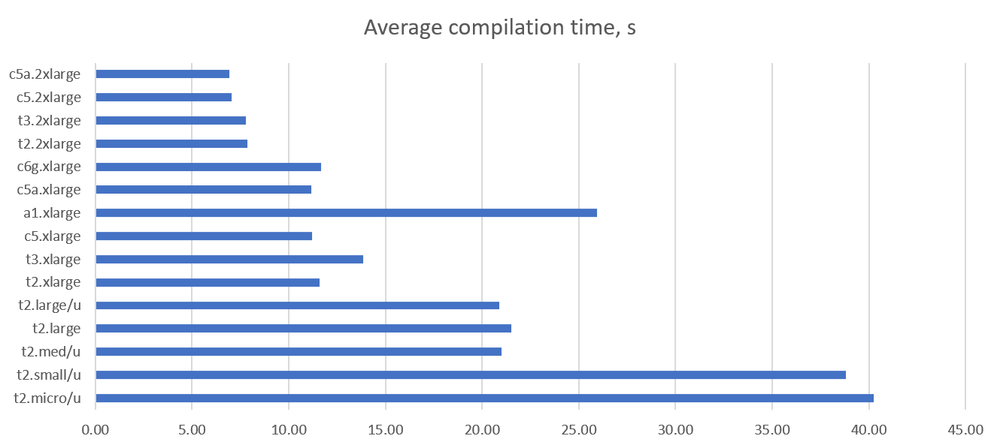
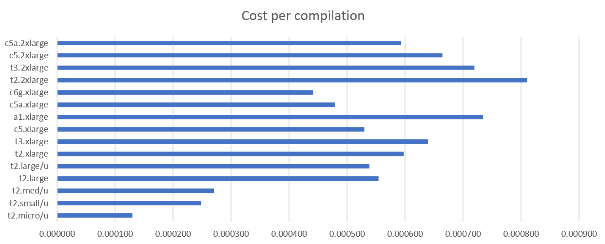
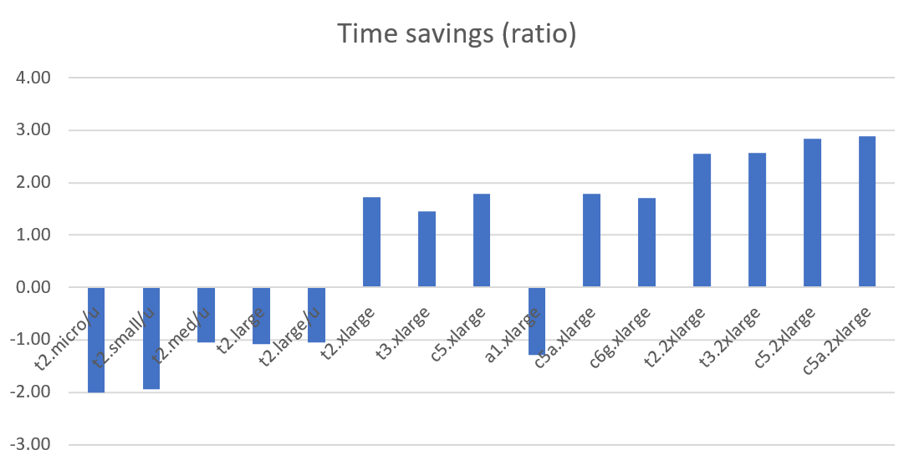
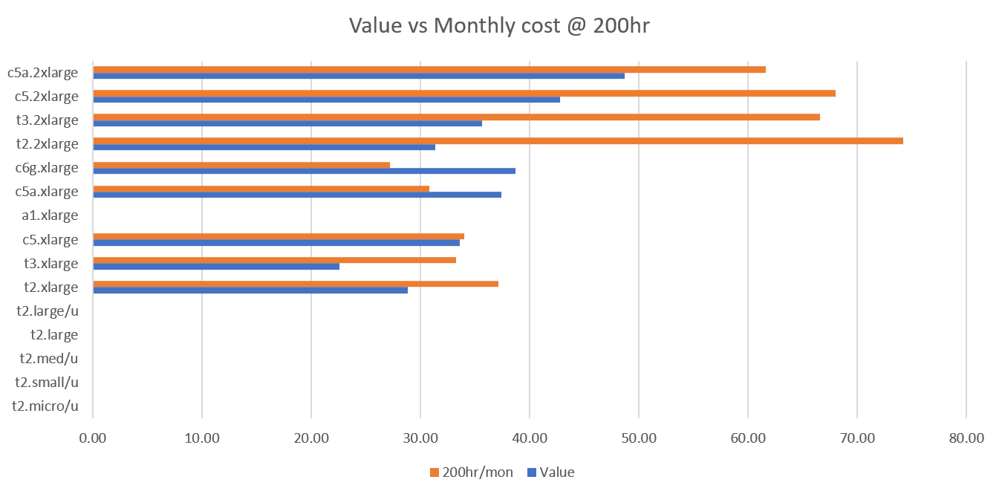
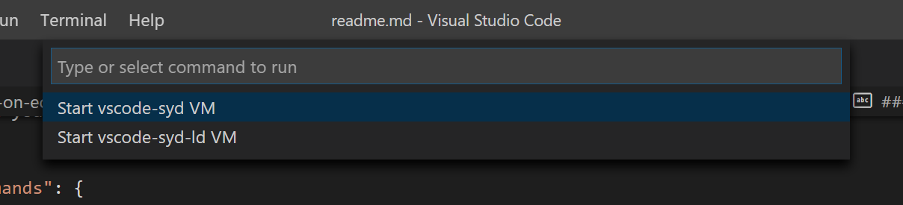
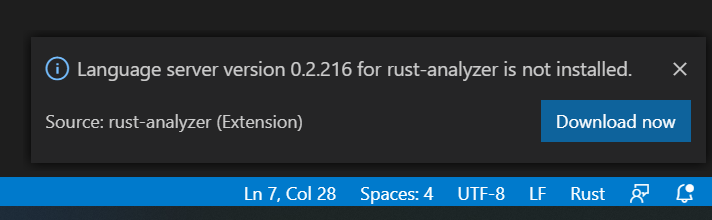

# AWS EC2 as a Rust development server with VSCode
#### Cost and performance analysis with a step-by-step setup guide

I dread running `cargo build --release`.

It's not that I dread build failures or compiler warnings - I dread the wait.

My current Rust project takes about a minute to build on my laptop. It's not long enough to do something meaningful, like read HackerNews, but is long enough to make it feel agonizingly boring. If I don't have the money for a faster laptop, maybe I could build a really fast Rust development server in the cloud?

#### Cost of Intel NUC vs EC2 Instance

A friend of mine is using an [Intel NUC bare-bones computer](https://www.intel.com/content/www/us/en/products/boards-kits/nuc/kits.html) as his local development server. It is quite powerful for its tiny size and will outperform by ageing Surface by a wide margin. We'll use it as a baseline for our comparison.

* **New NUC cost**: $1,000 incl shipping, credit card fees, etc
* **Useful lifetime**: 2 years
* **Residual cost**: $200 in today's money (discounted for inflation and the cost of sale)
* **Total cost**: $900 in today's money ($1000 outlay + $100 interest - $200 residual cost)

Somehow I find it painful to part with $1,000 for a gadget I may not need in a few months, even if it's as cute as a NUC. Let's see what an EC2 instance may cost.

* **t3.2xlarge AWS instance**:  33c per hour or $247 per month or $5,942 over 2 years or 6 NUCs
* **Working hours usage only**: 5 days * 10 hrs * 4 weeks = 200hrs per month or $1,584 over 2 years
* **Realistic usage**: 100 hrs per month or $792 over 2 years
* **Total cost**: $33 per month

$33 per month vs. $1,000 upfront. That's an easy choice, but how much faster will the builds be?

#### Rust Compilation Benchmarks on EC2

I compared Rust build time on different instance types using a very simple Rust project for logging AWS Lambda input in CloudWatch.

* **Source code**: https://github.com/rimutaka/rusty_lambdas/tree/master/json_logger
* **AMI**: ubuntu/images/hvm-ssd/ubuntu-bionic-18.04-amd64-server-20200408
* **Build command**: `cargo build --release --target x86_64-unknown-linux-musl`


Type | vCPU | Mem | Cost/hr | Avg build | Builds/hr | 100 hrs | 200 hrs | 1,200 hrs
--|---|---|---|---|---|---|---|--
t2.micro/u | 1 | 1 |  $0.0116  | 40.25s | 89 | too slow |  | 
t2.small/u | 1 | 2 |  $0.0230  | 38.81s | 93 | too slow |  | 
t2.med/u | 2 | 4 |  $0.0464  | 21.00s | 171 | too slow |  | 
t2.large | 2 | 8 |  $0.0928  | 21.50s | 167 | too slow |  | 
t2.large/u | 2 | 8 |  $0.0928  | 20.89s | 172 | too slow |  | 
t2.xlarge | 4 | 16 |  $0.1856  | 11.59s | 311 |  $19  |  $37  |  $223 
t3.xlarge | 4 | 16 |  $0.1664  | 13.83s | 260 |  $17  |  $33  |  $200 
c5.xlarge | 4 | 8 |  $0.1700  | 11.22s | 321 |  $17  |  $34  |  $204 
a1.xlarge | 4 | 8 |  $0.1020  | 25.93s | 139 | too slow |  | 
c5a.xlarge | 4 | 8 |  $0.1540  | 11.18s | 322 |  $15  |  $31  |  $185 
c6g.xlarge | 4 | 8 |  $0.1360  | 11.69s | 308 |  $14  |  $27  |  $163 
t2.2xlarge | 8 | 32 |  $0.3712  | 7.86s | 458 |  $37  |  $74  |  $445 
t3.2xlarge | 8 | 32 |  $0.3328  | 7.79s | 462 |  $33  |  $67  |  $399 
c5.2xlarge | 8 | 16 |  $0.3400  | 7.04s | 512 |  $34  |  $68  |  $408 
c5a.2xlarge | 8 | 16 |  $0.3080  | 6.93s | 519 |  $31  |  $62  |  $370

The average compilation time proved that the defining factor is the number of vCPUs (cores) - the more the better. Factors like extra memory, EBS optimization or network throughput didn't make any difference. I did use *Unlimited* option (*u* in *t2.micro/u*) for some tests.

Surprisingly, the new ARM-based instances (a1.xlarge, c6g.xlarge) were slower than x86, but provided more value. I also ran into several toolchain issues with them. It may be a bit too early to consider them for this particular application.



*t2.micro* has the lowest cost per compilation. It is too slow for real-time builds, but it gets there eventually. I would use it for a build server in a CI/CD pipeline where the build duration is not critical.



The time saved per build is relative to the size of the build. The next graph shows the ratio of improvement with EC2 time compared to my current Surface/VSCode/WSL2/Rust set up. I may be saving 15s per build on this test project, but some builds may run into minutes, so the higher the ratio the more time it saves. 



And finally, consider some measure of value vs the monthly cost. It looks like *c5* types provide the best value for money for real-time Rust builds. I arbitrary defined the value as *time_saving_ratio/cost_per_build*, which can be simplified to *1/(instance_cost * avg_compilation_time^2)*.



I would go with *c5a.2xlarge* for larger builds to get 2.89x improvement or *c5a.xlarge* for smaller ones with 1.79x. They seem to be the optimal choice between speed, value and what I am prepared to pay for it.

**Total cost: $31 per month** (c5a.2xlarge @ 100 hrs per month, 7s, 2.58x faster)

---

*The rest of the post is a detailed step by step guide of setting up VSCode with a Rust development server on EC2.*

## AWS set up

The primary purpose of this development environment is building AWS Lambda functions. That adds a few extra steps with *x86_64-unknown-linux-musl* target and other specifics. 

This section assumes that you already know how to configure a security group, launch an instance and connect to it. Let's get started ...

1. Launch a *t3.micro* instance with *Ubuntu Server 18.04 LTS (HVM), SSD Volume Type* AMI
2. Connect to the instance via SSH
3. Run the following series of commands to install Rust and AWS CLI 
  
```bash
sudo apt-get update
sudo apt-get install musl
sudo apt-get install build-essential -y
sudo apt-get install zip -y
curl https://sh.rustup.rs -sSf | sh -s -- -y
source $HOME/.cargo/env
rustup --version
rustup target add x86_64-unknown-linux-musl

curl "https://awscli.amazonaws.com/awscli-exe-linux-x86_64.zip" -o "awscliv2.zip"
unzip awscliv2.zip
sudo ./aws/install
aws --version
rm awscliv2.zip
```

You may need to stop the process to troubleshoot if you get any errors. I included some links that helped me along the way.

* https://forge.rust-lang.org/infra/other-installation-methods.html
* https://github.com/awslabs/aws-lambda-rust-runtime/issues/17#issuecomment-577837255
* https://stackoverflow.com/questions/52445961/how-do-i-fix-the-rust-error-linker-cc-not-found-for-debian-on-windows-10
* https://aws.amazon.com/blogs/opensource/rust-runtime-for-aws-lambda/

### AWS config

We need to prepare the environment to easily start/stop the instance and deploy test Lambdas.

1. Create 2 IAM policies (`StartStopDevEC2` and `UpdateOrInvokeLambda`)
2. Create an EC2 role with `UpdateOrInvokeLambda` policy and attach it to the Rust instance
4. Allocate a new IP and associate it with the Rust instance
5. Create a new AWS CLI user in IAM with `StartStopDevEC2` policy
6. Copy the user credentials into `~/.aws/credentials` on your computer running VSCode. Add them as a named profile, e.g. I called mine `[vscode-syd-ld-start-stop]`
7. Create an alarm inside EC2 instance monitoring for auto-stopping the Rust instance when not in use:
   * *Stop this instance* when *Sum* of *NetPacketsIn* < 100 for 1 Hr
   * Change the default name to something nice, like *Stop Rust Dev EC2*


### IAM policy templates

Replace the region (*ap-southeast-2*) and instance ID (*i-026a4507e766ebe50*) in the templates with your values.

This is `StartStopDevEC2` policy for starting your Rust EC2 instance from inside VSCode:
```json
{
    "Version": "2012-10-17",
    "Statement": [
        {
            "Sid": "VisualEditor0",
            "Effect": "Allow",
            "Action": [
                "ec2:StartInstances",
                "ec2:StopInstances"
            ],
            "Resource": "arn:aws:ec2:ap-southeast-2:028534811986:instance/i-026a4507e766ebe50"
        }
    ]
}
```

This is `UpdateOrInvokeLambda` policy for updating Lambda function code from your EC2:
```json
{
    "Version": "2012-10-17",
    "Statement": [
        {
            "Sid": "VisualEditor0",
            "Effect": "Allow",
            "Action": [
                "lambda:UpdateFunctionCode",
                "lambda:InvokeFunction",
                "lambda:InvokeAsync"
            ],
            "Resource": "arn:aws:lambda:us-east-1:028534811986:function:*"
        }
    ]
}
```
Launch the EC2 instance in the AWS location closest to you to minimize the latency. Lambdas can be deployed in the location with the rest of your infra - the latency from the Lambda to you is not critical. For me the nearest AWS data centre is in Sydney (*ap-southeast-2*) and my Lambdas live in *us-east-1*.


### VS Code configuration

#### Starting / stopping Rust EC2 instance

* Install [vscode-command-runner extension](https://marketplace.visualstudio.com/items?itemName=edonet.vscode-command-runner)
* Add [start-instances](https://docs.aws.amazon.com/cli/latest/reference/ec2/start-instances.html) custom command to VSCode `settings.json` with your instance, region and profile IDs:

```json
"command-runner.commands": {
  "Start vscode-syd VM": "aws ec2 start-instances --instance-ids i-026a4507e766ebe50 --profile vscode-syd-ld-start-stop --region ap-southeast-2"
}
```

**Starting the instance**: press `Ctrl`+`Shift`+`R` and select `Start vscode-syd VM`. This shortcut works only if the VSCode is running locally. Give it a minute or so for the instance to start before connecting.



**Stopping the instance**: disconnect all SSH sessions and the instance will be stopped 1 hr later by the EC2 alarm described in *AWS Config* section. You can add `stop-instances` custom command if you want to stop it immediately.


#### Connecting to the EC2 instance

* **Configure SSH details**: type "open ssh" in command pallet, select *Remote SSH: Open configuration file* and add the following entry. Note, *IdentityFile* should be located on the computer running VSCode.
```
Host rust-aws-syd-ld
  HostName 13.54.209.171
  User ubuntu
  IdentityFile ~/.ssh/dev-ld-syd.pem
```

* **Connect to the instance**:
  * Open a remote window (click on `><` at the bottom left of the screen or search for "SSH Connect" in command pallet)
  * Watch for prompts at the top of the screen: select *Linux* and *Continue*
  * Let the VS install its components on the remote system


Learn more about VSCode remote SSH connections from https://code.visualstudio.com/docs/remote/ssh.

#### Setting up Rust for VS

* Install `rust-analyzer` VSCode extension on the remote machine
* Consider other useful extensions: `Better TOML`, `Code Spell Checker`, `CodeLLDB`
* Open the terminal and create a folder for Rust projects, e.g. `mkdir rust` + `cd rust`
* Clone a demo lambda project `git clone https://github.com/rimutaka/rusty_lambdas.git`
* Open any *.rs* file from the cloned project folder in VSCode and watch out for a message from `rust-analyzer` to install its server (bottom-right of the screen)



### Build and deploy a demo Lambda function

If you are still running on that *t2.micro* instance it's time to upgrade to *c5.xlarge* and build the demo project for deployment to AWS Lambda:

`cargo build --release --target x86_64-unknown-linux-musl`

Package the Lambda with Rust [custom runtime](https://docs.aws.amazon.com/lambda/latest/dg/runtimes-custom.html):

`cp ./target/x86_64-unknown-linux-musl/release/lambda ./bootstrap && zip lambda.zip bootstrap && rm bootstrap`

[Push](https://awscli.amazonaws.com/v2/documentation/api/latest/reference/lambda/update-function-code.html) the package to AWS Lambda. The Lambda must already exist for `update-function-code` command to work. Replace the region and function name with your IDs.

`aws lambda update-function-code --region us-east-1 --function-name JsonLogger --zip-file fileb://lambda.zip`

I noticed that IntelliSense within VSCode stops working from time to time. If that happens to you, search Command Pallet for *Rust Analyzer:Restart Server*. It should start picking errors and expanding the syntax as soon as the Rust Analyzer is restarted.

----

*Comments with questions, corrections or suggestions are very welcome.*
