# Merging development and production databases for cloud migration
#### This post is a part of a series based on my experience migrating 184 DBs to Azure SQL.

> It can take a long time to prepare a system for migration to a cloud environment. One problem you are likely to face just before the deployment to the cloud is **dealing with recent changes introduced to production environment**.

Our migration process for those 184 databases started with taking a snapshot of production. It took us 3 months to modify and test the code before it was ready to run on Azure. In the meantime, the production code *"evolved"*. In other words, the SQL code changed here and there. We actually took a conscious decision to ignore the changes until we make it work on AZ, then merge. **This article is a detailed description of the merge process to help others facing a similar problem.**

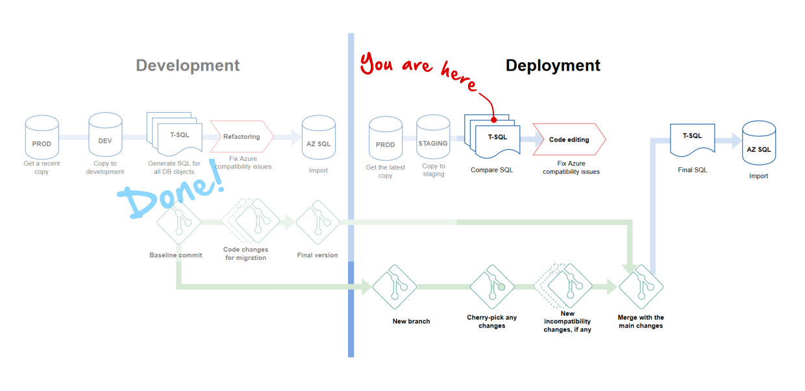

## Project structure
We had to enforce a certain structure to make everything hang together.

**Files**:
* `\` - root_solution_folder
  * `db` - contains folders with T-SQL code from *snapshot* DBs
    * `c_4vallees` - T-SQL code of *c_4vallees* DB, including its own GIT repo
    * `central` - same for *central* and other DBs
    * `helpdesk`
    * `reporting`
    * etc ...
  * `utils` - all sorts of shell and SQL scripts for code refactoring and automation
  * `staging-diff` - diff files for comparing *base* and *model* versions
  * `customer-dbs` - modified code for customer DBs, based on a single *customer model DB*

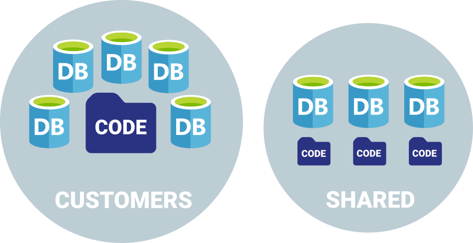

**Customer databases**:

*Customer DBs* have data specific to a single customer, but share the same code base. In practice, there are minute difference in their code as well. We are only concerned with the differences that affect AZ compatibility.

* `c_4vallees_base` - the original customer DB snapshot taken for development
* `c_4vallees_model` - a copy of snapshot customer DB modified for AZ
* `c_4vallees` - the latest production copy of the same customer DB
* `c_8hdke93`, `c_a83hdk2`, `c_hdj3ud5` - the latest production copies of other customer DBs

**Shared databases**:

*Shared* or *Central DBs* have function and code that are specific to that DB only. No code is shared between them.

* `central`, `helpdesk`, `reporting` - latest production copies
* `central_base`, `helpdesk_base`, `reporting_base` - original snapshots taken for development (before any AZ modifications)

## What compares to what

So we take 3 sets of T-SQL code from DBs:
* `base` - the original snapshot before AZ mods
* `model` - a modified snapshot that works on AZ
* `prod` - the latest copy from production

and compare them in this order

1. `base` to `model` to get the list of all Azure compatibility changes
2. `base` to `prod` to find out changed in production while we were busy modding `base` for Azure
3. merge `prod` and `model`

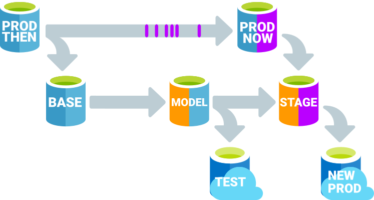

## Step 1: getting AZ compatibility mods
This script diffs the latest version of modified (*model*) DBs against their original (*base*) state. We'll need these diffs to limit our search for recent prod changes to those objects only.

This script should be run from the solution root because it expects database repositories to be in `./db/db_name` folders.

**Required input vars**:
* `$diffDBs` - an array with DB names, e.g. `$diffDBs = @("central", "helpdesk", "reporting")`
* `$diffFolderName` - relative path to the output folder, e.g. `$diffFolderName = "staging-diff"`

**Output**: a bunch of diff files per DB, e.g. `staging-diff/init-head-diff-db_name.txt`


```powershell
. (Join-Path $PSScriptRoot vars.ps1)

# prepare paths and variables
$rootDir = (Get-Item -Path ".\").FullName
$diffDir = Join-Path $rootDir $diffFolderName

# create a folder for diffs, if needed
if (!(Test-Path -Path $diffDir )) {
  New-Item -Path $rootDir -Name $diffFolderName -ItemType "directory" -Force | Out-Null
}
"Diff folder: $diffDir"

foreach ($dbName in $diffDBs) {
  "`nDB: $dbName"
  
  # try to checkout master branch
  $dbCodeFolder = Join-Path "db" $dbName
  git -C $dbCodeFolder checkout master --force
  if ($LASTEXITCODE -ne 0) {
    Write-Host "Cannot checkout MASTER on $dbCodeFolder" -ForegroundColor DarkRed
    continue
  }

  # get the very first commit with the unmodified (base) code
  $allCommits = git -C $dbCodeFolder rev-list HEAD
  $initialCommit = $allCommits.split()[-1]
  "Initial commit: $initialCommit"

  # save the list of all modified files
  $diffFileName = Join-Path $diffDir "init-head-diff-$dbName.txt"
  if (!(Test-Path -Path $diffFileName )) {
    $modFiles = git -C $dbCodeFolder diff --name-only $initialCommit HEAD
    "Files in diff: " + $modFiles.split().length
    Set-Content -Path $diffFileName -Value $modFiles
  }
  else {
    Write-Host "Diff file already exist: $diffFileName" -ForegroundColor Yellow
  }
}
```

Here is a small snipped from one of the DBs we diff'd. It's a simple list of all file names affected by AZ mods. The file names conform to SSMS object scripting format: *owner.object.type.sql*.

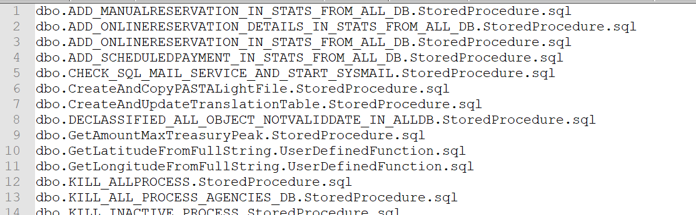

## Step 2: getting recent changes in PROD

The previous step gave us a list that limits our search for recent changes in PROD to a small set of objects (stored procedures, user functions and views). We achieved that by comparing 2 commits. In this step we compare the code directly between *base* and *prod* DBs using *sys.syscomments* tables to avoid exporting all objects from the *prod* DB.

This PowerShell script relies on the output from Step 1 and should also be run from the solution root.

**Required input vars**:
* `$diffDBs` - an array with DB names, e.g. `$diffDBs = @("central", "helpdesk", "reporting")`
* `$diffFolderName` - relative path to the output folder, e.g. `$diffFolderName = "staging-diff"`
* `$azpm` - location of [AZ migration CLI tool](https://github.com/rimutaka/onprem2az-elastic-query), e.g. `$azpm = "C:\Temp\AzurePoolCrossDbGenerator.exe"`
* `$modelCustomerDB` - name of the `model` customer DB. It is required only if you are processing customer DBs from a single `model`.

**Output**: new branches with unstaged files in each DB repo

```powershell
. (Join-Path $PSScriptRoot vars.ps1)

# prepare paths and variables
$rootDir = (Get-Item -Path ".\").FullName
$diffDir = Join-Path $rootDir $diffFolderName
"Diff folder: $diffDir"

# check if the diff folder exists
if (!(Test-Path -Path $diffDir )) {
  Write-Host "Cannot access the diffs in $diffDir " -ForegroundColor Red
  Exit
}

foreach ($dbName in $diffDBs) {
  $dbBase = $dbName + "_base" # the original version of the DB used for development
  $dbCodeDir = Join-Path "db" $dbName # folder with the code repo
  $diffFileName = Join-Path $diffDir "init-head-diff-$dbName.txt"
  <# Uncomment this block if processing customer DBs to compare them to the same base
  $dbBase = $modelCustomerDB + "_base"
  $dbCodeDir = Join-Path "db" $modelCustomerDB
  $diffFileName = Join-Path $diffDir "init-head-diff-$modelCustomerDB.txt"
  #>

  "`nStaging DB: $dbName"
  "Base DB: $dbBase"
  "Code repo: $dbCodeDir"

  # get the list of modified files
    if (!(Test-Path -Path $diffFileName )) {
    Write-Host "Cannot access diff file: $diffFileName" -ForegroundColor Red
    continue
  }
  
  # try to checkout master branch
  git -C $dbCodeDir checkout master --force
  if ($LASTEXITCODE -ne 0) {
    Write-Host "Cannot checkout MASTER on $dbCodeDir" -ForegroundColor Red
    exit
  }

  # get the initial commit
  $allCommits = git -C $dbCodeDir rev-list HEAD
  $initialCommit = $allCommits.split()[-1]
  "Initial commit on master: $initialCommit"

  # check out the very first commit into a new branch
  $branchName = $dbName +"-" + (Get-Date -Format "yyyyMMddHHmm")
  git -C $dbCodeDir checkout -B $branchName $initialCommit
  if ($LASTEXITCODE -ne 0) {
    "Failed to checkout $initialCommit as branch $branchName"
    continue
  }

  # extract changed files from the diff list into the DB folder
  $csl = "`"Persist Security Info=False;Integrated Security=SSPI;Initial Catalog=$dbName;Server=.`"" # staging DB (latest prod)
  $csb = "`"Persist Security Info=False;Integrated Security=SSPI;Initial Catalog=$dbBase;Server=.`"" # a DB with the original code (base)
  $wd = Join-Path $rootDir $dbCodeDir

  Start-Process -FilePath $azpm -ArgumentList @("extract", "-csl", $csl, "-csb", $csb, "-l", "$diffFileName") -NoNewWindow -Wait -WorkingDirectory $wd

  # multiple customer DBs are extracted into the same folder, so we need to stash the changes to keep them separate
  # the stashes would need to be popped manually for further editing
    $stashMsg = "staging"
    git -C $dbCodeDir stash push -m $stashMsg
    # run `git stash clear` to remove all stashes in the repo

}
```

#### Customer DBs vs Shared DBs

Our set up was quite typical - a single-DB per customer and a bunch of shared DBs for reporting, lists of values, taxonimies and other shared data. Shared DBs are all compared to their `base`. It is a 1:1 relationship and we can simply create a branch per DB.

Customer DBs, on the other hand, are all compared to a the same `base`, in our case it was called `4vallees` by the name of the customer DB used for the initial snapshot. To keep the repo clean we stash away the changes for every branch before moving onto the next one. This saves us making a rather "dirty" commit.

This is what the GIT tree looked like for us after running the script from Step 2:

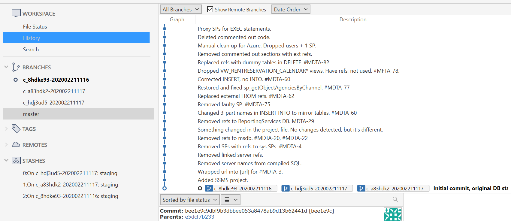

You can see 3 branches named as *DB + timestamp* with corresponding *stashes*. We are now ready to start reviewing and merging the code.

## Step 3: merge `base` and `prod`

The purpose of this merge is to converge our `base` version with the latest PROD changes.

This diff tells us that *prod* had some columns added and there is also expected difference in the header of the file because the code we extracted from *sys.syscomments* table doesn't have *SET* and *DROP* statements.

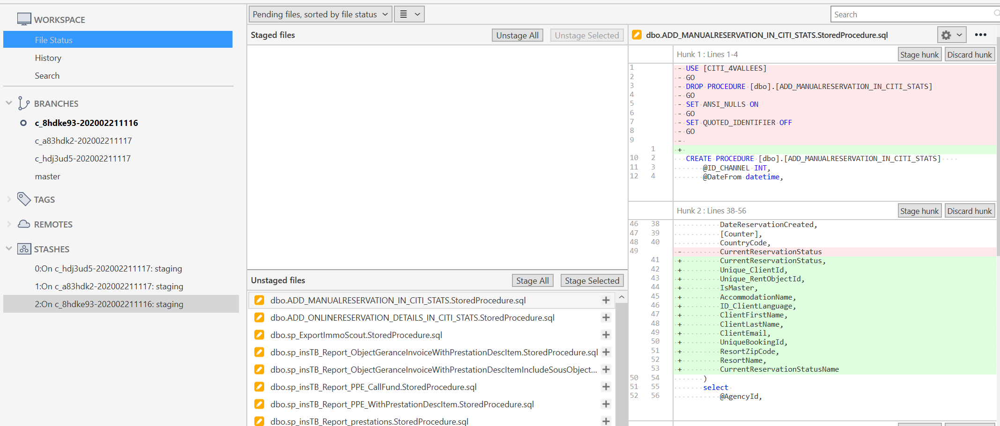

After some "cherry-picking" we ended up with this version to go ahead with:

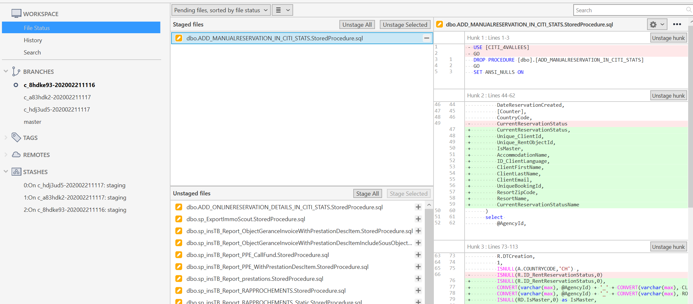

The merged tree then had 2 branches: `master` for the *model DB* and another one for *PROD*,

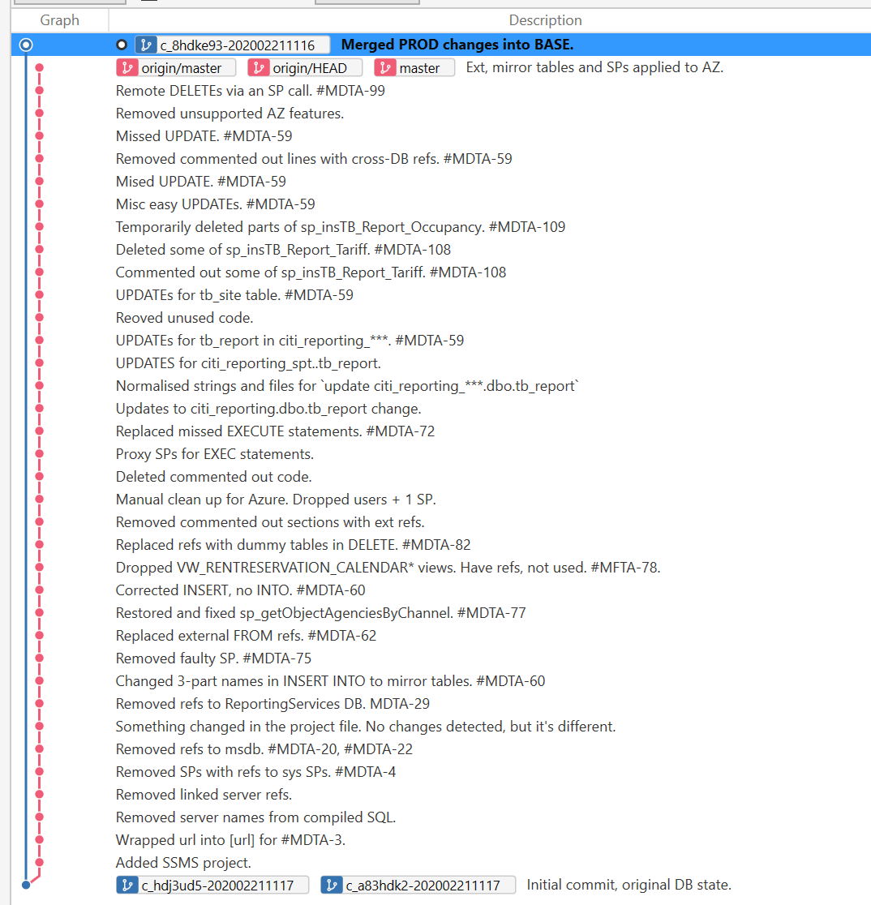

followed by a merge with all Azure compatibility changes from `master`.

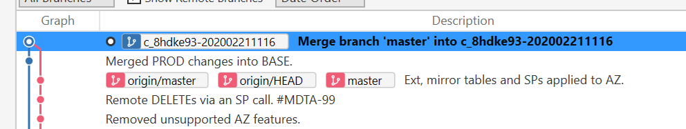

This diff confirmed that our AZ compatibility changes were all in there: cross-DB queries were updated with our mirror-table solution.

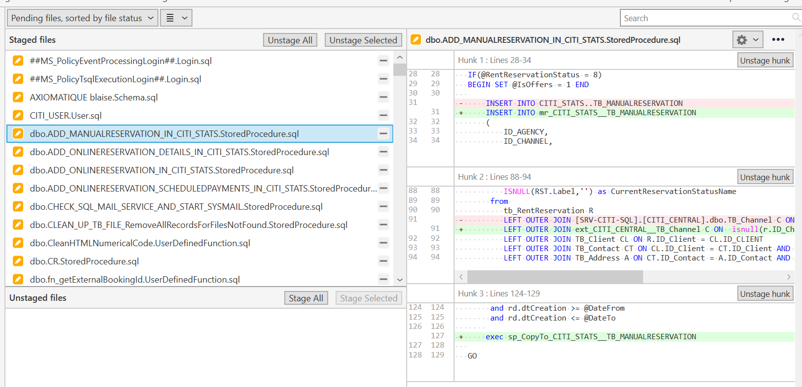

We repeated the merge for the other 2 branches and kept all customer-specific changes within their branches.

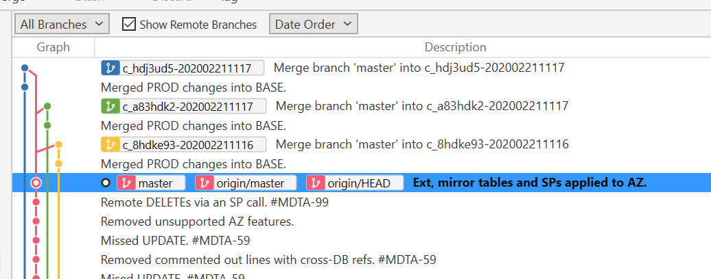

## Applying merged changes back to PROD DBs

The approach of applying the changes depends on whether there are individual differences between customer DBs or if the scripts from a single `model` DB can be applied to them all. 

In our case there were no differences and it was enough to copy the code from `model` to every customer DB with *search and replace* for the DB name. The following script does just that. Run it from the solution root.

**Required input vars**:
* `$dbCustomers` - an array with DB names, e.g. `$dbCustomers = @("c_8hdke93", "c_a83hdk2", "c_hdj3ud5")`
* `$modelCustomerDB` - name of the *model* customer DB, e.g. `$modelCustomerDB = "4vallees"`
* Copy the diff for customer *model* DB to `customer_dbs\diff.txt` and make changes to the list inside, if needed

**Output**: scripts for all modified objects are saved in `.\customer_dbs\db_name` folders.

```powershell
. (Join-Path $PSScriptRoot vars.ps1)

# source folder name - using the model DB
$sd = "db\" + $modelCustomerDB

# get the list of modified files from a diff
$diffFile = "customer-dbs\diff.txt"
if (!(Test-Path -Path $diffFile )) { 
  Write-Host "Missing the list of files to export: $diffFile" -ForegroundColor Red
  Exit
}

$diffFiles = (Get-Content $diffFile)

# remove all target DB scripts from the previous run
Write-Host "Deleting all SQL files in the target location ..." -ForegroundColor Yellow
foreach ($db in $dbCustomers) {
  $dbPath = "customer-dbs\" + $db
  if (Test-Path -Path $dbPath ) { Remove-Item -Path $dbPath -Force -Recurse }
}

$firstRun = 1 # reset to 0 after the first DB to reduce console output

foreach ($db in $dbCustomers) {

  Write-Host "$db" -ForegroundColor Yellow

  # target folder name - using the customer DB name
  $td = "customer-dbs\" + $db

  # process all SQL files from the diff
  foreach ($sqlFile in $diffFiles.Split("`n")) {

    if (! ($sqlFile -match ".+\.sql$")) {
      # report skipped files on the first run only
      if ($firstRun -eq 1) { Write-Host "Skipped $sqlFile" -ForegroundColor Yellow }
      continue
    }

    # check if the source file exists
    $sqlSourceFileName = Join-Path $sd $sqlFile
    if (!(Test-Path -Path $sqlSourceFileName )) { 
      if ($firstRun -eq 1) { Write-Host "Missing $sqlFile" -ForegroundColor Red } 
      continue
    }

    # replace model DB name with the target DB name
    $sqlTargetFileName = Join-Path $td $sqlFile

    # replace the contents of the file
    New-Item -Path $sqlTargetFileName -Force | Out-Null
    (Get-Content $sqlSourceFileName) | Foreach-Object { $_ -replace "$modelCustomerDB", "$db" } | Set-Content $sqlTargetFileName -Force
    # The () brackets around Get-Content are needed to make the file writable. Otherwise it would be locked.
  }

  # reset this flag to reduce console output
  $firstRun = 0
}
```

Running the above script for our 3 customer DBs produced ~ 600 SQL files.

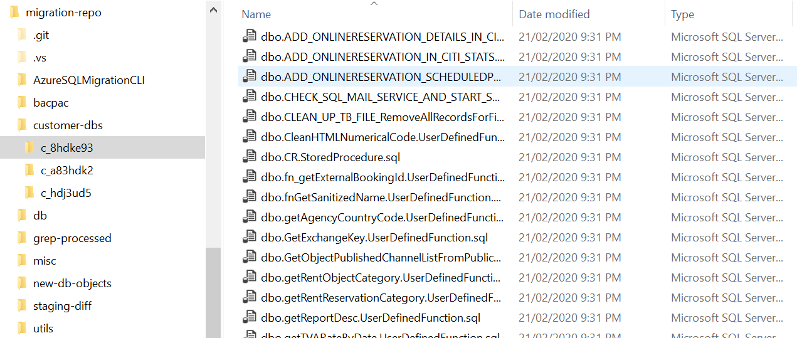

The following script applied those 600 SQL files to their DBs. Run it from the solution root.

**Required input vars**:
* `$dbCustomers` - an array with DB names, e.g. `$dbCustomers = @("c_8hdke93", "c_a83hdk2", "c_hdj3ud5")`
* `$customerDBsFolderName` - set to `$customerDBsFolderName = "customer-dbs"`.

**Output**: processed DB names and error messages from SQLCMD utility.

```powershell
. (Join-Path $PSScriptRoot vars.ps1)

foreach ($db in $dbCustomers) {
  Write-Host "$db" -ForegroundColor Yellow

  # folder name with DB files
  $td = Join-Path $customerDBsFolderName $db 
  if (!(Test-Path -Path $td )) {
    Write-Host "# Missing DB folder $db" -ForegroundColor Red
    continue
  }
  
  # get the list of files
  $allFiles = Get-ChildItem -Path $td -Filter "*.sql"
  foreach ($sqlFileName in $allFiles) {
    # file name as `customer-dbs\db_name\file_name.sql`
    $sqlFullFileName = (Join-Path $td $sqlFileName.Name)
    # run the SQL file on the local server, add -U and -P params if needed
    sqlcmd -b -S . -d $db -i `"$sqlFullFileName`"
    # output the file name for troubleshooting if there was a problem
    if ($LASTEXITCODE -ne 0) { $sqlFullFileName }
  }
}
```

The DBs are now ready for exporting into *bacpac* files required by AZ SQL DB import process. Run this script from the root of the solution to initiate the export.

**Required input vars**:
* `$dbs` - an array with DB names, e.g. `$dbs = @("c_8hdke93", "c_a83hdk2", "c_hdj3ud5")`
* Environmental var `SA_PWD` - enter your `sa` password in there.

**Output**: *.bacpac* files per DB in *bacpac* folder.

```powershell
. (Join-Path $PSScriptRoot vars.ps1)

# output folder
$folder = "bacpac"

# create the output forlder on the first run
if (!(Test-Path -Path $folder )) {
  New-Item -Path . -Name $folder -ItemType "directory" -Force
}

foreach ($db in $dbs) {

  #  SA password is taken from env var called `SA_PWD`
  $pwd = $env:SA_PWD
  $fileName = "$folder\$db.bacpac"

  # do not overwrite existing files
  if (Test-Path -Path $fileName) {
    Write-Host "`n$fileName exists.`n" -ForegroundColor Yellow
    continue
  }

  sqlpackage.exe /Action:Export /ssn:127.0.0.1 /su:sa /sp:$pwd /sdn:$db /tf:$fileName #/d:True
  # You may want to enable `/d:True` flag if the utility fails with no good explanation to why
}
```

There is a chance you will get some errors during the export. They will have to be addressed before the export can be completed. Sometimes it means going back to the very beginning and re-running the entire process again.

Successfully exported files can be imported into Azure SQL Pool with this PowerShell script.

**Required input vars**:
* `$dbs` - an array with DB names, e.g. `$dbs = @("c_8hdke93", "c_a83hdk2", "c_hdj3ud5")`
* Environmental var `SA_PWD` - enter your `sa` password for AZ SQL server / pool.
* `$AzUserName` - AZ SQL server admin user name, e.g. `$AzUserName = "sa"`
* `$AzResourceGroup`, `$AzServerName`, `$AzPoolName` - Azure SQL server params.

**Output**: *.bacpac* files imported into AZ SQL.

```powershell
. (Join-Path $PSScriptRoot vars.ps1)

foreach ($db in $dbs) {
  #  SA password is taken from env var called `SA_PWD`
  $pwd = $env:SA_PWD
  $filename = "$db.bacpac"

  Write-Host "`n`nProcessing $fileName`n" -ForegroundColor Yellow

  # ignore if the file is not there
  if (!(Test-Path -Path $fileName)) {
    Write-Host "`n$fileName doesn't exist.`n" -ForegroundColor Red
    continue
  }

  # this line requires running `az login` and `az account set --subscription ...` first
  Write-Host "Deleting AZ SQL DB ..." -ForegroundColor Yellow
  az sql db delete --name $db --resource-group "$AzResourceGroup" --server $AzServerName --yes
  if ($lastexitcode -ne 0) { continue }

  sqlpackage.exe /a:import /tcs:"Data Source=tcp:$AzServerName.database.windows.net,1433;Initial Catalog=$db;User Id=$AzUserName;Password=$pwd" /sf:$filename /p:DatabaseEdition=Standard /p:DatabaseServiceObjective=S4 #/d:True
  # You may want to enable `/d:True` flag if the utility fails with no good explanation to why
  if ($lastexitcode -ne 0) { continue }

  # add the DB to elastic pool
  Write-Host "Moving to pool ..." -ForegroundColor Yellow
  az sql db create --name $db --resource-group "$AzResourceGroup" --elastic-pool "$AzPoolName"  --server $AzServerName
  if ($lastexitcode -ne 0) { continue }

  # rename the .bacpac file so that doesn't get imported again
  Move-Item -Path $filename -Destination "_$filename"
}
```

## Congratulations - you are done

The DBs have been imported into AZ SQL pool. It's time to start testing.

----

*It took me days to figure out the right process and write the scripts to automate it as much as possible. Your process is likely to be different, but I hope this post gives you a good foundation to build on.*