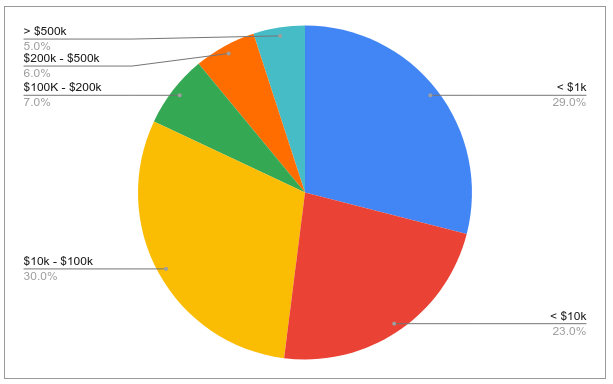
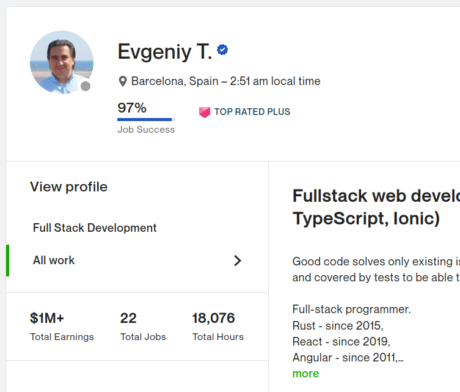

# How much can you earn on UpWork before you give up?
#### A brief analysis of actual UpWork earnings for software developers

> TL;DR; The sooner you give up, the more you earn elsewhere.

*In case you don't know what [UpWork](https://www.upwork.com) is, it is a leading freelance marketplace. They are a publicly listed company with $338M revenue in 2020. Anyone can post a job there, and most professionals can offer their services there as well, should they want to. The platform provides no vetting for employers and minimal vetting for freelancers leaving it to the feedback system to weed out bad players. It is one of the better freelance marketplaces out there.*

I used to hire on UpWork for a startup I was involved with. It was an easy way to get things done on a limited budget. The results were a mixed bag. Most of the work was either a complete throw-away or below the acceptable quality.
We got what we paid for, but there were a few outliers.

## High-quality freelancers are outliers

We were lucky to hire some really good engineers from places like Moldova, Macedonia or Turkey. They were up and coming, had reasonable rates and appreciated the constant stream of work we were sending them. Despite considering bids only from freelancers with excellent feedback and [95%+ Job Success Score](https://support.upwork.com/hc/en-us/articles/211068358) our hit rate was about 1 in 10 for "acceptable" and 1 in 20 for "great".

## Paying more doesn't get you more quality

There seem to be a pretty low ceiling on the quality of the workforce there. Assuming that our job ads were well-written, simply offering more money didn't bring many more high-quality bids. None of those ended up being a long-term hire.

## Freelancer's lifetime value

I got in touch with 11 out of 13 UpWork freelancers we used as long term hires. To my surprise, none of them was still using UpWork or any other freelance marketplace. Only 3 continued with casual contract work mostly through referrals from past clients.

They all had a different story to tell, but the common theme was that the jobs on UpWork were hard to get, many employers had no idea what they were doing and the pay was below the market rate.

**So how much can you make before you move off the platform?**

I looked at the total earning of 100 freelancers in [search results for Rust](https://www.upwork.com/ab/profiles/search/?category_uid=531770282580668418&page=1&q=rust).

Assuming [you don't give up before landing that very first job](https://www.reddit.com/r/Upwork/comments/plwc3u/im_just_tired_of_bidding_for_work_with_no/), the chances are:

* 1/3 quits before earning $1,000
* 1/4 quits before earning $10,000
* 1/3 gives up before reaching $100,000
* the rest stays for a long haul and makes it a significant source of their income

## High-earner list

It's not all doom and gloom. You can make a decent living in some categories.

13 out of 100 freelancers listing Rust in their skills earned well over $100k.

* [$100,000](https://www.upwork.com/freelancers/~017778f12a2565f8f4)	
* [$185,288](https://www.upwork.com/freelancers/~0147f8ce8730c3d633)	
* [$185,288](https://www.upwork.com/freelancers/~017778f12a2565f8f4)	
* [$210,023](https://www.upwork.com/freelancers/~0147f8ce8730c3d633)	
* [$259,614](https://www.upwork.com/freelancers/~0144b974ba8a3d287f)	
* [$277,418](https://www.upwork.com/freelancers/~01f24fb7d3fa638cfa)	
* [$300,000](https://www.upwork.com/freelancers/~010ba56ab4bc5aba48)	
* [$300,000](https://www.upwork.com/freelancers/~01364b7feb73f1d7ae)	
* [$407,727](https://www.upwork.com/freelancers/~010f4e6ae0c1778aae)	
* [$673,153](https://www.upwork.com/freelancers/~01aa1b7467b4eb49bc)	
* [$673,153](https://www.upwork.com/freelancers/~01aa1b7467b4eb49bc)	
* [$700,000](https://www.upwork.com/freelancers/~01aa1b7467b4eb49bc)	
* [$900,000](https://www.upwork.com/freelancers/~01364b7feb73f1d7ae)	
* [$1,000,000](https://www.upwork.com/freelancers/~01d95397aacaef6e88)	

## $1,000,000 club - do you want to be a member?

[Evgeniy T. from Catalonia](https://www.upwork.com/freelancers/~01d95397aacaef6e88) tops our list. We don't know how much exactly he earned, but let's assume it is a million.

Earning one million dollars sounds very inspirational. Who doesn't want to be a millionaire! Let's break it down:

* $1,000,000 / 18,076hrs worked = $55 per hour
* period over 10 years (started in 2011)
* **$130k per year** if adjusted for inflation

If we disregard the intangible values such as freedom this type of work brings, 

> **$130k per year for someone with 10 years of full-stack experience is a rather low figure in today's world.**

In the end, UpWork is no better or worse than any other avenue of building a successful career. It does a good job of putting you in front of employers. If you are good and want to be poached, you most likely will be, [despite what the Terms and Conditions](https://www.upwork.com/legal#OPTINGOUT) say.
